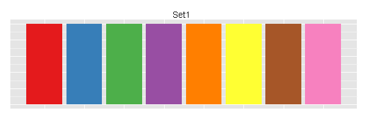

# Introduction to ggplot2

*Author: Joslin Goh*

*Last Updated: Feb 09, 2021*

--- 

## Introduction

In this chapter, we assume that the readers have a basic understanding of R and RStudio. We have prepared a [chapter][Introduction to R] for those who need a quick introduction to R and RStudio.

`r cran_link("ggplot2")` is a data visualization package for R and RStudio. It is implemented based on @wilkinson12. The package can be installed and loaded using the command
```{r visgg-load, echo = TRUE, eval = TRUE}
require("ggplot2")
```

The layers of a graph is shown in Figure \@ref(fig:visgg-grammar). In this chapter, we will show you how to build a plot layer by layer. 
```{r visgg-grammar, fig.cap="The layers of a graph", echo=FALSE, fig.align='center'}
knitr::include_graphics("images/visgg-grammarOfGraphics.png")
```

### Example Data Set

The examples shown in this chapter comes from the data set `diamond` from the **ggplot2** package.

```{r visgg-data-load, echo = TRUE, eval = TRUE}
data("diamonds")
```

The `diamond` data set consists of the price, quality information and physical measurements of different diamonds. The structure of the data set is displayed using the function `str()`.
```{r visgg-data-str, echo = TRUE, eval = TRUE, comment = NA}
str(diamonds)
```

The `diamond` data set consists of many data points. To simplify illustration, we will only use a subset of the data. To sample a subset:
```{r visgg-data-sample, echo = TRUE, eval = TRUE, comment = NA}
set.seed(2019)
my.diamonds <- diamonds[sample(nrow(diamonds), 100), ]
```
The function `set.seed()` ensures that the sample is consistent and replicable. 

## Data

The first step to graphing is to specify the data set and decide what goes on the axes. 

Suppose we want to investigate how the price of a diamond behaves with respect to its carat. Then, the two variables (or columns) involved are `price` and `carat`. The x-axis is usually the explanatory variable and the y-axis is the dependent variable. In this scenario, `price` should be on the y-axis and `carat` on the x-axis. 

To initiate this graph in **ggplot2**, 
```{r visgg-plot-blank, echo = TRUE, eval = TRUE, comment = NA}
ggplot(my.diamonds, aes(x = carat, y = price))
```

The command creates a blank plot with no points or lines in it. The function does not assume the type of graphs it needs to produce unless it was told. Since this is the first (base) layer which will be used over and over again, it is best to save it as an object
```{r visgg-plot-blank-save, echo = TRUE, eval = TRUE, comment = NA}
p <- ggplot(my.diamonds, aes(x = carat, y = price))
```

## Aesthetics

The first layer to be added on to the blank plot is a layer of the data points. In our case, we are interested to make a scatterplot that involves points that represent the data on the graph. The function `geom_point()` adds the necessary points onto the base layer.
```{r visgg-aes-point, echo = TRUE, eval = TRUE, comment = NA}
p + geom_point()
```

Each layer has its own components. For this layer, the common components include:

- `col`: colour of the points specified using names, rgb specification or NA for transparent colour, 
- `size`: size of the points specified in millimeters, and
- `shape`: shape of the points.

### The Colour Component

A common way to specify the colour of the points is through the name of the colours. For example, `red`, `darkblue`, `magenta`, `chocolate` etc. A complete list of colours can be found [here](http://www.stat.columbia.edu/~tzheng/files/Rcolor.pdf).

Suppose we want the points to appear blue, use
```{r visgg-aes-point-blue, echo = TRUE, eval = TRUE, comment = NA}
p + geom_point(col = "blue")
```

When `col=NA`, the points become transparent
```{r visgg-plot-point-NA, echo = TRUE, eval = TRUE, comment = NA, warning=FALSE}
p + geom_point(col = NA)
```

#### Setting vs Mapping

So far, we **set** the colour of the points to a specific colour of our choice. In some cases, we prefer the colour to change based on the information from another column (usually categorical) in the data set.

For example, suppose we want the colour of the points on the graph to change based on `cut`, which has 5 categories: `Fair`, `Good`, `Very Good`, `Premium` and `Ideal`. 

```{r visgg-aes-col-cut, echo = TRUE, eval = TRUE, comment = NA}
p + geom_point(aes(col = cut))
```

This is called **mapping**.

#### Changing the Colour Palette

The choice of colours used in `aes()` is determined by the choice of the colour palette. When the choice is not mentioned, the default option is used. There are many online packages with pre-set palettes that you can use. We will show you the most common one known as `RColorBrewer`, which includes three types of colour palettes: sequential, diverging and qualitative.

```{r visgg-colbrew-display, echo=TRUE, eval=TRUE, comment=NA, fig.dim=c(8,10)}
require(RColorBrewer)
display.brewer.all()
```
<!--- For example, this is the "Set 1" colours from `RColorBrewer`.
```{r visgg-colbrew-set1, fig.cap="Set 1 from ColorBrewer", echo=FALSE, fig.align='center'}

```
--->

Suppose we want to use the `Set1` colour palette from `RColorBrewer` on the scatterplot created earlier, we can use the function `scale_colour_brewer()`
```{r visgg-colbrew-set1-plot, echo = TRUE, eval = TRUE, comment = NA}
p1 <- p + geom_point(aes(col = cut))
p1 + scale_colour_brewer(palette = "Set1")
```

Readers can refer [here](https://www.datanovia.com/en/blog/the-a-z-of-rcolorbrewer-palette/) for more information about `RColorBrewer`.

Our preference for general purposes is to use a colour-blind friendly palette such as:

```{r visgg-colblind-grey, fig.cap="Colour blind friendly palette (grey)", echo=FALSE, fig.align='center'}
knitr::include_graphics("images/visgg-cbPalette-grey.png")
```

```{r visgg-colblind-black, fig.cap="Colour blind friendly palette (black)", echo=FALSE, fig.align='center'}
knitr::include_graphics("images/visgg-cbPalette.png")
```

Both palettes are not part of `RColorBrewer` and are extracted from [Cookbook for R](http://www.cookbook-r.com/Graphs/Colors_(ggplot2)/). They are coded as follow: 
```{r visgg-colblind-extract, echo = TRUE, eval = TRUE, comment = NA}
# colour blind friendly palette with grey
cbgPalette <- c(
  "#999999", "#E69F00", "#56B4E9", "#009E73",
  "#F0E442", "#0072B2", "#D55E00", "#CC79A7"
)
# colour blind friendly palette with black
cbbPalette <- c(
  "#000000", "#E69F00", "#56B4E9", "#009E73",
  "#F0E442", "#0072B2", "#D55E00", "#CC79A7"
)
```

Readers can also create palettes of their choice at [Color Brewer 2.0](https://colorbrewer2.org/). If you chose to create your own palette, we recommend to have them included at the beginning of your R script. 

In order to use the colour blind friendly palettes that are not part of the `RColorBrewer` library, we need to use `scale_colour_manual` instead.
```{r visgg-colblind-black-plot, echo = TRUE, eval = TRUE, comment = NA}
p1 + scale_colour_manual(values = cbbPalette)
```

### The Size Component

Another component of `geom_point()` is the size of the points. They can be changed by either setting or mapping. The size of the points is specified in millimeters. 

#### Setting the Size 

To change the size of all the points in the plot to 5mm,
```{r visgg-aes-size-set, echo = TRUE, eval = TRUE, comment = NA}
p1 + geom_point(size = 5)
```

Here, we notice that

- All the points are larger in size.
- The colour of the points are the same. Recall that we have mapped the colour of the points to `cut` and saved it as `p1` earlier.
<!---```{r visgg-aes-col-save, echo = TRUE, eval = TRUE, comment = NA}
p1 <- p + geom_point(aes(col = cut))
    ```
--->

When `geom_point()` was called the second time, it overwrites the command to map the colour of the points.

So to change the colour and size at the same time, we can use
```{r visgg-aes-col-size, echo = TRUE, eval = TRUE, comment = NA}
p + geom_point(aes(col = cut), size = 5)
```

#### Mapping the Size

Similar to mapping the colour component, the size of the points can be mapped to a variable. 
```{r visgg-aes-size-map, echo = TRUE, eval = TRUE, comment = NA}
p1 + geom_point(aes(size = cut))
```

Notice in the previous graph that the points are in black colour but the legend still includes `cut`. This is because the mapping contradicts `p1` that was stored in such a way earlier:
```{r visgg-aes-size-exp2, echo = TRUE, eval = FALSE, comment = NA}
p1 <- p + geom_point(aes(col = cut))
```

The plot appears "incorrect" and there will be a lot of warnings. To map both colour and size properly, 
```{r visgg-aes-col-size-map, echo = TRUE, eval = TRUE, comment = NA}
p + geom_point(aes(col = cut, size = cut))
```

### The Shape Component

Another component to consider is the shape of the points, which are identified using numbers.

```{r visgg-aes-shape-list, fig.cap="Shapes", echo=FALSE, fig.align='center'}
knitr::include_graphics("images/visgg-ggplot2-shape-identity.png")
```

For example, we can set the shapes of the points to an inverse triangle. 
```{r visgg-aes-shape-invtri, echo = TRUE, eval = TRUE, comment = NA}
p + geom_point(shape = 6)
```

If we want to map the points to the `cut` of the diamonds, we can write
```{r visgg-aes-shape-cut, echo = TRUE, eval = TRUE, comment = NA, warning=FALSE}
p + geom_point(aes(shape = cut), size = 5)
```

You may have received a warning that the shape component is not recommended for ordinal variable such as `cut`. This is a recommendation. Usually, the shape component is used to better visualize nominal variables. It is the readers' choice to manipulate the shape component for better visual presentation.


To summarize,  we recommend to include the choice of colour, size and shape in one call of `geom_point()` to minimize error. For example, 
```{r visgg-aes-summary, echo = TRUE, eval = FALSE, comment = NA, warning=FALSE}
p + geom_point(aes(col = cut, size = cut, shape = cut))
```

## Geometrics

Geometric objects perform the actual rendering of the layer and control the type of plot that you created. The common ones are: 

- `geom_point()` produces scatterplots,
- `geom_line()` produces line graphs, and
- `geom_bar()` produces bar plots. 


### Line Graphs

Previously we have been drawing scatterplots to draw relationship between `carat` and `price`. We used `geom_point()`. What happens if we used `geom_line()`? 
```{r visgg-geo-line-plain, echo = TRUE, eval = TRUE, comment = NA}
p + geom_line()
```

#### Setting Colour, the Thickness and Type of Line

Similar to `geom_point()`, we can set the colour of the line to `red`.
```{r visgg-geo-line-col, echo = TRUE, eval = TRUE, comment = NA}
p + geom_line(col = "red")
```

The thickness of the line can also be changed. It is set to 1 by default, but we can change it to any decimal of our choice. The larger the number, the thicker the line. 
```{r visgg-geo-line-size, echo = TRUE, eval = TRUE, comment = NA}
p + geom_line(size = 1.5)
```

The default type of line is a solid line, which is also coded as `1`. There are a total of [12 types of line](http://sape.inf.usi.ch/quick-reference/ggplot2/linetype), in which seven of them can also be referred to using numbers 0 to 6 instead of the string values. We can change the solid line into `dashed` as follow:

```{r visgg-geo-line-type, echo = TRUE, eval = TRUE, comment = NA}
p + geom_line(linetype = "dashed")
```


#### Multiple Lines

To draw multiple lines, the points must be grouped by a variable. Otherwise, all the points will be connected by a single line. Hence, when we create the base layer, we need to specify the `group` that we want to group the points into. Usually, the grouping is based on a categorical variable. 

Suppose we are interested to draw the lines according to `cut`. 
```{r visgg-geo-lines-plain, echo = TRUE, eval = TRUE, comment = NA}
p2 <- ggplot(my.diamonds, aes(x = carat, y = price, group = cut))
p2 + geom_line()
```

We can adjust the colour by the `group`.
```{r visgg-geo-lines-col, echo = FALSE, eval = TRUE, comment = NA}
ggplot(my.diamonds, aes(x = carat, y = price, group = cut)) +
  geom_line(aes(col = cut))
```
To map the colours of the lines to `cut`, there are two options:

- Option 1:
    ```{r visgg-geo-lines-col1, echo = TRUE, eval = FALSE, comment = NA}
ggplot(my.diamonds, aes(x = carat, y = price, group = cut)) +
  geom_line(aes(col = cut))
    ```
- Option 2:
    ```{r visgg-geo-lines-col2, echo = TRUE, eval = FALSE, comment = NA}
ggplot(my.diamonds, aes(
  x = carat, y = price, group = cut,
  col = cut
)) +
  geom_line()
    ```

Both options produce the exact same graph. However, we prefer Option 2 over Option 1 because we can manipulate the components of the line (and points) more efficiently when creating graphs that are more complex later on.

#### Lines with Points

It is no surprise that we can add points in a line graph:

```{r visgg-geo-line-points, echo = TRUE, eval = TRUE, comment = NA}
p + geom_line() + geom_point()
```

The appearance of the lines and points can be changed as discussed previously.

### Bar Plots

Bar plots are commonly used to graph categorical variables. 

Suppose we are interested in how the total price of diamonds is affected by the different `colour`. After laying down the base layer with `price` on the y-axis and `color` on the x-axis, we use the `geom_bar()` function to create the bars in the graph.
```{r visgg-geo-bar-plain, echo = TRUE, eval = TRUE, comment = NA}
ggplot(my.diamonds, aes(x = color, y = price)) +
  geom_bar(stat = "identity")
```

Notice that the x- and y-axes are similar to that of the scatterplots. The only difference is the use of `geom_bar()`. 

The colours of the bar can be mapped to the `color` variable by specifying the `fill` option.
```{r visgg-geo-bar-col, echo = TRUE, eval = TRUE, comment = NA}
ggplot(my.diamonds, aes(x = color, y = price, fill = color)) +
  geom_bar(stat = "identity")
```

## Others

It may be of interest to change

- x- and y-axes labels,
- title of the graph, and
- legends.

### Axes Labels

Similar to graphing in the `base` package, we can change the labels of the axes by adding the components as follow:

- x-axis: `xlab("name")`
- y-axis: `ylab("name")`

```{r visgg-lables, echo = TRUE, eval = TRUE, comment = NA}
p + geom_line(col = "red") +
  xlab("Price") + ylab("Carat")
```

### Title of the Graph

To add a title to the graph, we can use `ggtitle()`

```{r visgg-title, echo = TRUE, eval = TRUE, comment = NA}
p + geom_line(col = "red") +
  xlab("Price") + ylab("Carat") +
  ggtitle("Relationship between price and carat")
```

The title are left-centered and can be adjusted through the "theme" layer which we will not covered here. In general, we prefer to not add a title to the graph because captions would be added in the final presentation of the data and results.

### Legends

There are two ways for changing the title and labels of the legend:

- modify the data frame directly, or
- use `scale_xxx_yyy()`. Refer [here](http://www.cookbook-r.com/Graphs/Legends_(ggplot2)/#with-fill-and-color) for the different combinations of `xxx` and `yyy`.

Suppose we want the legend to show the `cut` in different colours. Since the legend is related to the colour of the lines, `xxx` is `colour` and the variable is categorical, we set `yyy` to `discrete`:
```{r visgg-legend, echo = TRUE, eval = TRUE, comment = NA}
p + geom_line(aes(col = cut)) +
  scale_colour_discrete(
    name = "Cut of diamonds",
    breaks = c("Fair", "Good", "Very Good", "Premium", "Ideal"),
    labels = c("A", "B", "C", "D", "E")
  )
```


