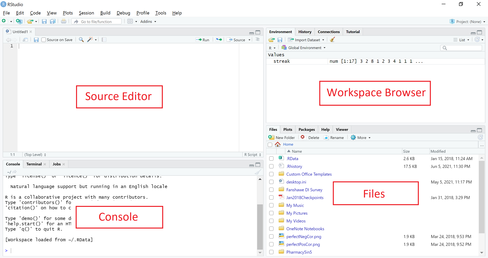

# Introduction to R

*Author: Joslin Goh, Trang Bui*

*Last Updated: Feb 04, 2021*

--- 

## R and RStudio

[R](https://www.r-project.org/) is a software environment for statistical computing and graphics. Unlike other statistical software, R is free. Besides buit-in functions, additional pacakges for solving many different statistical or application problems are made and maintained by contributors around the world. This makes R an attractive and popular statistical tool nowadays.

[RStudio](https://rstudio.com/products/rstudio/) is an integrated development environment ([IDE](https://en.wikipedia.org/wiki/Integrated_development_environment)) for R. It is easier to work with R using RSudio. 

The interface of RStudio is shown in Figure \@ref(fig:rintro-rstudio).
```{r rintro-rstudio, fig.cap="The RStudio interface", echo=FALSE, fig.align='center'}

```
- The Code Editor contains the R code files, where you can write and edit your code. You can also run the R code from the Code Editor by selecting the code chunk and click <kbd>Run</kbd>. 
- If you want to run a line of code, you can write the code in the R Console and press <kbd>Enter</kbd>. The printed results of the code is also shown in the R Console.  
- The Workspace shows you the data, objects and values you are working with. The History shows the codes that you have run previously.
- The Plot and files panel will let you view other outputs such as plots or files that you created with the R code. It also helps you manage packages or files that you are working with. 

The four panels can be positioned differently based on your preferences, the default is shown in Figure \@ref(fig:rintro-rstudio).

## Basic R

### Calculating with R {#rintro-calculate}

In its simplest form, R can be used as a calculator. In the R Console area, type:
```{r rintro-basic-sum, echo = TRUE, eval = FALSE}
1 + 2
```
you will see the following being printed in the R Console area
```{r rintro-basic-sum-result, echo = FALSE, eval = TRUE, comment = NA}
1 + 2
```

Subtraction can be done in a similar way
```{r rintro-basic-subtract, echo = TRUE, eval = TRUE, comment = NA}
5 - 10
```

Other basic operations such as multiplication, division and powers are also included.
```{r rintro-basic-operations, echo = TRUE, comment = NA}
9 * 26

100 / 7.5

2^3
```

Some basic operations involves built-in functions in R. For example,

- $\sqrt{25}$
    ```{r rintro-basic-squareroot, echo = TRUE, eval = TRUE, comment = NA}
sqrt(25)
    ```
- $\log_{10}(10)$
    ```{r rintro-basic-log10, echo = TRUE, eval = TRUE, comment = NA}
log(10, base = 10)
    ```
- $\tx{ln}(10)$
    ```{r rintro-basic-log, echo = TRUE, eval = TRUE, comment = NA}
log(10)
    ```

#### Practice 1

Evaluate the following ratio
$$
\frac{e^{1}}{1-e^{1}}
$$
*Solution:* 
```{r rintro-basic-practice-cal1, echo = FALSE, eval = TRUE, comment = NA}
exp(1) / (1 - exp(1))
```

#### Practice 2

Calculate
$$
\frac{e^{1-\pi}}{1-e^{1-\pi}}
$$
*Solution:* 
```{r rintro-basic-practice-cal2, echo = FALSE, eval = TRUE, comment = NA}
exp(1 - pi) / (1 - exp(1 - pi))
```

### Variables

Variables are useful when they need to be used repeatedly or to be recalled in the future. 

For example, suppose we are interested in evaluating
$$
\frac{e^{1-9.2315468}}{1-e^{1-9.2315468}},
$$
we can store the repeated value $9.2315468$ as a variable before performing the calculation. 

To store the value as the variable $x$, we can write and run
```{r rintro-basic-variable-assign, echo = TRUE, eval = TRUE, comment = NA}
x <- 9.2315468
```
- In the Console panel, nothing is returned.
- In the Workspace and History panel, $x$ appears together with the value it represents. This shows that your current workspace recognize $x$ as $9.2315468$.
- Now if we try typing $x$ in the Console
    ```{r rintro-basic-variable-result, echo = TRUE, eval = TRUE, comment = NA}
x
    ```

Back to our example, we wanted to evaluate
$$
\frac{e^{1-9.2315468}}{1-e^{1-9.2315468}},
$$
Since $x = 9.2315468$ in our work environment, we can now type and run
```{r rintro-basic-variable-calculate, echo = TRUE, eval = TRUE, comment = NA}
exp(1 - x) / (1 - exp(1 - x))
```

In R, there are built-in variables, which are called default variables in R. The number $\pi$ is recognized as `pi`. Another default variable is the imaginary number, i.e $\sqrt{-1}$, which is recorded as `i` in R. 

#### Practice 3

Can you simplify the code further?
```{r rintro-basic-practice-var1, echo = TRUE, eval = FALSE, comment = NA}
exp(1 - x) / (1 - exp(1 - x))
```

*Solution:*  
```{r rintro-basic-practice-var1-sol1}
y <- 1 - x
exp(y) / (1 - exp(y))
```
or
```{r rintro-basic-practice-var1-sol2}
z <- exp(1 - x)
z / (1 - z)
```

### Getting Help

Before getting others for help, it is generally a good idea for you to try to help yourself.

#### R Documentation

R has an extensive documentation and resources for help. To read the documentation of a function, add a quotation mark before the name of a function. 

For example, to find out how to use the function `round()`, you can run
```{r rintro-basic-help, echo = TRUE, eval = FALSE, comment = NA}
?round
```
Then in the Plot and Files panel, which is on the bottom right, you can see a description of the function and examples of how to use it. In this example, as shown in the documentation, the function `round()` rounds the values in its first argument to the specified number of decimal places.

#### Online Resources

There are a lot of basic functions or default variables that have not been mentioned so far. When analyzing data, we often encounter situations in which we need to use unknown or unfamiliar functions. In this case, we often rely on online search engines to find those functions. It is a common practice to use online resources in real world data analysis. Hence, we encourage you to explore the online resources.

### Vectors

In the real world, we often encounter sequences of numbers. For example, 

- the height of 10 students,
- the grades of the ECON 101 students in the Fall term,
- the age of the attendees, and
- many more.

In R, sequences of numbers can be recorded as vectors. 

Suppose there are five people in a class. The ages of the people in the class are:
$$
18, 21, 19, 20, 21
$$
We can create a vector for our record as below.
```{r rintro-basic-vector, echo = TRUE, eval = FALSE, comment = NA}
age <- c(18, 21, 19, 20, 21)
```
In the Enviroment panel, we can see the variable `age` with the values that we have given. And if we type `age` in the Console panel, we get these values printed in the Console.  

Vectors may not appear to be be useful for many since most of the popular functions are ready for use. But for those intending to create your own R functions, it is important to understand how to create and manipulate vectors. You can use the same operators and functions as in Section [1.2.1](#rintro-calculate) to calculate with vectors. These calculations will be element-wise. For example, 
```{r rintro-basic-vector-calculate, echo = TRUE, eval = FALSE, comment = NA}
age * 2
log(age)
x <- c(0, 1, 2, 3, 4, 5)
age - x
```

### Some Coding Tips

#### Code Editor

It will be hard to remember all the codes you created, especially if you run many lines of code. If you want to save the codes for future references, the Code Editor allows writing and saving all the written codes into R code files. The lines of codes in the Code Editor are not processed by R.

There are many ways you can run the codes in the Code Editor: 

- Select the codes you want R to process, click <kbd>Run</kbd> on the top right corner of the Code Editor.
- For Windows users, you can run the selected codes by pressing <kbd>Ctrl</kbd> + <kbd>Enter</kbd>. For Mac users, you can do the same with <kbd>Command</kbd> + <kbd>Enter</kbd>.
- If you only want to run one line of code, you can place the cursor at the line of code, and use either the two ways above.

We recommend typing the codes in the Code Editor and then run the codes. This way, you have a copy of what you did for your future references.

#### Commenting

Comment your code! R does not process anything behind \#. You can also add your comments or notes about what you want to do with the code or the output of the codes, etc. this way. 
```{r rintro-basic-comment, echo = TRUE, eval = FALSE, comment = NA}
# I am trying to like R!!!!
```

To comment off a section of code, select the section, and press <kbd>Ctrl</kbd> + <kbd>Shift</kbd> + <kbd>C</kbd>. Doing this a second time, the code section will be uncommented. 

There is another tip for RStudio. If you type the following in the Code Editor:
```{r rintro-basic-comment-section, echo = TRUE, eval = FALSE, comment = NA}
# ----------------
# Try Me!
# ----------------
```
you can see a triangle button next to the line numbers at the beginning and end of the code section. You can click the button to hide or unhide the code. 

#### Saving the Environment

When you quit R or RStudio, you can choose to save the Environment and History that you are working with in the files called `.RData` and `.RHistory` respectively. When you open the R code file next time, the two files will be automatically loaded. 

However, it is recommended not to save the Environment in the default way. Instead, start in a clean environment so that older objects do not remain in your environment any longer than they need to. If that happens, it can lead to unexpected results.

But if you want to save the Environment for conveniences or future use, we recommend that you save the Environment with names of your choice using the function `save.image()` rather than using the default files `.RData`. If you only want to save certain values, you can use the function `save()` and when you want to load the saved Environment, use `load()` function. 

#### Installing Libraries

The R user community creates functions and data sets to share. We call them packages or libraries. The packages are free and can be installed as long as you have access to the Internet.

To install a library, say `r cran_link("ggplot2")`, include the following code at the beginning of your file:
```{r rintro-basic-require, echo=TRUE, eval=FALSE, comment=NA}
require("ggplot2")
```
This line of code install the package if it is not installed already, and load the package to your Environment. You can do this separately using functions `install.packages()` and `library()` in R, respectively.

#### Good Coding Practices

- Start each program with a description of what it does.
- Load all required packages at the beginning.
- Consider what working directory you are in.
- Use comments to mark off sections of code.
- Put function definitions at the top of your file, or in a separate file if there are many.
- Name and style code consistently.
- Break code into small, discrete pieces.
- Factor out common operations rather than repeating them.
- Keep all of the source files for a project in one directory and use relative paths to access them.
<!-- - Always start with a clean environment instead of saving the workspace. -->
- Have someone else review your code.
- Use version control.

## Data Analysis with R

### Accessing the Data

#### Setting Working Directory

Before you can use these functions, it is important to inform R the directory that the data file is stored. For Mac/Windows users of RStudio, proceed as follows, choose <kbd>Session</kbd> > <kbd>Set Working Directory</kbd> > <kbd>Choose Directory</kbd>. 

You can also use the function `setwd()` to set the working directory if you have the directory string. For example
```{r rintro-data-setwd, echo = TRUE, eval = FALSE, comment = NA}
setwd("D:/")
```
will set the working directory to "D:/".

#### Importing the Data

In the real world, data are recorded in different formats such as Excel spreadsheet (`xls`), Comma Separated Values (`csv`) or Text (`txt`). Each row of a data files is an observation whie each column is a variable or a feature. 

You can import the data into R Environment using functions such as `read.csv()` and `read.table()`. Imported data are stored as a data frame object. 

In this tutorial, we will focus on two data sets: `r embed_data_file("data/caliRain.csv", text = "caliRain.csv")` and `r embed_data_file("data/drinks.csv", text = "drinks.csv")`. 

We can import both data sets `caliRain.csv` and `drinks.csv` into the R environment and save them as data frames called `drinks.df` and `rain.df` respectively. Suppose we save the data sets in a subfolder called `data` in the working directory, then
```{r rintro-data-import, echo=TRUE, eval=TRUE, comment = NA}
drinks.df <- read.csv("data/drinks.csv")
rain.df <- read.csv("data/caliRain.csv")
```

#### A Look at the Data 

It is important to take a look at the data set imported into the environment before performing the analysis. You can use 
```{r rintro-data-view, echo=TRUE, eval=FALSE, comment = NA}
View(rain.df)
```
to view the data set as a table in R or you can use the function `head()` to take a look at the first few rows of the data set.  
```{r rintro-data-head, echo=TRUE, eval=TRUE, comment = NA}
head(rain.df)
```

The `caliRain.csv` file contains daily rainfall recorded at numerous meteorological stations monitored  by the state of California. The variables recorded are:
  
- STATION: Name of the station,
- PRECIP: precipitation (inches),
- ALTITUDE: altitude (feet),
- LATITUDE: latitude (feet),
- DISTANCE: distance to the Pacific Ocean (miles), and
- SHADOW: slope face (1: Westward, 2:Leeward).

The variables `STATION` and `SHADOW` are categorical variables, whereas the remaining are continuous variables. 

#### Accessing the Data Frame 

Oftentimes, we are interested to access an individual column (or variable) within the data frame. For example, you are the precipitation variable in the data set `caliRain.csv` (or the data frame now stored as `rain.df` in R). There are two ways to access the columm:

- You can use the dollar sign followed by the name of the variable.
    ```{r rintro-data-dollar, echo=TRUE, eval=TRUE, comment = NA}
rain.df$PRECIP
    ```
- You can use the number of the column in the data set. 
    ```{r rintro-data-col, echo=TRUE, eval=TRUE, comment = NA}
rain.df[, 2]
    ```

Similarly, there are times we want to investigate a particular row (or observation). Suppose we are interested in the 10th observation, then you can use
```{r rintro-data-row, echo=TRUE, eval=TRUE, comment = NA}
rain.df[10, ]
```

We can also access a specific cell in the data. Suppose we are interested in the precipitation of the 5th observation, then you can use either of
```{r rintro-data-cell, echo=TRUE, eval=TRUE, comment = NA}
rain.df$PRECIP[5]
rain.df[5, 2]
```

Accessing a random variable, an observation or a specific value coming from an observation are all useful for data management and manipulation purpose. 

#### Modifying the Data Frame

Sometimes, we want to make changes to the data frame such as

- make changes to existing records,
- add new observations or variables, or
- remove outliers from the data set.

If we want to change the existing records, we need to identify which records we are interested to change.

- a variable, i.e. a column, or 
- a specific observation.

##### Modifying a Variable

To modify a variable, we need to 

- identify the name or the column of the variable to access it in the data frame,
- decide on the modification or conversion, and 
- decide on how you would like to store the new variable. We recommend storing the conversion as a new variable in the data frame to avoid confusion.

Suppose we are interested to analyze `DISTANCE` in metres ($1 \tx{ ft} = 0.3048 \tx{ m}$). We can make the conversion and save it as a new column called `DISTANCE.M` in the data set. 
```{r rintro-data-modcol, echo=TRUE, eval=TRUE,comment=NA}
rain.df$DISTANCE.M <- rain.df$DISTANCE * 0.3048
```

##### Modifying a Specific Observation

To modify a specific observation, we need to

- identify how to access variable in the data frame,
- decide on the modification, and 
- decide on how you would like to store the new variable. In this scenario, it is a replacement.

Suppose the distance for \texttt{Eureka} station is entered incorrectly and is supposed to be 1.5 feet instead.
```{r rintro-data-modcell, echo=TRUE, eval=TRUE,comment=NA}
rain.df$DISTANCE[1] <- 1.5
```

##### Removing Records

To remove an entire column from a data frame we use
```{r rintro-data-rmcol, echo=TRUE, eval=FALSE,comment=NA}
rain.df <- rain.df[, -COLUMN_NUMBER]
```

To remove an entire row from a data frame we use
```{r rintro-data-rmrow, echo=TRUE, eval=FALSE,comment=NA}
rain.df <- rain.df[-ROW_NUMBER, ]
```

This way we re-store `rain.df` with the new data frame `rain.df` where its row/column removed. 

#### Data Structure

You can see the structure that R store the data using the function `str()`.   
```{r rintro-data-str, echo=TRUE, eval=TRUE, comment = NA}
str(rain.df)
```
Here, the variable `SHADOW` is recorded as a numeric value. This is not an accurate depiction of the data set. 

To ensure the analysis can be done properly, we need to convert the values in `SHADOW` into categorical values in the data set. In R, we can do so using the function `factor()`.
```{r rintro-data-factor, echo=TRUE, eval=TRUE, comment = NA}
rain.df$SHADOW <- factor(rain.df$SHADOW,
  levels = c("1", "2"),
  labels = c("Westward", "Leeward")
)
```
Here we are making references to the numerical values 1 and 2, by
setting them as “Westward” and “Leeward”, respectively. Now we can check the structure of the data set after the transformation. The variable `SHADOW` is now stored as a factor (or categorical) variable.
```{r rintro-data-factor-str, echo=TRUE, eval=TRUE, comment = NA}
str(rain.df)
```

##### Practice 4

Based on the data set `drinks.csv`, try to answer the following questions:
  
- How many observations are there? How many variables are recorded?
- What are the names of the variables in the data set?
- What is the recorded `fat` for the third observation?

*Solution:*
```{r rintro-data-practice-mod1, echo=TRUE, eval=TRUE, comment = NA}
# How many observations are there? How many variables are recorded?
str(drinks.df)

# What are the names of the variables in the data set?
names(drinks.df)

# What is the recorded \texttt{fat} for the third observation?

## Option 1:
drinks.df$fat[3]

## Option 2:
drinks.df[3, 4]
```

##### Practice 5

We are interested to group the drinks into categories of `HIGH` and `LOW` calories. Drinks with less than or equal to 150 calories are considered `LOW` calories, whereas drinks with more than 150 calories are considered `HIGH` calories. 

- Create a new variable in `drinks.df` called `is.high.calorie` to record whether a drink contains high or low calorie.

    *Solution:*
    ```{r rintro-data-practice-mod21, echo=TRUE, eval=TRUE, comment = NA}
drinks.df$is.high.calorie <- as.factor(drinks.df$calories > 150)
levels(drinks.df$is.high.calorie)[levels(drinks.df$is.high.calorie) == "TRUE"] <- "HIGH"
levels(drinks.df$is.high.calorie)[levels(drinks.df$is.high.calorie) == "FALSE"] <- "LOW"
    ```
- Subset the `drinks.df` data frame into two data frames: `hc.drinks.df` for drinks with `HIGH` calories and `lc.drinks.df` for drinks with `HIGH` calories.

    *Solution:*
    ```{r rintro-data-practice-mod22, echo=TRUE, eval=TRUE, comment = NA}
hc.drinks.df <- drinks.df[drinks.df$is.high.calorie == "HIGH", ]
lc.drinks.df <- drinks.df[drinks.df$is.high.calorie == "LOW", ]
    ```

*Notes:* Take a look at the [comparators and logical operators](https://www.statmethods.net/management/operators.html) in R.

### Descriptive Statistics

Some commonly computed statistics can be computed easily in R.

- [Mean](https://en.wikipedia.org/wiki/Mean) or average of a sequence of numbers can be obtained using the function `mean()`.
    ```{r rintro-data-mean, echo=TRUE, eval=TRUE, comment=NA}
mean(rain.df$PRECIP)
    ```
- [Median](https://en.wikipedia.org/wiki/Median) of a sequence of  numbers can be obtained using the function `median()`.
    ```{r rintro-data-median, echo=TRUE, eval=TRUE, comment=NA}
median(rain.df$PRECIP)
    ```
- [Variance and standard deviation](https://en.wikipedia.org/wiki/Variance) of a sequence of numbers can be obtained using the functions `var()` and `sd()` respectively.
    ```{r rintro-data-var, echo=TRUE, eval=TRUE, comment=NA}
var(rain.df$PRECIP)
sd(rain.df$PRECIP)
sqrt(var(rain.df$PRECIP))
    ```
- The minimum and maximum of a set of numbers can be obtained through functions `min()` and `max()`. 
    ```{r rintro-data-minmax, echo=TRUE, eval=TRUE, comment=NA}
min(rain.df$PRECIP)
max(rain.df$PRECIP)
    ```
    We can also use function `range()` to get the minimum and maximum values.
    ```{r rintro-data-range, echo=TRUE, eval=TRUE, comment=NA}
range(rain.df$PRECIP)
    ```
    
#### Practice 6

The five numbers: minimum, first quartile ($Q_1$), median, second quartile ($Q_2$), and maximum are called the [5-number summary](https://en.wikipedia.org/wiki/Five-number_summary). Please find the 5-number summary of the calories for the precipitation.

*Solution:*
```{r rintro-data-practice-des1, echo=TRUE, eval=TRUE, comment=NA}
summary(rain.df$PRECIP)
```

#### Practice 7

Find the average precipitation of the station with Leeward Shadow.

*Solution:*
```{r rintro-data-practice-des2, echo=TRUE, eval=TRUE, comment=NA}
mean(rain.df$PRECIP[which(rain.df$SHADOW == "Leeward")])
```

### Basic Data Visualization

There are a wide variety of plots that we can draw in R, but we will focus on some of our favourites:

- bar graphs: show the distribution of categorical variables,
- boxplots: show the five-number summaries of continuous variables, and
- histograms: show the distribution of continuous variables.

#### Categorical Variables

The numerical summary of a categorical variable are usually summarized in a table
```{r rintro-data-table-shadow, echo=TRUE, eval=TRUE, comment=NA}
count_of_shadow <- table(rain.df$SHADOW)
count_of_shadow
```
or
```{r rintro-data-table-milk, echo=TRUE, eval=TRUE, comment=NA}
table.of.milk.by.temp <- table(
  drinks.df$hasMilk,
  drinks.df$temp
)
table.of.milk.by.temp
```

Sometimes it is more useful to report the proportions. 
```{r rintro-data-table-shadow-prop, echo=TRUE, eval=TRUE, comment=NA}
prop.table(count_of_shadow)
```

We can convert the proportions into percentages, and round the values to 2 decimal places using
```{r rintro-data-table-shadow-per, echo=TRUE, eval=TRUE, comment=NA}
round(100 * prop.table(count_of_shadow), 2)
```

For contingency table, the default `prop.table()` function will output the proportions based on the entire data set
```{r rintro-data-table-milk-prop, echo=TRUE, eval=TRUE, comment=NA}
prop.table(table.of.milk.by.temp)
```

What if we are asked, "What are the percentages of the hot drinks that contain milk?" If we want to report the proportion by column (`Temperature`):
```{r rintro-data-table-milk-prop-col, echo=TRUE, eval=TRUE, comment=NA}
prop.table(table.of.milk.by.temp, 2)
```
These values are the proportions of drinks which contains milk (or not) conditioning on whether the drink is cold or hot, i.e., the values are normalized by the columns. Now we can answer, "100\% of the hot drinks contain milk."

##### Practice 8

We can normalize the values by the rows:
```{r rintro-data-table-milk-prop-row, echo=TRUE, eval=TRUE, comment=NA}
prop.table(table.of.milk.by.temp, 1)
```
Now, what percentage of drinks that contain milk are cold? 

#### Bar Plots

[Bar plots](https://www.statmethods.net/graphs/bar.html) are commonly used to visualize categorical variables. We can make a barplot from the count table using the function `barplot()` in R.

```{r rintro-data-barplot, echo=TRUE, eval=TRUE, fig.height=4.5}
barplot(count_of_shadow,
  main = "Distribution of shadow",
  xlab = "Shadow", ylab = "Frequency"
)
```

#### Boxplots

The [boxplot](https://en.wikipedia.org/wiki/Box_plot) is a visual representation of the five-number summary that can give us a sense of the distribution of the variable.

- minimum,
- first quartile, $Q_1$,
- second quartile, i.e., median,
- third quartile, $Q_3$, and
- maximum.

Potential outliers are shown as dots outside the boxplots.

Here is the boxplot of `PRECIP`. Notice the potential outliers.
```{r rintro-data-boxplot, echo=TRUE, eval=TRUE, fig.height=5}
boxplot(rain.df$PRECIP,
  main = "Precipitation",
  ylab = "Inches"
)
```

Side-by-side boxplots are commonly used to visualize relationship between a continuous variable and a categorical variable. The following is the boxplot of the precipitation by shadow. 
```{r rintro-data-boxplot-side, echo=TRUE, eval=TRUE, fig.height=5}
boxplot(rain.df$PRECIP ~ rain.df$SHADOW,
  main = "Precipitation",
  ylab = "Inches"
)
```
In the side-by-side boxplots, notice that there are no potential outliers. Compared to the whole data, certain observations can be considered as outliers. But if we group the data by `SHADOW`, the data are not outliers in their groups. 

#### Histograms

[Histograms](https://en.wikipedia.org/wiki/Histogram) are commonly used to visualize the distribution of continuous variables. When looking at histograms, pay attention to

- the shape: symmetric vs asymmetric,
- the center, and
- the spread.

We can plot a histogram of the precipitation.
```{r rintro-data-histogram, echo=TRUE, eval=TRUE, fig.height=5}
hist(rain.df$PRECIP,
  main = "Distribution of precipitation",
  xlab = "Precipitation", ylab = "Inches"
)
```
Notice that there is no space in between the bars like in the barplot. This is because we are plotting a continuous variable instead of a categorical variable.

#### Scatterplots

Scatterplots are used to visualize relationship between two continuous variables.

```{r rintro-data-scatter, echo=TRUE, eval=TRUE, fig.height=6}
plot(rain.df$DISTANCE, rain.df$PRECIP,
  main = "Relationship: precipitation vs distance",
  xlab = "Distance (ft)", ylab = "Precipitation (inches)"
)
```
We can see that there are some precipitation records that are exceptionally high when the distance is at 0ft and 150ft. 

#### A Fancy Visualization Library

The `r cran_link("ggplot2")` library is a package created by Hadley Wickham. It offers a powerful language to create elegant graph. We have a [tutorial](#visgg-main) on this package.
