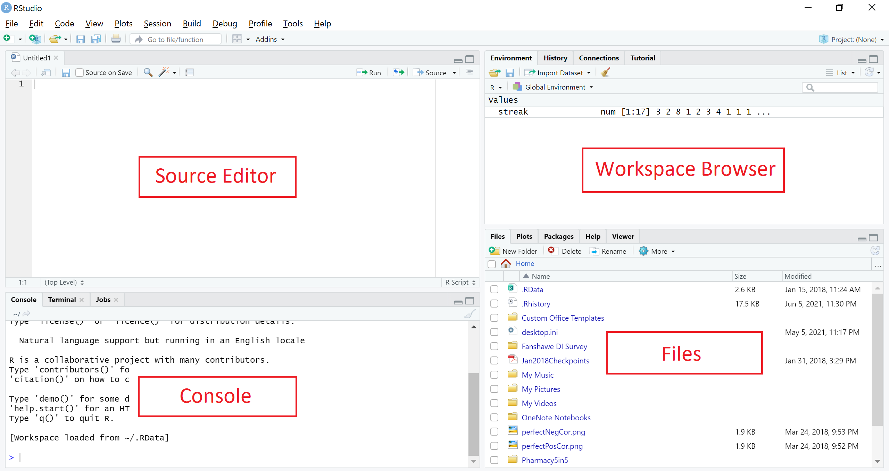

# Introduction to R 

*Author: Joslin Goh, Trang Bui*

*Last Updated: Feb 04, 2021*

--- 

## R and RStudio

[R](https://www.r-project.org/) is a software environment for statistical computing and graphics. Unlike other statistical software, R is free. Besides built-in functions, additional packages for solving many different statistical or application problems are made and maintained by contributors around the world. This makes R an attractive and popular statistical tool nowadays.

[RStudio](https://rstudio.com/products/rstudio/) is an integrated development environment ([IDE](https://en.wikipedia.org/wiki/Integrated_development_environment)) for R. It is easier to work with R using RStudio. 

<div class="figure" style="text-align: center">

<p class="caption">(\#fig:rintro-rstudio)The RStudio interface</p>
</div>

The interface of RStudio shown in Figure \@ref(fig:rintro-rstudio) contains four panes:

- [Source Editor], <!-- contains the R code files, where codes are written and edited. We can also run the R code from the Code Editor by selecting the code chunk and click <kbd>Run</kbd>. -->  
- Console, <!-- To run a single line of code, write the code in the R Console and press <kbd>Enter</kbd>. The printed results of the code is also shown in the R Console.  --> 
- Workspace Browser, and <!-- consists of (1) the Environment pane that shows the objects we are working with, and (2) the History pane that shows codes that were executed previously.-->
- Files (and Plots, Packages, Help and Viewer). <!-- pane shows outputs such as plots or files created with the R code. It also helps with the management of packages or files required for the codes.-->

The four panes can be positioned differently based on personal preference. Figure \@ref(fig:rintro-rstudio) shows the default position. In this section, we will mainly be using the Source Editor and Console panes. Readers are encouraged to refer to other [resources](https://robwschlegel.github.io/Intro_R_Workshop/rstudio.html#the-panes-of-rstudio) on the use of other panes.

## Basic R

### Calculating with R {#rintro-calculate}

In its simplest form, R can be used as a calculator. In the R Console area, type:

```r
1 + 2
```
The following will being printed in the R Console area

```
[1] 3
```

Subtraction can be done in a similar way

```r
5 - 10
```

```
[1] -5
```

Other basic operations such as multiplication, division and powers are also included.

```r
9 * 26
```

```
[1] 234
```

```r
100 / 7.5
```

```
[1] 13.33333
```

```r
2^3
```

```
[1] 8
```

Some basic operations involves built-in functions in R. For example,

- Square root
    
    ```r
    sqrt(25)
    ```
    
    ```
    [1] 5
    ```
- Logarithm

```r
log(10, base = 10)
```

```
[1] 1
```
- Natural logarithm
    
    ```r
    log(10)
    ```
    
    ```
    [1] 2.302585
    ```

### Variables

Variables are useful when they need to be used repeatedly or to be recalled in the future. 

For example, suppose we are interested in evaluating
$$
\frac{e^{1-9.2315468}}{1-e^{1-9.2315468}},
$$
we can store the repeated value $9.2315468$ as a variable before performing the calculation. 

To store the value as the variable $x$, we can type

```r
x <- 9.2315468
```

Note that:

- In the Console pane, nothing is returned.
- In the Environment tab under the Workspace Browser pane, $x$ appears together with the value it represents. This shows that the current workspace recognizes $x$ as $9.2315468$.
- Now if we try typing $x$ in the Console, we will see the value it represents.
    
    ```r
    x
    ```
    
    ```
    [1] 9.231547
    ```

Back to our example, we wanted to evaluate
$$
\frac{e^{1-9.2315468}}{1-e^{1-9.2315468}},
$$
Since $x = 9.2315468$ is in our work environment, we can now type

```r
exp(1 - x) / (1 - exp(1 - x))
```

```
[1] 0.0002661952
```

In R, there are built-in variables, which are called default variables in R. The number $\pi$ is recognized as `pi`. Another default variable is the imaginary number, i.e $\sqrt{-1}$, which is recorded as `i` in R. 

### Vectors

Oftentimes, we encounter sequences of numbers during data analysis. For example, 
the height of 10 students, the grades of the ECON 101 students in the Fall term, the age of the attendees, etc.

In R, sequences of numbers can be recorded as vectors. 

Suppose there are five people in a class. The ages of the people in the class are:
$$
18, 21, 19, 20, 21
$$
We can create a vector for our record as below.

```r
age <- c(18, 21, 19, 20, 21)
```
In the Workspace Browser pane, we can see the variable `age` with the values that we have given. And if we type `age` in the Console pane, we get these values printed in the Console.  

Vectors may not appear to be be useful for many since most of the popular functions are ready for use. But for those intending to create their own R functions, it is important to understand how to create and manipulate vectors. Many [comparators and logical operators](https://www.statmethods.net/management/operators.html) such as those discussed in Section [1.2.1](#rintro-calculate) work on both vectors and scalars. These calculations will be element-wise. <!--- For example, 

```r
age * 2
log(age)
x <- c(0, 1, 2, 3, 4, 5)
age - x
```
---> 

## Basic Data Analysis Workflow

### Reading Data into R

#### Setting Working Directory

To start, it is important to inform R the directory that the data file is stored. For Mac/Windows users of RStudio, choose <kbd>Session</kbd> > <kbd>Set Working Directory</kbd> > <kbd>Choose Directory</kbd>. 

The function `setwd()` can also be used to set the working directory if the directory string is available. For example,

```r
setwd("D:/")
```


