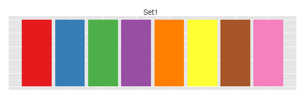

```{r setup, include=FALSE}
# common functions
# contributors should be aware of these and use them whenever possible.
source("common_functions.R")
```

# Preface {-}

This book aims to give introductions to some topics in statistical consulting. We hope that this will help audiences who have light background in statistics.

For contributors to this book, please refer to the Appendix for [General Guidelines], [Formatting Guidelines] and [Github tutorials][Git and GitHub: A Quick Tutorial].

For questions regarding the materials of this book, please [contact us](https://uwaterloo.ca/statistical-consulting-and-collaborative-research-unit/).

## Authors  {-}

- Trang Bui
- Meixi Chen
- Kelly Ramsay
- Feiyu Zhu

## Editors {-}

- Martin Lysy
- Glen McGee
- Joslin Goh


<!--chapter:end:index.Rmd-->

# Introduction to R 

*Author: Joslin Goh, Trang Bui*

*Last Updated: Feb 04, 2021*

--- 

## R and RStudio

[R](https://www.r-project.org/) is a software environment for statistical computing and graphics. Unlike other statistical software, R is free. Besides built-in functions, additional packages for solving many different statistical or application problems are made and maintained by contributors around the world. This makes R an attractive and popular statistical tool nowadays.

[RStudio](https://rstudio.com/products/rstudio/) is an integrated development environment ([IDE](https://en.wikipedia.org/wiki/Integrated_development_environment)) for R. It is easier to work with R using RStudio. 

```{r rintro-rstudio, fig.cap="The RStudio interface", echo=FALSE, fig.align='center'}
knitr::include_graphics("data/images/rintro-rstudio.png")
```

The interface of RStudio shown in Figure \@ref(fig:rintro-rstudio) contains four panes:

- [Source Editor], <!-- contains the R code files, where codes are written and edited. We can also run the R code from the Code Editor by selecting the code chunk and clicking <kbd>Run</kbd>. -->  
- Console, <!-- To run a single line of code, write the code in the R Console and press <kbd>Enter</kbd>. The printed results of the code are also shown in the R Console.  --> 
- Workspace Browser, and <!-- consists of (1) the Environment pane that shows the objects we are working with, and (2) the History pane that shows codes that were executed previously.-->
- Files (and Plots, Packages, Help, and Viewer). <!-- pane shows outputs such as plots or files created with the R code. It also helps with the management of packages or files required for the codes.-->

The four panes can be positioned differently based on personal preference. Figure \@ref(fig:rintro-rstudio) shows the default position. In this section, we will mainly be using the Source Editor and Console panes. Readers are encouraged to refer to other [resources](https://robwschlegel.github.io/Intro_R_Workshop/rstudio.html#the-panes-of-rstudio) on the use of other panes.

## Basic R

### Calculating with R {#rintro-calculate}

In its simplest form, R can be used as a calculator. In the R Console area, type:
```{r rintro-basic-sum, echo = TRUE, eval = FALSE}
1 + 2
```
The following will be printed in the R Console area:
```{r rintro-basic-sum-result, echo = FALSE, eval = TRUE, comment = NA}
1 + 2
```

Subtraction can be done in a similar way:
```{r rintro-basic-subtract, echo = TRUE, eval = TRUE, comment = NA}
5 - 10
```

Other basic operations such as multiplication, division, and powers are also included.
```{r rintro-basic-operations, echo = TRUE, comment = NA}
9 * 26

100 / 7.5

2^3
```

Some basic operations involve built-in functions in R. For example,

- Square root:
    ```{r rintro-basic-squareroot, echo = TRUE, eval = TRUE, comment = NA}
sqrt(25)
    ```
- Logarithm:
    ```{r rintro-basic-log10, echo = TRUE, eval = TRUE, comment = NA}
log(10, base = 10)
    ```
- Natural logarithm:
    ```{r rintro-basic-log, echo = TRUE, eval = TRUE, comment = NA}
log(10)
    ```

### Variables

Variables are useful when they need to be used repeatedly or to be recalled in the future. 

For example, suppose we are interested in evaluating
$$
\frac{e^{1-9.2315468}}{1-e^{1-9.2315468}},
$$
we can store the repeated value $9.2315468$ as a variable before performing the calculation. 

To store the value as the variable $x$, we can type
```{r rintro-basic-variable-assign, echo = TRUE, eval = TRUE, comment = NA}
x <- 9.2315468
```

Note that:

- In the Console pane, nothing is returned.
- In the Environment tab under the Workspace Browser pane, $x$ appears together with the value it represents. This shows that the current workspace recognizes $x$ as $9.2315468$.
- Now if we try typing $x$ in the Console, we will see the value it represents.
    ```{r rintro-basic-variable-result, echo = TRUE, eval = TRUE, comment = NA}
x
    ```

Back to our example, we wanted to evaluate
$$
\frac{e^{1-9.2315468}}{1-e^{1-9.2315468}},
$$
Since $x = 9.2315468$ is in our work environment, we can now type
```{r rintro-basic-variable-calculate, echo = TRUE, eval = TRUE, comment = NA}
exp(1 - x) / (1 - exp(1 - x))
```

In R, there are built-in variables, which are called default variables in R. The number $\pi$ is recognized as `pi`. Another default variable is the imaginary number, i.e $\sqrt{-1}$, which is recorded as `i` in R. 

### Vectors

Oftentimes, we encounter sequences of numbers during data analysis. For example, 
the height of 10 students, the grades of the ECON 101 students in the Fall term, the age of the attendees, etc.

In R, sequences of numbers can be recorded as vectors. 

Suppose there are five people in a class. The ages of the people in the class are:
$$
18, 21, 19, 20, 21
$$
We can create a vector for our record as below.
```{r rintro-basic-vector, echo = TRUE, eval = FALSE, comment = NA}
age <- c(18, 21, 19, 20, 21)
```
In the Workspace Browser pane, we can see the variable `age` with the values that we have given. And if we type `age` in the Console pane, we get these values printed in the Console.

Vectors may not appear to be useful for many since most of the popular functions are ready for use. But for those intending to create their own R functions, it is important to understand how to create and manipulate vectors. Many [comparators and logical operators](https://www.statmethods.net/management/operators.html) such as those discussed in Section [1.2.1](#rintro-calculate) work on both vectors and scalars. These calculations will be element-wise. <!--- For example, 
```{r rintro-basic-vector-calculate, echo = TRUE, eval = FALSE, comment = NA}
age * 2
log(age)
x <- c(0, 1, 2, 3, 4, 5)
age - x
```
---> 

## Basic Data Analysis Workflow

### Reading Data into R

#### Setting Working Directory

To start, it is important to inform R the directory that the data file is stored. For Mac/Windows users of RStudio, choose <kbd>Session</kbd> > <kbd>Set Working Directory</kbd> > <kbd>Choose Directory</kbd>. 

The function `setwd()` can also be used to set the working directory if the directory string is available. For example,
```{r rintro-data-setwd, echo = TRUE, eval = FALSE, comment = NA}
setwd("D:/")
```
will set the working directory to "D:/".

#### Importing the Data

In the real world, data are recorded in different formats such as Excel spreadsheet (`xls`), Comma Separated Values (`csv`) or Text (`txt`). Each row of a data file is an observation while each column is a variable or a feature. 

Data are imported into the R Environment using functions such as `read.csv()` and `read.table()`. Imported data are stored as a data frame object. In this section, we will look at two data sets: [`caliRain.csv`](data/caliRain.csv) and [`drinks.csv`](data/drinks.csv).

<!-- `r embed_data_file("data/caliRain.csv", text = "caliRain.csv")` and `r embed_data_file("data/drinks.csv", text = "drinks.csv")`.  -->

Suppose we saved the data sets in a subfolder called `data` in the working directory. We can import both data sets `caliRain.csv` and `drinks.csv` into the R environment and save them as data frames called `drinks_df` and `rain_df` respectively.
```{r rintro-data-import, echo=TRUE, eval=TRUE, comment = NA}
drinks_df <- read.csv("data/drinks.csv")
rain_df <- read.csv("data/caliRain.csv")
```

#### A Look at the Data 

It is important to take a look at the data set imported into the environment before performing the analysis. To view `rain_df` as a table, 
```{r rintro-data-view, echo=TRUE, eval=FALSE, comment = NA}
View(rain_df)
```
The function `head()` can also show the first few rows of the data set.  
```{r rintro-data-head, echo=TRUE, eval=TRUE, comment = NA}
head(rain_df)
```

The `caliRain.csv` file contains daily rainfall recorded at numerous meteorological stations monitored by the state of California. The variables recorded are:
  
- `STATION`: Name of the station,
- `PRECIP`: precipitation (inches),
- `ALTITUDE`: altitude (feet),
- `LATITUDE`: latitude (feet),
- `DISTANCE`: distance to the Pacific Ocean (miles), and
- `SHADOW`: slope face (1: Westward, 2:Leeward).

The variables `STATION` and `SHADOW` are categorical variables, whereas the remaining are continuous variables. 

#### Accessing the Data Frame 

Oftentimes, we are interested to access an individual column (or variable) within the data frame. For example, if we are interested in the `PRECIP` variable in the data set `caliRain.csv` (which is now stored as `rain_df`). There are two ways to access the column:

- Use the dollar sign followed by the name of the variable.
    ```{r rintro-data-dollar, echo=TRUE, eval=TRUE, comment = NA}
rain_df$PRECIP
    ```
- Use the number of the column in the data set. 
    ```{r rintro-data-col, echo=TRUE, eval=TRUE, comment = NA}
rain_df[, 2]
    ```

Similarly, there are times we want to investigate a particular row (or observation). Suppose we are interested in the 10th observation, type
```{r rintro-data-row, echo=TRUE, eval=TRUE, comment = NA}
rain_df[10, ]
```

We can also access a specific cell in the data. If we want to access the precipitation of the 5th observation, we can do either one of the following: 
```{r rintro-data-cell, echo=TRUE, eval=FALSE, comment = NA}
rain_df$PRECIP[5]
rain_df[5, 2]
```

Accessing a random variable, an observation or a specific value coming from observation are all useful for data management and manipulation purpose. 

#### Modifying the Data Frame

Sometimes, we want to make changes to the data frame such as

- make changes to existing records,
- add new observations or variables, or
- remove outliers from the data set.

If we want to change the existing records, we need to identify which records we are interested to change.

- a variable, i.e. a column, or 
- a specific observation.

##### Modifying a Variable

To modify a variable, we need to 

- identify the name or the column of the variable to access it in the data frame,
- decide on the modification or conversion, and 
- decide on how to store the new variable. 

We recommend storing the conversion as a new variable in the data frame to avoid confusion.

Suppose we are interested to analyze `DISTANCE` in meters ($1 \tx{ ft} = 0.3048 \tx{ m}$). We can make the conversion and save it as a new column called `DISTANCE_M` in the data set. 
```{r rintro-data-modcol, echo=TRUE, eval=TRUE,comment=NA}
rain_df$DISTANCE_M <- rain_df$DISTANCE * 0.3048
```

##### Modifying a Specific Observation

To modify a specific observation, we need to

- identify how to access the variable in the data frame,
- decide on the modification, and 
- decide on how to store the new variable. 

Suppose the distance for \texttt{Eureka} station is entered incorrectly and is supposed to be 1.5 feet instead. To replace this value, type
```{r rintro-data-modcell, echo=TRUE, eval=TRUE,comment=NA}
rain_df$DISTANCE[1] <- 1.5
```

##### Removing Records

To remove an entire column from a data frame, 
```{r rintro-data-rmcol, echo=TRUE, eval=FALSE,comment=NA}
rain_df <- rain_df[, -COLUMN_NUMBER]
```

To remove an entire row from a data frame, 
```{r rintro-data-rmrow, echo=TRUE, eval=FALSE,comment=NA}
rain_df <- rain_df[-ROW_NUMBER, ]
```

This way we re-store `rain_df` with the new data frame `rain_df` where its row/column has been removed.

#### Data Structure

The structure that R stores the data can be viewed using the function `str()`.   
```{r rintro-data-str, echo=TRUE, eval=TRUE, comment = NA}
str(rain_df)
```
Here, the variable `SHADOW` is recorded as a numeric value. This is not an accurate depiction of the data set. 

To ensure the analysis can be done properly, we need to convert the values in `SHADOW` into categorical values in the data set. To do so, we use the function `factor()`.
```{r rintro-data-factor, echo=TRUE, eval=TRUE, comment = NA}
rain_df$SHADOW <- factor(rain_df$SHADOW,
  levels = c("1", "2"),
  labels = c("Westward", "Leeward")
)
```
Here, the numerical values 1 and 2 are set to “Westward” and “Leeward”, respectively. 

Now, when we check the structure of the data set after the transformation, the variable `SHADOW` is now stored as a categorical variable (or factor).
```{r rintro-data-factor-str, echo=TRUE, eval=TRUE, comment = NA}
str(rain_df)
```

### Descriptive Statistics

We will use the `PRECIP` variable to demonstrate how common statistics are computed.

- [Mean](https://en.wikipedia.org/wiki/Mean) or average of a sequence of numbers can be obtained using the function `mean()`.
    ```{r rintro-data-mean, echo=TRUE, eval=TRUE, comment=NA}
mean(rain_df$PRECIP)
    ```
- [Median](https://en.wikipedia.org/wiki/Median) of a sequence of numbers can be obtained using the function `median()`.
    ```{r rintro-data-median, echo=TRUE, eval=TRUE, comment=NA}
median(rain_df$PRECIP)
    ```
- [Variance and standard deviation](https://en.wikipedia.org/wiki/Variance) of a sequence of numbers can be obtained using the functions `var()` and `sd()` respectively.
    ```{r rintro-data-var, echo=TRUE, eval=TRUE, comment=NA}
var(rain_df$PRECIP)
sd(rain_df$PRECIP)
    ```
- The minimum and maximum of a set of numbers can be obtained through functions `min()` and `max()`. 
    ```{r rintro-data-minmax, echo=TRUE, eval=TRUE, comment=NA}
min(rain_df$PRECIP)
max(rain_df$PRECIP)
    ```
    The function `range()` also shows the minimum and maximum values.
    ```{r rintro-data-range, echo=TRUE, eval=TRUE, comment=NA}
range(rain_df$PRECIP)
    ```
    
### Data Visualization

There are a wide variety of plots that can be created using R, but we will focus on some of our favorites:

- bar graphs: show the distribution of categorical variables,
- boxplots: show the five-number summaries of continuous variables, and
- histograms: show the distribution of continuous variables.

#### Categorical Variables

In order to create bar graphs, we need to summarize data using tables.

The numerical summary of a categorical variable are usually summarized in a table:
```{r rintro-data-table-shadow, echo=TRUE, eval=TRUE, comment=NA}
count_of_shadow <- table(rain_df$SHADOW)
count_of_shadow
```

A cross-tabulation table (or [contingency table](https://en.wikipedia.org/wiki/Contingency_table)) can also be done. Suppose we are interested to create cross-tab for the variables `hasMilk` and `temp` in the `drinks_df`, we can do the following:
```{r rintro-data-table-milk, echo=TRUE, eval=TRUE, comment=NA}
table_of_milk_by_temp <- table(
  drinks_df$hasMilk,
  drinks_df$temp
)
table_of_milk_by_temp
```

Sometimes it is more useful to report the proportions, which can be converted into percentages. To do so, we use the function `prop.table()`.
```{r rintro-data-table-shadow-prop, echo=TRUE, eval=TRUE, comment=NA}
prop.table(count_of_shadow)
```

<!--- The proportions can be converted into percentages, and round the values to 2 decimal places using
```{r rintro-data-table-shadow-per, echo=TRUE, eval=TRUE, comment=NA}
round(100 * prop.table(count_of_shadow), 2) 
```
--->

For a contingency table, the default `prop.table()` function will output the proportions based on the entire data set.
```{r rintro-data-table-milk-prop, echo=TRUE, eval=TRUE, comment=NA}
prop.table(table_of_milk_by_temp)
```

Suppose we are interested in the percentages of the hot drinks that contain milk, we will want to report the proportion by column (`Temperature`).
```{r rintro-data-table-milk-prop-col, echo=TRUE, eval=TRUE, comment=NA}
prop.table(table_of_milk_by_temp, 2)
```
These values are the proportions of drinks which contains milk (or not) conditioning on whether the drink is cold or hot, i.e., the values are normalized by the columns. 

#### Bar Graphs

[Bar graphs](https://www.statmethods.net/graphs/bar.html) are commonly used to visualize categorical variables. We can make a bar graph from the count table using the function `barplot()` in R.

```{r rintro-data-barplot, echo=TRUE, eval=TRUE, fig.height=4.5}
barplot(count_of_shadow,
  main = "Distribution of shadow",
  xlab = "Shadow", ylab = "Frequency"
)
```

#### Boxplots

The [boxplot](https://en.wikipedia.org/wiki/Box_plot) is a visual representation of the five-number summary that can give us a sense of the distribution of the variable.

- minimum,
- first quartile, $Q_1$,
- second quartile, i.e., median,
- third quartile, $Q_3$, and
- maximum.

Potential outliers are shown as dots outside the boxplots.

The boxplot of `PRECIP` shows some potential outliers.

```{r rintro-data-boxplot, echo=TRUE, eval=TRUE, fig.height=5}
boxplot(rain_df$PRECIP,
  main = "Precipitation",
  ylab = "Inches"
)
```

Side-by-side boxplots are commonly used to visualize the relationship between a continuous variable and a categorical variable. The following is the boxplot of the precipitation by shadow. 

```{r rintro-data-boxplot-side, echo=TRUE, eval=TRUE, fig.height=5}
boxplot(rain_df$PRECIP ~ rain_df$SHADOW,
  main = "Precipitation",
  ylab = "Inches"
)
```

In the side-by-side boxplots, notice that there are no potential outliers. Compared to the whole data, certain observations can be considered as outliers. But if we group the data by `SHADOW`, the data are not outliers in their groups. 

#### Histograms

[Histograms](https://en.wikipedia.org/wiki/Histogram) are commonly used to visualize the distribution of continuous variables. When looking at histograms, pay attention to

- the shape: symmetric vs asymmetric,
- the center, and
- the spread.

To plot precipitation in a histogram,
```{r rintro-data-histogram, echo=TRUE, eval=TRUE, fig.height=5}
hist(rain_df$PRECIP,
  main = "Distribution of precipitation",
  xlab = "Precipitation", ylab = "Inches"
)
```

Notice that there is no space in between the bars like in the bar graph. This is because the graph is for continuous variables instead of categorical variables.

#### Scatterplots

Scatterplots are used to visualize the relationship between two continuous variables.

```{r rintro-data-scatter, echo=TRUE, eval=TRUE, fig.height=6}
plot(rain_df$DISTANCE, rain_df$PRECIP,
  main = "Relationship: precipitation vs distance",
  xlab = "Distance (ft)", ylab = "Precipitation (inches)"
)
```
<!-- The scatterplot shows some precipitation records that are exceptionally high when the distance is at 0ft and 150ft.  -->

#### A Fancy Visualization Library

The `r cran_link("ggplot2")` library is a package created by Hadley Wickham. It offers a powerful language to create elegant graphs. A basic introduction of this package can be found in later [section][Introduction to ggplot2].

## Some Coding Tips

### Source Editor

It will be hard to remember and troublesome to re-write all the codes created in the Console every time, especially if there are many lines of code. The Source Editor allows us to write and save all codes into R code files. The lines of codes in the Source Editor are not processed by R unless executed by the user.

There are many ways the codes in the Code Editor can be executed: 

- Select the codes to process, click <kbd>Run</kbd> on the top right corner of the Source Editor.
- For Windows users, run the selected codes by pressing <kbd>Ctrl</kbd> + <kbd>Enter</kbd>. For Mac users, use <kbd>Command</kbd> + <kbd>Enter</kbd>.
- If we only want to run one line of code, place the cursor at the line of code, and use either one of the two ways mentioned above.

We recommend typing the codes in the Source Editor and then executing the codes. This way, there is a copy of what was done for future references.

### Commenting

Comment the codes! To do so, use \#.  R does not process anything behind \#. For example, 
```{r rintro-basic-comment, echo = TRUE, eval = FALSE, comment = NA}
# I am trying to like R!!!!
```

Everyone uses comments differently, but generally, comments are useful for understanding what is the code for and sometimes, the expected output.

To comment off a block of code, select the lines, and press <kbd>Ctrl</kbd> + <kbd>Shift</kbd> + <kbd>C</kbd>. Doing this a second time, the code section will be uncommented. 

In RStudio, if the following is done in the Code Editor:
```{r rintro-basic-comment-section, echo = TRUE, eval = FALSE, comment = NA}
# ----------------
# Try Me!
# ----------------
```
a triangle button will appear next to the line numbers at the beginning and end of the code section. Clicking the button will hide or unhide the section.

### Saving the Environment

When quitting R or RStudio, we can choose to save the Environment and History that we were working with in the files called `.RData` and `.RHistory` respectively. When we open the R code file next time, the two files will be automatically loaded. 
However, it is recommended not to save the Environment in the default way. Instead, start in a clean environment so that older objects do not remain in the environment any longer than they need to. If that happens, it can lead to unexpected results.

For those who want to save the Environment for future use, we recommend saving the Environment using the function `save.image()` rather than using the default files `.RData`. If we only want to save certain values, we can use the function `save()` and then load the saved Environment later using the `load()` function. 

### Installing and Loading Libraries

The R user community creates functions and data sets to share. They are called packages or libraries. The packages are free and can be installed as long as there is access to the Internet.

To install a library, say `r cran_link("ggplot2")`, you can either use the RStudio interface, or you can do it from the command line as follows:
```{r rintro-basic-install, echo=TRUE, eval=FALSE, comment=NA}
install.packages("ggplot2", dependencies=TRUE)
```
You only need to do this once in a while, e.g., when you install a new version of R.  Then, to use the package, include the following code at the beginning of the file:
```{r rintro-basic-require, echo=TRUE, eval=TRUE, comment=NA}
require(ggplot2)
```
This command needs to be run every time you want to use the package in a new R session.

### Good Coding Practices

- Start each program with a description of what it does.
- Load all required packages at the beginning.
- Consider the choice of working directory.
- Use comments to mark off sections of code.
- Put function definitions at the top of the file, or in a separate file if there are many.
- Name and style code consistently.
- Break code into small, discrete pieces.
- Factor out common operations rather than repeating them.
- Keep all of the source files for a project in one directory and use relative paths to access them.
- Have someone else review the code.
- Use version control.

## Getting Help

Before getting others for help, it is generally a good idea for you to try to help yourself.

### R Documentation

R has extensive documentation and resources for help. To read the documentation of a function, add a question mark before the name of a function. 

For example, to find out how to use the function `round()`, try
```{r rintro-basic-help, echo = TRUE, eval = FALSE, comment = NA}
?round
```
The description of the function and examples of how to use it will appear in the Files pane. In this example, as shown in the documentation, the function `round()` rounds the values in its first argument to the specified number of decimal places.

### Online Resources

There are a lot of basic functions or default variables that have not been mentioned so far. When analyzing data, we often encounter situations in which we need to use unknown or unfamiliar functions. In this case, we often rely on online search engines to find those functions. It is common practice to use online resources in real-world data analysis. Hence, readers are encouraged to explore the online resources.

<!--chapter:end:mod_intro_r.Rmd-->

# Introduction to ggplot2

*Author: Joslin Goh*

*Last Updated: Feb 09, 2021*

--- 

## Introduction

In this chapter, we assume that the readers have a basic understanding of R and RStudio. We have prepared a [chapter][Introduction to R] for those who need a quick introduction to R and RStudio.

`r cran_link("ggplot2")` is a data visualization package for R and RStudio. It is implemented based on @wilkinson12. The package can be installed and loaded using the command:
```{r visgg-load, echo = TRUE, eval = TRUE}
require("ggplot2")
```

The layers of a graph are shown in Figure \@ref(fig:visgg-grammar). In this chapter, we will show you how to build a plot layer by layer. 
```{r visgg-grammar, fig.cap="The layers of a graph", echo=FALSE, fig.align='center'}
knitr::include_graphics("data/images/visgg-grammarOfGraphics.png")
```

### Example Data Set

The examples shown in this chapter come from the data set `diamond` from the **ggplot2** package.
```{r visgg-data-load, echo = TRUE, eval = TRUE}
data("diamonds")
```

The `diamond` data set consists of the price, quality information, and physical measurements of different diamonds. The structure of the data set is displayed using the function `str()`.
```{r visgg-data-str, echo = TRUE, eval = TRUE, comment = NA}
str(diamonds)
```

The `diamond` data set consists of many data points. To simplify the illustration, we will only use a subset of the data. To sample a subset:
```{r visgg-data-sample, echo = TRUE, eval = TRUE, comment = NA}
set.seed(2019)
my.diamonds <- diamonds[sample(nrow(diamonds), 100), ]
```
The function `set.seed()` ensures that the sample is consistent and replicable. 

## Data

The first step to graphing is to specify the data set and decide what goes on the axes. 

Suppose we want to investigate how the price of a diamond behaves with respect to its carat. Then, the two variables (or columns) involved are `price` and `carat`. The x-axis is usually the explanatory variable and the y-axis is the dependent variable. In this scenario, `price` should be on the y-axis and `carat` on the x-axis. 

To initiate this graph in **ggplot2**, 
```{r visgg-plot-blank, echo = TRUE, eval = TRUE, comment = NA}
ggplot(my.diamonds, aes(x = carat, y = price))
```

The command creates a blank plot with no points or lines in it. The function does not assume the type of graphs it needs to produce unless it was told. Since this is the first (base) layer which will be used over and over again, it is best to save it as an object:
```{r visgg-plot-blank-save, echo = TRUE, eval = TRUE, comment = NA}
p <- ggplot(my.diamonds, aes(x = carat, y = price))
```

## Aesthetics

The first layer to be added onto the blank plot is a layer of the data points. In our case, we are interested to make a scatterplot that involves points that represent the data on the graph. The function `geom_point()` adds the necessary points onto the base layer.
```{r visgg-aes-point, echo = TRUE, eval = TRUE, comment = NA}
p + geom_point()
```

Each layer has its own components. For this layer, the common components include:

- `col`: the colour of the points specified using names, rgb specification or NA for transparent colour, 
- `size`: the size of the points specified in millimeters, and
- `shape`: the shape of the points.

### The Colour Component

A common way to specify the colour of the points is through the name of the colours. For example, `red`, `darkblue`, `magenta`, `chocolate` etc. A complete list of colours can be found [here](http://www.stat.columbia.edu/~tzheng/files/Rcolor.pdf).

Suppose we want the points to appear blue, use
```{r visgg-aes-point-blue, echo = TRUE, eval = TRUE, comment = NA}
p + geom_point(col = "blue")
```

When `col=NA`, the points will become transparent:
```{r visgg-plot-point-NA, echo = TRUE, eval = TRUE, comment = NA, warning=FALSE}
p + geom_point(col = NA)
```

#### Setting vs Mapping

So far, we **set** the colour of the points to a specific colour of our choice. In some cases, we prefer the colour to change based on the information from another column (usually categorical) in the data set.

For example, suppose we want the colour of the points on the graph to change based on `cut`, which has 5 categories: `Fair`, `Good`, `Very Good`, `Premium` and `Ideal`. 
```{r visgg-aes-col-cut, echo = TRUE, eval = TRUE, comment = NA}
p + geom_point(aes(col = cut))
```
This is called **mapping**.

#### Changing the Colour Palette

The choice of colours used in `aes()` is determined by the choice of the colour palette. When the choice is not mentioned, the default option is used. There are many online packages with pre-set palettes that you can use. We will show you the most common one known as `RColorBrewer`, which includes three types of colour palettes: sequential, diverging and qualitative.
```{r visgg-colbrew-display, echo=TRUE, eval=TRUE, comment=NA, fig.dim=c(8,10)}
require(RColorBrewer)
display.brewer.all()
```
<!--- For example, this is the "Set 1" colours from `RColorBrewer`.
```{r visgg-colbrew-set1, fig.cap="Set 1 from ColorBrewer", echo=FALSE, fig.align='center'}

```
--->

Suppose we want to use the `Set1` colour palette from `RColorBrewer` on the scatterplot created earlier, we can use the function `scale_colour_brewer()`:
```{r visgg-colbrew-set1-plot, echo = TRUE, eval = TRUE, comment = NA}
p1 <- p + geom_point(aes(col = cut))
p1 + scale_colour_brewer(palette = "Set1")
```

Readers can refer [here](https://www.datanovia.com/en/blog/the-a-z-of-rcolorbrewer-palette/) for more information about `RColorBrewer`.

Our preference for general purposes is to use a colour-blind friendly palette such as:
```{r visgg-colblind-grey, fig.cap="Colour blind friendly palette (grey)", echo=FALSE, fig.align='center'}
knitr::include_graphics("data/images/visgg-cbPalette-grey.png")
```

```{r visgg-colblind-black, fig.cap="Colour blind friendly palette (black)", echo=FALSE, fig.align='center'}
knitr::include_graphics("data/images/visgg-cbPalette.png")
```

Both palettes are not part of `RColorBrewer` and are extracted from [Cookbook for R](http://www.cookbook-r.com/Graphs/Colors_(ggplot2)/). They are coded as follow: 
```{r visgg-colblind-extract, echo = TRUE, eval = TRUE, comment = NA}
# colour blind friendly palette with grey
cbgPalette <- c(
  "#999999", "#E69F00", "#56B4E9", "#009E73",
  "#F0E442", "#0072B2", "#D55E00", "#CC79A7"
)
# colour blind friendly palette with black
cbbPalette <- c(
  "#000000", "#E69F00", "#56B4E9", "#009E73",
  "#F0E442", "#0072B2", "#D55E00", "#CC79A7"
)
```

Readers can also create palettes of their choice at [Color Brewer 2.0](https://colorbrewer2.org/). If you chose to create your own palette, we recommend having them included at the beginning of your R script. 

In order to use the colour blind friendly palettes that are not part of the `RColorBrewer` library, we need to use `scale_colour_manual` instead.
```{r visgg-colblind-black-plot, echo = TRUE, eval = TRUE, comment = NA}
p1 + scale_colour_manual(values = cbbPalette)
```

### The Size Component

Another component of `geom_point()` is the size of the points. They can be changed by either setting or mapping. The size of the points is specified in millimeters. 

#### Setting the Size 

To change the size of all the points in the plot to 5mm,
```{r visgg-aes-size-set, echo = TRUE, eval = TRUE, comment = NA}
p1 + geom_point(size = 5)
```

Here, we notice that

- All the points are larger in size.
- The colours of the points are the same. Recall that we have mapped the colours of the points to `cut` and saved it as `p1` earlier.
<!---```{r visgg-aes-col-save, echo = TRUE, eval = TRUE, comment = NA}
p1 <- p + geom_point(aes(col = cut))
    ```
--->

When `geom_point()` was called the second time, it overwrites the command to map the colours of the points.

So to change the colour and size at the same time, we can use
```{r visgg-aes-col-size, echo = TRUE, eval = TRUE, comment = NA}
p + geom_point(aes(col = cut), size = 5)
```

#### Mapping the Size

Similar to mapping the colour component, the sizes of the points can be mapped to a variable. 
```{r visgg-aes-size-map, echo = TRUE, eval = TRUE, comment = NA}
p1 + geom_point(aes(size = cut))
```

Notice in the previous graph that the points are in black colour but the legend still includes `cut`. This is because the mapping contradicts `p1` that was stored in such a way earlier:
```{r visgg-aes-size-exp2, echo = TRUE, eval = FALSE, comment = NA}
p1 <- p + geom_point(aes(col = cut))
```

The plot appears "incorrect" and there will be a lot of warnings. To map both colour and size properly, 
```{r visgg-aes-col-size-map, echo = TRUE, eval = TRUE, comment = NA}
p + geom_point(aes(col = cut, size = cut))
```

### The Shape Component

Another component to consider is the shape of the points, which are identified using numbers.
```{r visgg-aes-shape-list, fig.cap="Shapes", echo=FALSE, fig.align='center'}
knitr::include_graphics("data/images/visgg-ggplot2-shape-identity.png")
```

For example, we can set the shapes of the points to an inverted triangle. 
```{r visgg-aes-shape-invtri, echo = TRUE, eval = TRUE, comment = NA}
p + geom_point(shape = 6)
```

If we want to map the points to the `cut` of the diamonds, we can write
```{r visgg-aes-shape-cut, echo = TRUE, eval = TRUE, comment = NA, warning=FALSE}
p + geom_point(aes(shape = cut), size = 5)
```

You may have received a warning that the shape component is not recommended for ordinal variables such as `cut`. This is a recommendation. Usually, the shape component is used to better visualize nominal variables. It is the readers' choice to manipulate the shape component for better visual presentation.

To summarize,  we recommend including the choice of colour, size and shape in one call of `geom_point()` to minimize error. For example, 
```{r visgg-aes-summary, echo = TRUE, eval = FALSE, comment = NA, warning=FALSE}
p + geom_point(aes(col = cut, size = cut, shape = cut))
```

## Geometrics

Geometric objects perform the actual rendering of the layer and control the type of plot that you created. The common ones are: 

- `geom_point()` produces scatterplots,
- `geom_line()` produces line graphs, and
- `geom_bar()` produces bar plots. 


### Line Graphs

Previously we have been drawing scatterplots to draw the relationship between `carat` and `price`. We used `geom_point()`. What happens if we used `geom_line()`? 
```{r visgg-geo-line-plain, echo = TRUE, eval = TRUE, comment = NA}
p + geom_line()
```

#### Setting Colour, the Thickness and Type of Line

Similar to `geom_point()`, we can set the colour of the line to `red`.
```{r visgg-geo-line-col, echo = TRUE, eval = TRUE, comment = NA}
p + geom_line(col = "red")
```

The thickness of the line can also be changed. It is set to 1 by default, but we can change it to any decimal of our choice. The larger the number, the thicker the line. 
```{r visgg-geo-line-size, echo = TRUE, eval = TRUE, comment = NA}
p + geom_line(size = 1.5)
```

The default type of line is a solid line, which is also coded as `1`. There are a total of [12 types of lines](http://sape.inf.usi.ch/quick-reference/ggplot2/linetype), in which seven of them can also be referred to using numbers 0 to 6 instead of the string values. We can change the solid line into `dashed` as follow:
```{r visgg-geo-line-type, echo = TRUE, eval = TRUE, comment = NA}
p + geom_line(linetype = "dashed")
```

#### Multiple Lines

To draw multiple lines, the points must be grouped by a variable. Otherwise, all the points will be connected by a single line. Hence, when we create the base layer, we need to specify the `group` that we want to group the points into. Usually, the grouping is based on a categorical variable. 

Suppose we are interested to draw the lines according to `cut`. 
```{r visgg-geo-lines-plain, echo = TRUE, eval = TRUE, comment = NA}
p2 <- ggplot(my.diamonds, aes(x = carat, y = price, group = cut))
p2 + geom_line()
```

We can adjust the colour by the `group`.
```{r visgg-geo-lines-col, echo = FALSE, eval = TRUE, comment = NA}
ggplot(my.diamonds, aes(x = carat, y = price, group = cut)) +
  geom_line(aes(col = cut))
```
To map the colours of the lines to `cut`, there are two options:

- Option 1:
    ```{r visgg-geo-lines-col1, echo = TRUE, eval = FALSE, comment = NA}
ggplot(my.diamonds, aes(x = carat, y = price, group = cut)) +
  geom_line(aes(col = cut))
    ```
- Option 2:
    ```{r visgg-geo-lines-col2, echo = TRUE, eval = FALSE, comment = NA}
ggplot(my.diamonds, aes(
  x = carat, y = price, group = cut,
  col = cut
)) +
  geom_line()
    ```

Both options produce the exact same graph. However, we prefer Option 2 over Option 1 because we can manipulate the components of the line (and points) more efficiently when creating graphs that are more complex later on.

#### Lines with Points

It is no surprise that we can add points in a line graph:
```{r visgg-geo-line-points, echo = TRUE, eval = TRUE, comment = NA}
p + geom_line() + geom_point()
```
The appearance of the lines and points can be changed as discussed previously.

### Bar Plots

Bar plots are commonly used to graph categorical variables. 

Suppose we are interested in how the total price of diamonds is affected by the different `colour`. After laying down the base layer with `price` on the y-axis and `color` on the x-axis, we use the `geom_bar()` function to create the bars in the graph.
```{r visgg-geo-bar-plain, echo = TRUE, eval = TRUE, comment = NA}
ggplot(my.diamonds, aes(x = color, y = price)) +
  geom_bar(stat = "identity")
```

Notice that the x- and y-axes are similar to that of the scatterplots. The only difference is the use of `geom_bar()`. 

The colours of the bar can be mapped to the `color` variable by specifying the `fill` option.
```{r visgg-geo-bar-col, echo = TRUE, eval = TRUE, comment = NA}
ggplot(my.diamonds, aes(x = color, y = price, fill = color)) +
  geom_bar(stat = "identity")
```

## Others

It may be of interest to change

- x- and y-axes labels,
- title of the graph, and
- legends.

### Axes Labels

Similar to graphing in the `base` package, we can change the labels of the axes by adding the components as follow:

- x-axis: `xlab("name")`
- y-axis: `ylab("name")`

```{r visgg-lables, echo = TRUE, eval = TRUE, comment = NA}
p + geom_line(col = "red") +
  xlab("Price") + ylab("Carat")
```

### Title of the Graph

To add a title to the graph, we can use `ggtitle()`:
```{r visgg-title, echo = TRUE, eval = TRUE, comment = NA}
p + geom_line(col = "red") +
  xlab("Price") + ylab("Carat") +
  ggtitle("Relationship between price and carat")
```

The title is left-centered and can be adjusted through the "theme" layer which we will not cover here. In general, we prefer to not add a title to the graph because captions would be added in the final presentation of the data and results.

### Legends

There are two ways for changing the title and labels of the legend:

- modify the data frame directly, or
- use `scale_xxx_yyy()`. Refer [here](http://www.cookbook-r.com/Graphs/Legends_(ggplot2)/#with-fill-and-color) for the different combinations of `xxx` and `yyy`.

Suppose we want the legend to show the `cut` in different colours. Since the legend is related to the colour of the lines, `xxx` is `colour` and the variable is categorical, we set `yyy` to `discrete`:
```{r visgg-legend, echo = TRUE, eval = TRUE, comment = NA}
p + geom_line(aes(col = cut)) +
  scale_colour_discrete(
    name = "Cut of diamonds",
    breaks = c("Fair", "Good", "Very Good", "Premium", "Ideal"),
    labels = c("A", "B", "C", "D", "E")
  )
```


<!--chapter:end:mod_ggplot2.Rmd-->

# Introduction to Linear Regression

*Author: Ferris Zhu, Joslin Goh, Trang Bui, Glen McGee*

*Last Updated: Feb 09, 2021*

--- 

## Introduction

The goal of this chapter is to introduce linear regression, an important model which is widely used in data analysis. The reasons for its popularity are

- the model assumptions are often found satisfactory among many data sets; and 
- the interpretation of each parameter in the model is easy and clear.

When the assumptions of the linear regression model are satisfied, the model is powerful in terms of inference and interpretation.  

### List of R packages Used

In this chapter, we will be using the packages `r cran_link("wooldridge")`, `r cran_link("corrplot")`, `r cran_link("lmtest")`, and `r cran_link("MASS")`. 
<!-- Use the line `install.packages(c("wooldridge","corrplot","lmtest","MASS"))` to install required packages for this document. To install individual packages, use the line `install.packages("package name")`, e.g. `install.packages("corrplot")`. -->

```{r linreg-library, warning=FALSE, message=FALSE}
# load the required packages
library(wooldridge)
library(corrplot)
library(lmtest)
library(MASS)
```

### Motivating Example

Throughout this chapter, we will be considering the data set `econmath` from the R package **wooldridge**. 

We can first load the data set `econmath` to the working environment.
```{r linreg-data-load, warning=FALSE}
data("econmath") # load the data econmath
```
This data set contains information about students taking an economics class in college. The details can be found in the reference manual of the package. 

A data set is usually represented by a table of rows and columns. The rows represent individual observations and the column represents "features" or "factors" of the individual observations. The function `head()` provides the preview of the data set by printing out the first six rows of the data set. To see the whole data set, use the function `View()`.
```{r linreg-data-head}
head(econmath) # preview of the data set
```
In the data set `econmath`, the rows are students and the columns are "features" of these students, for example, age, work hours, study hours, high school GPA, etc. These "features" are called "variables".

The function `summary()` gives a brief summary of the data, including the minimum value, maximum value, the [mean and median](https://www.statisticshowto.com/probability-and-statistics/statistics-definitions/mean-median-mode/) of each variable in the data set. 
```{r linreg-data-summary}
summary(econmath)
```

Based on the information from this data set, we want to answer the question: "What factors are significantly associated with a student’s score in a college economics course?". To do this, we will try to find how the variable `score`, i.e., the final score in an economics course measured as a percentage, can be "explained" by other variables. Linear regression is a helpful statistical model to answer this question. 

The data set contains some missing data. In this chapter, we will only analyze the observations that are complete. Therefore, we will discard the data points with missing fields and gather them in a new data set `econ`.

```{r linreg-data-omitmissing}
econ <- econmath[complete.cases(econmath), ]
```

### Variables

- Dependent/Response/Outcome/Explained/Predicted Variable: This is the variable that we want to study, usually denoted as $y$ in linear regression models. In our case, the dependent variable is `score`. Linear regression is typically used to model *continuous* outcomes.

- Independent/Control/Explanatory/Covariate/Predictor Variables: They are factors which may influence the dependent variable, denoted as $X$ in linear models. These variables can be of different data types, *continuous* or *categorical*. 

- Continuous data type takes any value over a continuous range. We can have measurement units for it. In R, continuous data is usually defined as `num` or `int`. In the data set `econ`, there are variables that should be treated as continuous. These are `age` (years), `work` (hours worked per week), `study` (hours studying per week), `colgpa` (college GPA at the beginning of the semester), `hsgpa` (high school GPA), `acteng` (ACT English score), `actmth` (ACT math score), and `act` (ACT composite score). 

- Categorical data type only takes values over a finite set of values (levels), while continuous data type has infinite possible values over a continuous range. In the data set `econ`, there are variables that should be treated as categorical, such as `male` (gender of the student, only takes in 2 values, 0 for female and 1 for male), `mathscr` (math quiz score, only takes in 11 values from 0 to 1). However, R is treating all these variables as continuous. In fact, we can see how R defines each variable in the data set using the function `str()`.
    ```{r linreg-data-struc}
str(econ) # structure of the data set
    ```
To convert a variable into the categorical data type in R, we use function `factor()`.
    
- Binary variables are categorical variables that take in only 2 values, 1 or 0. In the data set `econ`, we have `male` (=1 if male), `econhs` (=1 if taken economics), `calculus` (=1 if taken calculus), `fathcoll` (=1 if father has BA), and `mothcoll` (=1 if mother has BA).
```{r linreg-data-factor}
econ$male <- factor(econ$male)
econ$econhs <- factor(econ$econhs)
econ$calculus <- factor(econ$calculus)
econ$fathcoll <- factor(econ$fathcoll)
econ$mothcoll <- factor(econ$mothcoll)
```

- Categorical variables with more than 2 levels: In the data set `econ`, there are two variables that indicate attendance: `attexc` (=1 if past attendance is excellent) and `attgood` (=1 if past attendance is good). It will make sense if we combine these two variables into one variable for attendance `att`(=2 if past attendance 'excellent'; =1 if past attendance 'good'; =0 if otherwise).

```{linreg-data-cate}
econ$att <- econ$attgood # 1 if past attendance is good
econ$att[econ$attexc == 1] <- 2 # 2 if past attendance is excellent
econ$att <- factor(econ$att) # turn att in to categorical variable
econ <- econ[, -c(13, 14)] # remove the attgood and attexc column
```
        
- Ordinal/likert scale: `mathscr` (math quiz score) has 11 levels, but these levels are ordered. For example, a score of 7 is better than a score of 4. So we need to order the levels for the variable `mathscr` using the argument `ordered = TRUE`.
```{r linreg-data-ord}
econ$mathscr <- factor(econ$mathscr, ordered = TRUE)
```

We can now check the structure of the new data set `econ`. Notice how it is different from the original `econmath` data set. The categorical variables are now treated as categorical (`Factor`) in R.  

```{r linreg-data-struc-cleaned}
str(econ)
```

## Simple Linear Regression {#linreg-slm}

Consider the case where we are interested to know how an independent variable $x$ is associated $y$. Suppose we have a *random* sample of size $n$ \{$(x_i, y_i)$: $i=1,\ldots, n$\} following the model:
$$
y_i = \beta_0 + \beta_1 x_i + \epsilon_i, \quad \epsilon_i \overset{iid}{\sim} \N(0, \sigma^2).
$$

In this model, the values of the independent variable $x$ in the data set $(x_1, \ldots, x_n)$ are fixed and known while the model parameters $\beta_0, \beta_1, \sigma$ are fixed but unknown.

Here, $\beta_0$ represents the average response for $y$ if the value of $x$ is 0, $\beta_1$ represents the average increase in $y$ for every one unit increase in $x$. Graphically, $\beta_0$ represents an intercept and $\beta_1$ a slope of a straight line. $\epsilon_i$'s, which are usually called the "errors", represent the part of $y$ that is not explained by $\beta_0$, $\beta_1$ and $x$. 

### Assumptions {#linreg-slm-assumption}

A simple linear regression model has the LINE assumptions.

- L-inearity: given the value $x_i$, the [expectation](https://en.wikipedia.org/wiki/Expected_value) of the response $y_i$ is a linear function 
    $$
\E(y_i|x_i) = \beta_0 + \beta_1 x_i.
    $$

- I-ndependence: the errors $\epsilon_i = y_i - \beta_0 - \beta_1 x_i$ are [independently](https://en.wikipedia.org/wiki/Independence_(probability_theory)) distributed. 

- N-ormality: the errors $\epsilon_i$ follow [normal distribution](https://en.wikipedia.org/wiki/Normal_distribution).

- E-qual variance: the errors $\epsilon_i$'s have mean zero and constant variance.

The I-N-E assumptions can be summarized with
    $$
\epsilon_i \overset{iid}{\sim} \N(0, \sigma^2).
    $$
Here, iid means [independently and identically distributed](https://en.wikipedia.org/wiki/Independent_and_identically_distributed_random_variables).

### Estimation {#linreg-slm-est}

In the simple linear model above, the coefficients $\beta_0$ and $\beta_1$ are unknown, so we need to estimate them. 

Suppose we are interested to know how a student's final score (`score`) changes if their college GPA (`colgpa`) increases/decreases. We can fit a simple linear regression model in R as follows:
```{r linreg-slm-fit, cache=TRUE}
slm <- lm(score ~ colgpa, data = econ)
```
Then we can get the estimates of the model coefficients $\beta_0$ and $\beta_1$ by
```{r linreg-slm-print}
slm
```

We can interpret this result as "the average difference in final score comparing student's gpa of 1 point difference is estimated as 14.32 points".

### Inference

However, the above values of $\beta_0$ and $\beta_1$ are only estimates, they depend on the data we collect and are not necessarily the true parameters, i.e., they are inherently uncertain. We will refer to these as $\hat{\beta}_0$, $\hat{\beta}_1$. How can we quantify this uncertainty and evaluate these estimates?

#### Variances

[Variance](https://en.wikipedia.org/wiki/Variance) gives information about the uncertainty of a variable. And [covariance](https://en.wikipedia.org/wiki/Covariance) measures the joint variability of two variables. As explained above, $\hat{\beta}_0$ and $\hat{\beta}_1$ are subject to variabilities, hence, we can use variance and covariance to quantify these variabilities.  

In fact, R gives the estimates of the variances and covariance of $\hat{\beta}_0$ and $\hat{\beta}_1$ by the function `vcov()`. This function will give a matrix where the diagonals are the estimated variances and the off-diagonals are the estimated covariance.
```{r linreg-slm-vcov}
vcov(slm)
```
Here, the estimated variance of $\hat{\beta}_0$ and $\hat{\beta}_1$ are $4.072$ and $0.497$ respectively, and their estimated covariance is $-1.397$. 

[Standard error](https://en.wikipedia.org/wiki/Standard_error) is the square root of the variance which also gives us information about the variabilities of the estimated parameters. Hence, it is usually reported with the estimated parameters. In R, the standard errors are included in the summary of the simple linear model with the function `summary()`. For example, in model `slm`, the standard error of $\hat{\beta}_1$ is 0.7051. 

```{r linreg-slm-summary}
summary(slm)
```


#### Hypothesis Testing {#linreg-slm-hyp}

Even though we have obtained an estimate for $\beta_1$, it is just an estimate that depends on the data set that we have. If we want to answer the question "do we have evidence that college GPA is associated with the final score?", we need to do [hypothesis testing](https://en.wikipedia.org/wiki/Statistical_hypothesis_testing].

If we want to find evidence that college GPA is associated with the final score, equivalently we want to challenge the hypothesis that there is no association between college GPA and final score. This is called the [null hypothesis](https://en.wikipedia.org/wiki/Exclusion_of_the_null_hypothesis) $H_0 : \beta_1 = 0$, i.e., there is no association between `colgpa` and `score`. In statistical hypothesis testing, we consider an [alternative hypothesis](https://en.wikipedia.org/wiki/Alternative_hypothesis) together with the null hypothesis, such that evidence supporting the alternative hypothesis is evidence against the null hypothesis. In this case we consider a [two-sided](https://en.wikipedia.org/wiki/One-_and_two-tailed_tests) alternative hypothesis $H_1: \beta_1 \ne 0$.

Then, to test this null hypothesis, we use the test statistics:
$$
t_1 = \frac{\hat\beta_1}{\std(\hat{\beta}_1)},
$$
which is shown to follow the [$t$ distribution](https://en.wikipedia.org/wiki/Student%27s_t-distribution) with $n-2$ degrees of freedom under the null hypothesis $H_0: \beta_1 = 0$. We can get $t_1$ from the model fit `slm` in Section [3.2.2](#linreg-slm-est). 

If the value of this test statistic $t_1$ is extreme compared to the $t(n-2)$ distribution, then the null hypothesis $H_0$ is less likely to be true. We can try to quantify this by calculating the probability that the $t(n-2)$ distribution has values greater than the one we have based on our data set $t_1$:
$$
p = \Pr(t(n-2) > t_1),
$$
which is called the $p$-value of the test.

Finally, we can choose a level of significance $\alpha$, usually 0.05 (5\%), and compare the $p$-value with $\alpha$. If $p < \alpha$, we reject the null hypothesis $H_0: \beta_1 = 0$ at $\alpha = 5\%$ significance level.

In R, we can easily do this hypothesis testing procedure by looking at the summary of the model. 
```{r linreg-slm-summary2}
summary(slm)
```
We can see that, the $p$-value for $\hat{\beta}_1$ is $< 2e-16$, which is less than $\alpha = 0.05$. Hence, we can declare that the association of `colgpa` with `score` is significant, or equivalently, we *reject* the null hypothesis that there is no association between `colgpa` and `score` at $5\%$ significance level.

If on the contrary, the $p$-value for $\hat{\beta}_1$ is $> \alpha = 0.05$, we *do not reject* the null hypothesis that there is no association between `colgpa` and `score` at $5\%$ significance level, or the association between `colgpa` and `score` is not significant at $5\%$ level.

#### Confidence Interval {#linreg-slm-conf}

The [confidence interval](https://en.wikipedia.org/wiki/Confidence_interval) of $\beta_1$ is the interval that the true value of $\beta_1$ lies in with a specified percentage of chance. 

The ($1-\alpha$)100\% confidence interval for $\beta_1$, is given by
$$
\left( \hat\beta_1 + t(n-2)_{\frac{\alpha}{2}} \std(\hat{\beta}_1),\quad \hat\beta_1 + t(n-2)_{1 - \frac{\alpha}{2}} \std(\hat{\beta}_1) \right),
$$
where $t(n-2)_q$ is the $q$ [quantile](https://en.wikipedia.org/wiki/Quantile) of the $t$ distribution with $n-2$ degrees of freedom. Confidence interval for $\beta_0$ is calculated similarly.

To be precise, *repeating* the experiment, or data collection will give us different data, and different confidence intervals. But if we construct the confidence intervals in the above way, 95\% of these intervals will contain the true values of $\beta_1$ (or $\beta_0$).

In R, we can get the confidence intervals for the parameters by using the function `confint()`. For example, 95\% confidence intervals of $\beta_0$ and $\beta_1$ from the above `slm` model are

```{r linreg-slm-confint}
confint(slm, level = 0.95)
```

### Model Checking {#linreg-slm-modelcheck}

After having fitted the model, it is important that we check that the [assumptions](#linreg-slm-assumption) of our model are satisfied in order to verify that our model is valid. 

#### Linear Trend

To check the linear trend in the data, i.e. $\E(y|x) = \beta_0 + \beta_1 x$, we can use scatterplot with the fitted line or residuals vs fitted values. In the perfect case, you should see a clear linear trend.

    ```{r linreg-slm-perfectdata, cache = TRUE}
n <- nrow(econ)
x <- econ$colgpa
y <- econ$score
# we can first create a perfect linear model as a contrast
x0 <- rnorm(n) # predictors
eps <- rnorm(n) # errors
y0 <- 1 + x0 + eps
plm <- lm(y0 ~ x0)
    ```

The linear trend plot of our simple linear model looks like the below.

```{r linreg-slm-plot-linearity}
plot(x, y, pch = 16, cex = .7, xlab = "x", ylab = "y", main = "Simple Linear Model")
abline(slm, col = "red")
```

The linear trend plot of the perfect linear model looks like the below.

```{r linreg-slm-plot-linearity-perfect}
plot(x0, y0, pch = 16, cex = .7, xlab = "x", ylab = "y", main = "Perfect Linear Model")
abline(plm, col = "red")
```

If the linearity assumption is not satisfied, the estimators are no longer [unbiased](https://en.wikipedia.org/wiki/Bias_of_an_estimator). In another word, as long as the linearity assumption is satisfied, the estimators we obtained from the linear regression model are unbiased. 

#### Independent Errors

It is not always possible to assess the independence assumption in practice. If data are serially correlated (e.g., measurements over time, say), we may be able to identify any violation of the independence assumption by plotting residuals against their natural ordering. If there is no serial correlation, we should see a horizontal band around 0 with no specific pattern.

The residual plot of our simple linear model looks like the below.
```{r linreg-slm-plot-residual}
plot(resid(slm))
```

The linear trend plot of the perfect linear model looks like the below.

```{r linreg-slm-plot-residual-perfect}
plot(resid(plm))
```

There are situations where the independence of residuals assumption is not valid. For example, if the economic class has several different sections, then the final scores of the students in each section may be correlated with each other. In this case, plotting the residuals against their order of appearance in the data set may not be sufficient to help us detect the violation of residual independence. Subject matter expertise may be necessary to determine whether observations are independent, given covariates.

If the independence of residuals assumption is invalid, the estimators are still unbiased if the linearity assumption is satisfied. However, standard errors, confidence intervals, and $p$-values are no longer valid. If there is error correlation, consider adding variables that can explain the correlation. In the above example, we can add `section` to the linear regression model. Consult [Multiple linear regression](#linreg-mlm) section for linear regression with more than one variable.

#### Normality

To check the normality of residuals, i.e. $\epsilon_i \sim \N(0, \sigma^2)$, we can plot a histogram of standardized residuals or a QQ-plot. In the perfect case, you should see a normal histogram and a straight QQ line.

The residual histogram of our simple linear model looks like the below.

```{r linreg-slm-plot-histogram}
zres <- studres(slm)
nbr <- 40 # may dramatically affect the histogram
hist(zres,
  breaks = nbr, # number of bins
  freq = FALSE, # make area under hist = 1 (as opposed to counts)
  xlab = "Standardized Residuals", main = "Simple Linear Model"
)
# add a standard normal curve for reference
curve(dnorm, add = TRUE, col = "red")
```

The residual histogram of the perfect linear model looks like the below.

```{r linreg-slm-plot-histogram-perfect}
hist(eps,
  breaks = nbr, # number of bins
  freq = FALSE, # make area under hist = 1 (as opposed to counts)
  xlab = "Standardized Residuals", main = "Perfect Linear Model"
)
# add a standard normal curve for reference
curve(dnorm, add = TRUE, col = "red")
```

The QQ plot of our simple linear model looks like the below.

```{r linreg-slm-plot-qq}
qqnorm(zres, main = "Simple Linear Model", pch = 16, cex = .7)
qqline(zres, col = "red", lty = 2)
```

The QQ plot of the perfect linear model looks like the below.

```{r linreg-slm-plot-qq-perfect}
qqnorm(eps, main = "Perfect Linear Model", pch = 16, cex = .7)
qqline(eps, col = "red", lty = 2)
```

If the normality assumption does not hold and the sample is small, the confidence intervals and $p$-values results are no longer valid. However, in large samples, they will be approximately valid. 

#### Conditional Homoscedasticity

To check conditional homoscedasticity (constant variance), i.e. $\var(\epsilon | x) = \sigma^2$, we can plot a scatterplot of residuals and fitted values. In the perfect case, you should see a horizontal band of residuals evenly distributed along with the fitted values.

The residuals vs. fitted plot of our simple linear model looks like the below.

```{r linreg-slm-plot-fitted}
plot(
  x = predict(slm), y = residuals(slm), # R way of calculating these
  pch = 16, cex = .7,
  xlab = "Fitted Values", ylab = "Residuals", main = "Simple Linear Model"
)
abline(h = 0, col = "red", lty = 2) # add horizontal line
```

The residuals vs. fitted plot of the perfect linear model looks like the below.

```{r linreg-slm-plot-fitted-perfect}
plot(
  x = predict(plm), y = residuals(plm), # R way of calculating these
  pch = 16, cex = .7,
  xlab = "Fitted Values", ylab = "Residuals", main = "Perfect Linear Model"
)
abline(h = 0, col = "red", lty = 2) # add horizontal line
```

##### Power Transformation {#linreg-powertransform}

In R, we can plot the residuals vs. fitted values and the QQ plots by the simple command below.
```{r linreg-slm-plot-fitted-qq}
plot(slm, which = c(1, 2), ask = FALSE)
```

From the plots, the normality assumption is satisfied since the points form a relatively good straight line. However, the residuals vs. fitted plot shows that the variability of our residuals seems to decrease as the fitted values increase, instead of having a constant variability. This is an example of the [heteroskedasticity](https://en.wikipedia.org/wiki/Heteroscedasticity) problem. 

One reason for the problem is that there may be more variables that can explain `score` instead of only `colgpa`. We can try to solve this by fitting a [multiple linear regression](#linreg-mlm) model.

Another solution to this problem is to use [power transformation](https://en.wikipedia.org/wiki/Power_transform). In R, we can find the best power transformation for the dependent variable using the `boxcox()` function.
```{r linreg-slm-boxcox}
tmp <- boxcox(slm)
```
The best power transformation has the power
```{r linreg-slm-best-power}
tmp$x[which.max(tmp$y)]
```
So we can transform `score` to `score^2` so that we have a model that satisfies the homoscedasticity assumption. 
```{r linreg-slm-transform-fit, cache=TRUE}
slm2 <- lm(score^2 ~ colgpa, data = econ)
summary(slm2)
```
```{r linreg-slm-transform-plot}
plot(slm2, which = c(1, 2), ask = FALSE)
```
Now we can see that we have a better horizontal band of residuals. However, be aware that with power transformation, the interpretation of the model is different. Each unit increase in `colgpa` will lead to 1992.70 increase in the square of economics score, `score^2`, not `score`. 

In practice, we don't always want to do power transformation because this may not answer the scientific question you want to answer. For example, you want to know the relationship of `colgpa` to the `score`, not `score^2`. 

If the homoscedasticity assumption is not satisfied, then standard errors, confidence intervals, and $p$-values are no longer valid. Besides transforming variables, we can use techniques such as [boostrapping](https://en.wikipedia.org/wiki/Bootstrapping_(statistics)) or [weighted least squares](https://en.wikipedia.org/wiki/Weighted_least_squares) to estimate the variabilities of our estimates.  

### Simple Linear Regression on a Binary Covariate

Consider the example where $y =$ `score` and $x =$ `econhs`. The covariate `econhs` is a binary variable with: 
- Group I: `econhs` $= 1$, students who have taken economics in high school; 
- Group II: `econhs` $= 0$, students who have not taken economics in high school.

We can fit a simple linear regression model:
```{r linreg-slm-binary, cache=TRUE}
slm3 <- lm(score ~ econhs, data = econ)
summary(slm3)
```
The result of simple linear regression gives us an estimate of $-0.9519$ for the linear coefficient of $\hat{\beta}_1$, i.e., the mean final score will be $0.951$ less if the student has taken high economics in high school. The $p$-value associated with this estimate is 0.326, which is greater than $\alpha = 0.05$, we conclude that `econhs` is not significant at $5\%$, or we do not reject the null hypothesis that `econhs` does not have any association with `score` at 5\% of significance level.

When the independent variable is a binary variable, the simple linear regression is equivalent to a [two-sample $t$-test](https://en.wikipedia.org/wiki/Student%27s_t-test#Independent_two-sample_t-test) with equal variance assumption or a [one-way ANOVA](https://en.wikipedia.org/wiki/One-way_analysis_of_variance) with two levels.

We can run a $t$-test of the scores between students who took economics class in high school and students who did not
```{r linreg-slm-ttest}
t.test(econ$score[econ$econhs == 1], econ$score[econ$econhs == 0],
  var.equal = TRUE
)
```
or run a anova
```{r linreg-slm-anova}
summary(aov(score ~ econhs, data = econ))
```

We can see that the $p$-values of these tests are all equal at 0.326, i.e., these procedures are equivalent.

While $t$-test is only equivalent to simple linear regression on one binary covariate, ANOVA is also equivalent to [multiple linear regression](#linreg-mlm) in which the variables are categorical.

In particular, Analysis of Variance ([ANOVA](https://en.wikipedia.org/wiki/Analysis_of_variance)) is a collection of statistical models and their associated procedures (such as "variation" among and between groups) used to analyze the differences among group means. In ANOVA we have a categorical variable with different groups, and we attempt to determine whether the measurement of a continuous variable differs between groups. On the other hand, linear regression tends to assess the relationship between a continuous response variable and one or multiple explanatory variables. Problems of ANOVA are in fact problems of linear regression in which the variables are categorical. In other words, the study of ANOVA can be placed within the framework of linear models. ANOVA and linear regression are essentially equivalent when the two models test against the same hypotheses and use the same categorical variables.

## Multiple Linear Regression {#linreg-mlm}

Usually, one independent variable may not be enough to explain the response variable. Hence, we may want to incorporate more than one variable in our model.

The multiple linear regression model with $n$ samples and $p$ independent variables can be written as
$$
y_i = \beta_0 + \beta_1 x_{i1} + \ldots + \beta_p x_{ip} + \epsilon_i,
$$
with $\epsilon_i \overset{iid}{\sim} \N(0, \sigma^2)$.

Similar to the [simple linear regression models](#linreg-slm), the values of the independent variable in the data set $\xx = (x_{i1}, \ldots, x_{ip})$ for $i = 1, ..., n$ are fixed and known while the model parameters $\beta_0, \beta_1, ..., \beta_p$ and $\sigma$ are fixed but unknown. The multiple linear regression model also assumes the [LINE assumptions](#linreg-slm-assumption).

### Estimation {#linreg-mlm-est}

We can estimate the unknown parameters of a multiple linear regression in a similar fashion to simple linear regression using [least squares method](https://en.wikipedia.org/wiki/Least_squares). 

For example, consider a multiple linear model with only 2 variables `colgpa` and `hsgpa`:
$$
y_i = \beta_0 + \beta_1 colgpa + \beta_2 hsgpa + \epsilon_i.
$$

We can fit this model in R and get the estimation of the coefficients $\beta_0, \beta_1, \beta_2$ with the following commands:
```{r linreg-mlm-ex1, cache=TRUE}
mln1 <- lm(score ~ colgpa + hsgpa, data = econ)
coef(mln1)
```

#### A "Partialling-Out" Interpretation {#linreg-partialling}

The power of multiple regression analysis is that it provides a [*ceteris paribus*](https://en.wikipedia.org/wiki/Ceteris_paribus) ("all things being equal") interpretation even though the data have not been collected in a ceteris paribus fashion. In the model [`mln1`](#linreg-mlm-est) above, $\hat\beta_1$ quantifies the association of `colgpa` to `score` with `hsgpa` being fixed.

Hence in the model `mln1`, keeping `hsgpa` fixed, one unit increase in `colgpa` is associated with an average increase of 12.6668 in `score`. Since the $p$-value for `colgpa` is less than $\alpha = 0.05$, we declare that `colgpa` is significant at 5\% level. The confidence intervals can be obtained in the same fashion as in Section [3.2.4](#linreg-slm-conf).

```{r linreg-mlm-ex1-summary}
summary(mln1)
```

### Interaction Effects

In a multiple linear regression model, the independent variables can have "combined" effects, which can be modeled as "interactions" among variables.

Interaction can be introduced into the multiple regression model between any type of covariates, i.e. continuous and continuous, continuous and categorical, categorical and categorical. For example, if we only have two covariates: `colgpa` (continuous) and `calculus` (binary). We may fit a model with `calculus` as an additive main effects.
$$
y_i = \beta_0 + \beta_1 colgpa_i + \beta_2 I(calculus_i = 1) + \epsilon_i.
$$
The result of this model is
```{r linreg-mlm-ex2, cache=TRUE}
mln2 <- lm(score ~ colgpa + calculus, data = econ)
summary(mln2)
```
Then the model in fact gives two parallel regression lines as shown in Figure \@ref(fig:linreg-mlm-ex2-plot). Red represents the students who have not taken calculus and blue represents the students who have taken calculus.
```{r linreg-mlm-ex2-plot, cache=TRUE, echo=FALSE, eval=TRUE, fig.cap= "A model without interaction", fig.align="center"}
plot(0,
  type = "n", xlab = "colgpa", ylab = "score",
  xlim = c(1, 4), ylim = c(20, 100)
)
points(econ$colgpa[econ$calculus == "0"],
  econ$score[econ$calculus == "0"],
  col = "#FF000025", pch = 16
)
points(econ$colgpa[econ$calculus == "1"],
  econ$score[econ$calculus == "1"],
  col = "#0000FF25", pch = 16
)
x <- seq(1, 4, length.out = 1000)
y <- mln2$coefficients[1] + mln2$coefficients[2] * x
lines(x, y, col = "red", lty = 1, lwd = 1)
y <- mln2$coefficients[1] + mln2$coefficients[2] * x + mln2$coefficients[3]
lines(x, y, col = "blue", lty = 1, lwd = 1)
```

If we wish to know whether the impact of `colgpa` on `score` would be different or not if a student has taken calculus before, we need to introduce the interaction term:
$$
y_i = \beta_0 + \beta_1 colgpa_i + \beta_2 I(calculus_i = 1) + \beta_3 (colgpa \cdot I(calculus_i = 1)) + \epsilon_i. 
$$
For the group who have taken calculus before, the intercept is $\beta_0 + \beta_2$ and the slope is $\beta_1 + \beta_3$. For the other group who have not taken calculus, the intercept is $\beta_0$ and the slope is $\beta_1$. Here, $\beta_2$ measures the difference in `score` between the two groups when `colgpa = 0`.
```{r linreg-mlm-ex3, cache=TRUE}
mln3 <- lm(score ~ colgpa * calculus, data = econ)
summary(mln3)
```
Note that the standard errors are larger than in the simpler model `mln2` (see [multicollinearity](#linreg-mlm-mulcol) section below).

We can again plot the two regression lines for the two groups, who have not taken calculus before (red) and who have taken calculus before (blue) as shown in Figure \@ref(fig:linreg-mlm-ex3-plot). We can see now that the two lines are no longer parallel.
```{r linreg-mlm-ex3-plot, cache=TRUE, echo=FALSE, eval=TRUE, fig.cap = "A model with interaction", fig.align="center"}
plot(0,
  type = "n", xlab = "colgpa", ylab = "score",
  xlim = c(1, 4), ylim = c(20, 100)
)
points(econ$colgpa[econ$calculus == "0"],
  econ$score[econ$calculus == "0"],
  col = "#FF000025", pch = 16
)
points(econ$colgpa[econ$calculus == "1"],
  econ$score[econ$calculus == "1"],
  col = "#0000FF25", pch = 16
)
x <- seq(1, 4, length.out = 1000)
y <- mln3$coefficients[1] + mln3$coefficients[2] * x
lines(x, y, col = "red", lty = 1, lwd = 1)
y <- mln3$coefficients[1] + mln3$coefficients[2] * x + mln3$coefficients[3] + mln3$coefficients[4] * x
lines(x, y, col = "blue", lty = 1, lwd = 1)
```

There are two interesting questions we may ask:

- Is the mean association between `colgpa` and `score` different for the two groups of students? This question leads to a hypothesis testing problem: $H_0: \beta_3 = 0$. Note that this hypothesis puts no restrictions on the difference in $\beta_2$. A difference in `score` between the two groups is allowed under this null, but it must be the same at all levels of college GPA points. In the `mln3` summary output, since we have the $p$ value for `colgpa:calculus1` is greater than $\alpha = 0.05$, we declare that the association between `colgpa` and `score` is the same for the two groups of students at 5\% significance level.

- Does mean `score` differ between those who took calculus and those who didn’t, holding `colgpa` fixed? This leads question to a hypothesis testing $H_0: \beta_2 = \beta_3 = 0$ which requires a [likelihood ratio test](https://en.wikipedia.org/wiki/Likelihood-ratio_test). In R, we can conduct the test by comparing two models: 
    $$
    y_i = \beta_0 + \beta_1 colgpa_i + \epsilon_i, 
    $$
    where $\beta_2 = \beta_3 = 0$, and the full original model that we consider from above 
    $$
    y_i = \beta_0 + \beta_1 colgpa_i + \beta_2 I(calculus_i = 1) + \beta_3 (colgpa \cdot I(calculus_i = 1)) + \epsilon_i. 
    $$
    We will use the `lrtest()` function from R package **lmtest** with the first argument being the smaller (nested) model and the argument being the bigger model. 
    ```{r linreg-mlm-lrtest}
lrtest(slm, mln3)
    ```
    The $p$-value $1.153e-10$ is less than $\alpha = 0.05$, so we *reject* at 5\% significant level the hypothesis that the average `score` is identical for the two groups of students (having taken calculus vs, not) who have the same levels of `colgpa`.
       
### Model Selection

The data set `econ` has 15 independent variables, hence our linear regression models can contain any combination of these variables or their interactions. So which model we should choose? A good model should

- fit the observed data well. This means that the model should explain the dependent variable very well. In linear regression, this means "minimizes the residual sum of squares."

- not overfit the data. The model should be capable of making good out-of-sample predictions for new observations.

Be aware that there is a trade-off between "explanatory" vs "predictive power". Sometimes (e.g. in machine learning), all you care about is that the model makes good predictions. However, sometimes (e.g. in econometrics) it is also important to interpret the model. This has been why even in the era of machine learning, the linear regression model is still very popular in many researches. 

There are two main ways to select a model:

- *Manual selection*: One can compare two or more models of interest via model selection criteria, such as  [AIC](https://en.wikipedia.org/wiki/Akaike_information_criterion),  [adjusted $R^2$](https://en.wikipedia.org/wiki/Coefficient_of_determination#Adjusted_R2), etc. In R, we can use the function `AIC()` for AIC and look at the `summary()` for adjusted $R^2$. For other functions, refer to online resources.
- *Automatic selection*: As the number of covariates increases, the number of possible models we can have also increases rapidly, which makes manual selection difficult. To solve this problem, there are some automatic selection algorithms such as forward selection, backward selection, stepwise selection, etc. These algorithms do not necessarily produce the same results. We can use manual selection, if needed, at the end to compare the models produced by these algorithms. These algorithms can be conducted using the R package `r cran_link("leaps")`.

In this chapter, we will only use the `step()` function in R to do stepwise selection.
```{r linreg-mlm-stepwise, cache = TRUE}
# bounds for model selection
M0 <- lm(score ~ 1, data = econ) # minimal model: intercept only
# maximal model: all main effects and all interaction effects except with career
Mfull <- lm(score ~ (. - acteng - actmth)^2, data = econ)
# stepwise selection
Mstart <- lm(score ~ . - acteng - actmth, data = econ)
Mstep <- step(object = Mstart, scope = list(lower = M0, upper = Mfull), direction = "both", trace = FALSE)
summary(Mstep) # model chosen by stepwise selection
```

### Model Diagnostics

Similar to [simple linear regression](#linreg-slm), in multiple linear regression, we also need to check the LINE [assumptions](#linreg-slm-assumption). 

#### Scatterplot 

Scatterplot is always the first step which helps us check the linear relationships among our variables.

```{r linreg-mlm-plot-linear-pair, cache=TRUE}
# Linear relationships among variables
pairs(~ age + work + study + colgpa + hsgpa + acteng + actmth + act + score, data = econ)
```

```{r linreg-mlm-plot-linear-cor, cache=TRUE, out.width = '80%'}
tmp <- data.matrix(econ[, c(1:3, 5:9, 16)])
corrplot(cor(tmp), method = "circle")
```

In this plot, if a pair of variables has a more blue circle, it will have a strong positive linear relationship, and if a pair of variables has a more red circle, it will have a strong negative linear relationship.

#### Homoscedasticity and Normality

We can check homoscedasticity (equal variance) and normality with the same command as in Section [3.2.5.4](#linreg-powertransform). 

```{r linreg-mlm-plot-homoscedasticity}
plot(Mstep, which = c(1, 2), ask = FALSE)
```

We can see the same problem from Section [3.2.5.4](#linreg-powertransform) that the variability of the residuals is not constant with respect to the fitted values (heteroskedasticity). One solution is to use power transformation as in Section [3.2.5.4](#linreg-powertransform) to try to solve this problem. 

Further discussion about the situation where each of the LINE [assumptions](#linreg-slm-assumption) is invalid can be found in Section [3.2.5](#linreg-slm-modelcheck).

#### Multicolinearity {#linreg-mlm-mulcol}

If two covariates are highly correlated, the regression has trouble figuring out whether the change in $y$ is due to one covariate or the other. Thus estimates of $\beta$ can change a lot from one random sample to another. This phenomenon is known as *variance inflation*. We can detect colinearity by checking the [*variance inflation factor* (VIF)](https://en.wikipedia.org/wiki/Variance_inflation_factor).

```{r linreg-mlm-vif, results='hide'}
X <- model.matrix(Mstep)
VIF <- diag(solve(cor(X[, -1])))
sqrt(VIF)
```

One example of the interpretation is that the standard error for the coefficient for `age` is 2.3 times larger than if that predictor variable had 0 correlation with the other predictor variables.

#### Outliers detection

Outliers are observations which have unusually large residuals compared to the others. These can be detected using the [leverage](https://en.wikipedia.org/wiki/Leverage_(statistics)) and [Cook's distance](https://en.wikipedia.org/wiki/Cook%27s_distance). In R, we can plot them by the following command:

```{r linreg-mlm-outliers}
par(mfrow = c(1, 2))
plot(Mstep, which = c(4, 5), ask = FALSE)
```

<!-- Observations with high Cook's distance will have a high influence on the output of the regression model, which can be shown in the first plot. Observations with high leverage will be far away from other observations. --> 

In the second plot, we can detect outliers by points that lie outside of the red contours of Cook's distance. In our case, we are fine as there are no points like that in the plot. 

It is relatively rare that outlier observations should be deleted to improve the model's fit, as it is almost always the model which is wrong.

## Further Extensions

More advanced issues we didn't cover in this chapter:

<!--- What covariates should we include? (depending on the goal of the analysis: prediction or inference, there are many different methods to choose covariates in our model).--> 

- How to do general hypothesis testing in multiple linear regression?

- How to deal with *heteroscedasticity*? (Robust test, Weighted least squares estimation, etc. besides power transformation)

- How to interpret *influential* points (PRESS statistic, DFFITS residuals, etc. besides leverage and Cook's distance)? How to deal with outliers?

- How to deal with functional form misspecification? And further, how to do nonlinear regression?

- Other special topics: proxy variables, instrumental variables, measurement errors, missing data, nonrandom samples, etc.

- Sometimes our data may vary across time and we may collect samples from a series of time points. We may further need to study time series analysis, panel data/longitudinal data. 


### Recommendations
The introductory level book by [@wooldridge16] is a great starting point. It is classic, comprehensive, and full of examples. But it is mainly from the perspective of econometricians. If you are more interested in the machine learning perspective of linear regression, another great book is [@friedman.etal09]. For an elegant theoretical description from a statistician, please see [@agresti15].

<!--chapter:end:mod_linear_regression.Rmd-->

# Introduction to Nonparametric Statistics

*Author: Kelly Ramsay*

*Last Updated: Nov 10, 2020*

--- 

## Introduction 

The aim of this chapter is to introduce nonparametric analogues of common statistical methods including ANOVA, two-sample tests, confidence intervals, and regression. Nonparametric statistical methods impose fewer assumptions on the data than their parametric counterparts. Some reasons for using nonparametric methods include:

- the data appear to be non-normal, or do not appear to fit the appropriate parametric assumptions for the problem;
- the sample size is too small for certain large sample approximations;
- the analyst is not comfortable imposing the typical model assumptions on the data; and
- the data contains outliers. (This reason only applies to rank-based methods, which are more resistant to outliers.)

The benefits of nonparametric statistics do not come for free. When the assumptions of a parametric model are satisfied, the parametric model-based procedures are typically more accurate/powerful. However, we cannot know for sure if those assumptions are satisfied. 

### R Packages and Data

In this chapter, the following libraries will be used:

- `r cran_link("coin")`,
- `r cran_link("PMCMRplus")`,
- `r cran_link("boot")`,
- `r cran_link("caret")`,
- `r cran_link("randomForest")`,
- `r cran_link("e1071")`,
- `r cran_link("inTrees")`,
- `r cran_link("DescTools")`,
- `r cran_link("dunn.test")`.

These packages can be installed using the `install.packages()` function as mentioned in [Introduction to R].
<!--- Use the line `install.packages(c("coin","PMCMRplus","boot","caret","randomForest","e1071","inTrees","DescTools", "dunn.test"))` to install required packages for this document. To install individual packages, use the line `install.packages("package name")`, e.g. `install.packages("coin")`. ---> 

Throughout this document, we will use the `iris` data as an example. 
```{r nonpram-data}
data(iris) # loads the data set
summary(iris) # displays summary statistics
```

This data set contains 4 continuous variables, namely `Sepal.Length`, `Sepal.Width`, `Petal.Length` and `Petal.Width`. The variable `Species` is a Categorical variable.

Other examples used in this chapter will involve simulated data sets.

### Sample Ranks {#nonpram-rank}

Many nonparametric procedures rely on ranking the data. Ranking a data variable means putting the values in order, from smallest to largest. Each point is then assigned a number for where in the order they fall. For example, the smallest observation has rank 1, the second smallest has rank 2, etc. the largest has rank $n$. 
```{r nonpram-data-rank}
# Ranking a test sample of 5 observations
test_sample <- rnorm(5)
test_sample
rank(test_sample)
```

### Sampling Distribution {#nonpram-sd}

Probability distributions are often understood by researchers in the context of "What is the distribution of my data?". 

In statistical analysis, we should also be concerned with the distribution of any estimators computed from the data. An estimator is a quantity that is computed from the data to estimate a population quantity, such as the sample mean (used to estimate the population mean) and the sample variance (used to estimate the population variance). 

The distribution of an estimator, known as its *sampling distribution*, gives the researcher a measure of how the estimator would vary across different samples drawn from the population. The sampling distribution allows the researcher to quantify the error introduced by the fact that different samples give different estimates of the population values. 

For example, one thing we might estimate is a population mean $\mu$, which can be estimated using the sample mean $\bar{x}$. The estimator here is then the sample mean. For large $n$ (sample size) and independent data, $\bar{x}$ is normally distributed with mean $\mu$ and variance $\sigma^2/n$, where $\sigma^2$ is the variance of the population. This is the sampling distribution of $\bar{x}$. We then use the quantiles of this sampling distribution to construct confidence intervals for the population parameter. 

## Two-sample Hypothesis Testing

### Quick Reference Table

| Observation type | Test goal | Test  |
|----|-----|-----|
| Independent      | Difference in Mean | [Wilcoxon rank-sum](#nonpram-mwu) |
| Paired | Difference in Mean | [Wilcoxon sign](#nonpram-wst) |
| Independent      | Difference in Variance | [Tukey-Siegel](#nonpram-tst) |
| More than two groups |- | See [ANOVA](#nonpram-anova)

### Wilcoxon Rank-Sum Test {#nonpram-mwu}

The Wilcoxon rank-sum test, also known as the Mann-Whitney U test, is used to test for a difference between two groups of observations. The null and alternate hypotheses for this test are:
$$
H_0\colon \tx{Both groups have the same distribution. vs. } H_1\colon\ \tx{One group stochastically dominates another.}
$$
Assumptions: 

- The variable of interest is continuous or ordinal.
- Data has only two groups.
- All observations are independent.
    
Notes: 

- The alternative is that in essence, the groups differ. One can read about stochastic domination [here](https://en.wikipedia.org/wiki/Stochastic_dominance).
- If the analyst is willing to assume that the distributions of each group have the same shape and scale/variance, then the alternative becomes "The group's median differs."
- If both groups are normal, then this is also a test for a difference in means.
- Mathematically, the test works if $P(X_1-X_2<0)\neq 1/2$ if $X_1$ and $X_2$ are random observations from groups 1 and 2 respectively.  

#### Test Concept

To perform the Wilcoxon rank-sum test, we must rank the response from lowest to highest, over both samples; both samples are pooled together and then the data is [ranked](#nonpram-rank). 

The Wilcoxon rank-sum test relies on the intuition that if the two groups have the same distribution then they should have, on average, the same amount of high and low [ranked](#nonpram-rank) variables. 

The test checks to see if one group has an abnormally large amount of high-ranked variables. 

#### An example using R

We use the `iris` data as an example. Below shows a boxplot for the sepal lengths of the two species.
```{r nonpram-data-boxplot}
# first two iris species
iris2 <- iris[1:100, ]
# for clean graph, can be ignored
iris2[, 5] <- as.factor(as.character(iris[1:100, 5]))


boxplot(Sepal.Length ~ Species, xlab = "Species", data = iris2)
```

Notice that the medians appear to be quite different for the two species, so we expect to reject the rank-sum test. We also notice that each group seems to have approximately the same shape and spread. This would allow us to interpret a rejected rank-sum test as the groups have different medians. 

We can use the `wilcox_test()` function in the **coin** package to perform the Wilcoxon rank-sum test. The function `wilcox_test()` first takes a formula of the form `response_variable ~ group_variable`. It also has a `data` argument to specify the data frame that contains the group and response variable. 
```{r nonpram-wilcox-test, cache=TRUE}
# iris[1:100,] is the first two species in the data
coin::wilcox_test(Sepal.Length ~ Species, data = iris[1:100, ])
```
The output contains the test statistic and $p$-value. At the end of the output, notice that we do reject the hypothesis of the same distribution. 

### Other Softwares

This test can also be done in [SAS](https://stat-methods.com/home/mann-whitney-u-sas/) and [SPSS](https://statistics.laerd.com/spss-tutorials/mann-whitney-u-test-using-spss-statistics.php).

### Wilcoxon Signed Rank Test {#nonpram-wst}

The Wilcoxon signed-rank test is used to test for a difference in rank means between observations when the data can be paired. The null and alternate hypotheses are:
$$
H_0\colon \tx{The median difference between the groups is 0. vs. } H_1\colon\ \tx{The groups have different medians.}
$$
Assumptions: 

- The variable of interest is continuous or ordinal.
- Data has only two groups.
- The between-subject observations are independent.
- The within-subject/within-pair observations can be dependent. 
- The distribution of each group is symmetric. If this is not satisfied, the test will still work, but the null and alternative hypotheses would be $H_0\colon$ The groups have the same distribution. vs. $H_1\colon$ The groups have different distributions.

#### Test Concept 

In the Wilcoxon signed-rank test, the absolute differences between pairs are ranked, rather than the observations themselves. 

The idea is that if there is a difference between the two groups then the absolute differences should be large. The sign of the difference is also accounted for, since we expect the sign of the differences to be consistent one way another. For example, if the paired observations correspond to time 1 and time 2, and if the mean of time 2 is higher, then we expect the differences (time2-time1) to be positive more often than not. 

#### An example using R

We will simulate a set of paired data set to demonstrate how to conduct the Wilcoxon Rank-Sum Test.

```{r nonpram-wilcox-fake}
# Create a fake paired data set, this code simply creates an example of a data set where the observations are associated.
before <- rnorm(100, 2)
after <- before * .2 + rnorm(100, 1)
test_data <- data.frame(before, after)
```

We can plot the data. 
```{r nonpram-wilcox-fake-boxplot}
boxplot(test_data)
```

The boxplots show that the two medians are quite different. Hence, we expect to reject this test. Notice whiskers of both boxplots are symmetric, so it is reasonable to agree that the assumptions required for the signed-rank test are satisfied. 

We can use the `wilcoxsign_test()` function in the **coin** package to perform the Wilcoxon rank-sum test. The function `wilcoxsign_test()` first takes a formula of the form `response_variable ~ group_variable`. It also has a `data` argument where you specify your data frame that contains your group variable and your response variable. 
```{r nonpram-wilcox-fake-test}
# format is before measurement ~after measurement
coin::wilcoxsign_test(before ~ after, test_data)
```

The test statistic and $p$-value of the tests are reported. They indicate that the null hypothesis is indeed rejected. 

Notes:
- This test also has an option `zero.method` which specifies the way zero differences are handled. 
- The default method is the `"Pratt"` method, which has been shown to be a better method of handling zeros than the traditional Wilcoxon test. 
- If you compute the Wilcoxon sign test with another software you may get a slightly different answer. 

### Siegel-Tukey Test {#nonpram-tst}

The Siegel-Tukey test is akin to the Wilcoxon rank-sum test, but the goal is to test for a difference in variance/dispersion between two groups. 

#### Hypotheses 

$$
H_0\colon \tx{Both groups have the same variance. vs. } H_1\colon\ \tx{Both groups do not have the same variance.}
$$
Assumptions:

- Variable of interest is continuous or ordinal.
- Data has only two groups.
- All responses are independent.
- Groups have the same mean or median. One can subtract each group's respective median to meet this assumption.

#### Test Concept 

To perform the Siegel-Tukey test we must rank the responses by how extreme the observation is, rather than how large. 

Intuitively, if one group has a larger variance then it will have a larger amount of observations that are high and low relative to the median. 

The test checks to see if one group has a large number of extreme observations. 
 
#### An Example Using R 

We can use the `siegelTukeyTest()` function in the **PMCMRplus** package to perform the Siegel-Tukey test. The function `siegelTukeyTest()` takes the first sample and second sample as its two arguments. In this example, we will use simulated data to demonstrate the use of the function.
```{r nonpram-tst-test, cache=TRUE}
# s1 and s2 have the same variance and mean
s1 <- rnorm(100, sd = 2)
s2 <- rnorm(100, sd = 2)
boxplot(s1, s2)
# We expect to fail to reject here
PMCMRplus::siegelTukeyTest(x = s1, y = s2)

# s1 and s2 are random samples with different variances but the same mean
s1 <- rnorm(100, sd = 3)
s2 <- rnorm(100, sd = 2)
boxplot(s1, s2)
# We expect to reject here
PMCMRplus::siegelTukeyTest(x = s1, y = s2)

# s1 and s2 are random samples with different variances but with different means
s1 <- rnorm(100, m = 4, sd = 3)
s2 <- rnorm(100, m = 0, sd = 2)
boxplot(s1 - median(s1), s2 - median(s2))
# notice we subtract the medians
# We expect to reject here
PMCMRplus::siegelTukeyTest(
  x = s1 - median(s1),
  y = s2 - median(s2)
)
```
The test statistic and $p$-value are reported. 

## ANOVA-type Methods {#nonpram-anova}

### One-way ANOVA

We can start with introducing nonparametric one-way ANOVA. 
We apply ANOVA to test whether or not there is a difference in a response/dependent variable between different groups. The nonparametric equivalent of the ANOVA $F$ test is the *Kruskal-Wallis rank test* or KW test for short. 

The KW test does not require a distributional assumption on the data; the data need not be normal in order for the test to be valid. Additionally, since this test is based on ranks, it is also robust to extreme observations and/or outliers in the data. These are both valid justifications for using Kruskal-Wallis ANOVA.

The null and alternate hypotheses are:

$$
H_0\colon \tx{All groups have the same distribution. vs. } H_1\colon\ \tx{At least one group stochastically dominates another.}
$$
Assumptions:

- The response variable is continuous or ordinal.
- Data has more than 2 groups (see [here](#nonpram-mwu) for two-group methods.).
- All responses are independent.

Notes: 

- The alternative is that in essence, one group differs from the others. One can read about stochastic domination [here](https://en.wikipedia.org/wiki/Stochastic_dominance).
- If the analyst is willing to assume that the distributions of each group have the same shape and scale/variance, then the alternative becomes "At least one group's median differs."
- Under standard parametric ANOVA assumptions, the standard parametric ANOVA hypotheses are covered by these hypotheses. In other words, if the data are normal with the same variance, then this is also a test for a difference in means.
- Let $g$ be the number of groups. Mathematically, if $p_j$ is the proportion of observations in group $j$, and $X_j$ is a random observation from group $j$, then the test works if $\sum_{j=1}^g p_jP(X_i-X_j<0)\neq 1/2$ for at least one group $i$. This can generally be interpreted as the median differences $X_i-X_j$ between groups being non-zero for some pairs of groups. 

#### Test Concept 

To perform KW ANOVA, the response values are ranked from lowest to highest, regardless of group. 

KW ANOVA relies on the intuition that a group which has a higher response on average, when compared to the remaining groups, will then have higher ranks on average as well. Conversely, if the groups all have the same distribution, we expect them to have roughly equal high and low-ranked responses. 

Therefore, the hypothesis is rejected if one or more groups have a disproportionately large amount of high or low ranked responses. 

#### An Example Using R 

We again use the `iris` data as an example. 
```{r nonpram-kw-data}
boxplot(Sepal.Length ~ Species, xlab = "Species", data = iris)
par(mfrow = c(1, 3))
hist(iris[1:50, ]$Sepal.Length, xlim = c(3, 9), breaks = 15)
hist(iris[51:100, ]$Sepal.Length, xlim = c(3, 9), breaks = 15)
hist(iris[101:150, ]$Sepal.Length, xlim = c(3, 9), breaks = 15)
par(mfrow = c(1, 1))
```

We see that the medians of the species are quite different, so we expect to reject the Kruskal-Wallis test. Notice that the distributions are approximately symmetric, and have a similar variance. This allows us to interpret the Kruskal-Wallis test as a test for a difference in medians. We can now run the KW Anova. 

The `kruskal.test()` and the `kruskal_test()` functions are used to perform KW ANOVA. The **coin** package must be installed to use `kruskal_test()`. Both `kruskal.test()` and `kruskal_test()` have a `data` argument to specify the data frame that contains the group variable and the response variable. They also have a formula argument which should be in the form `response_variable ~ group_variable`. 

Suppose we want to test whether the different species of iris flowers have different mean petal lengths. Here, `Petal.Length` is the response variable and `Species` is the group variable. These variables are stored in the `iris` data frame, and so we set the `data` argument to `iris`. 

```{r nonpram-kw-test}
kruskal.test(Petal.Length ~ Species, data = iris)
coin::kruskal_test(Petal.Length ~ Species, data = iris)
```

The test outputs the test statistic (130.41) and the $p$-value (< 2.2e-16). 

Under the null hypothesis, the KW test statistic follows a Chi-Squared distribution with $\# \text{of groups}-1$ degrees of freedom. Here, there are 3 groups so the degrees of freedom (df) is 2 (=3-1). 

The function `kruskal.test()` relies on an asymptotic approximation of the null distribution, which is appropriate if each group has at least 5 observations. 

#### Notes 

- For small samples, say each group has around 5 or fewer observations, it is recommended to use `kruskal_test()` function with the `distribution` argument set to`"approximate"`. The `"approximate"` method uses a Monte Carlo approximation of the null distribution rather than relying on a large sample argument, but takes longer computationally. 
```{r nonpram-kw-approximate}
coin::kruskal_test(Petal.Length ~ Species, data = iris, distribution = "approximate")
```

- As mentioned in the assumptions, the response/dependent variable should be continuous or can be approximated by a continuous variable. For example, Likert scale values are not continuous but they can be approximated by a continuous variable which can take any value between 1 and 5. Another variable that can be approximated by a continuous one is age.  
- The categories should not be ordered; the group variable should not be ordinal.
- Sometimes responses will have the same value, resulting in tied ranks. A good method is to assign the tied observations the middle rank if they had not been tied. For example if the data are $\{1,2,2,3\}$ the observations would be assigned ranks $\{1,2.5,2.5,4\}$. This is done automatically in the `kruskal_test()` function. Note that ties have been shown to have a small influence unless there are many ( say > 25\%) ties. If many ties are present, we recommend using the procedure discussed in Note 1. to compute the $p$-value. 

### Post Hoc Comparisons for KW ANOVA

When the KW Anova is rejected, we may then want to find which pairs of groups are different from each other. These are called post-hoc comparisons. 

After a significant KW result, we can use Dunn's test to compute post-hoc pairwise comparisons. Dunn's test checks for significant differences in pairwise rank means, given that a significant result was seen in the KW test.

#### Hypotheses 

$$
H_0\colon \tx{Groups have the same distribution. vs. } H_1\colon\ \tx{One group stochastically dominates the other.}
$$

#### An Example Using R 

Now that we have seen a significant KW Anova result with the `iris` data, we would like to see between which species there exist differences. Given the boxplots, we expect all 3 pairwise comparisons to be significant. 

The Dunn test is done via the package and function which are both named **dunn.test**. The `dunn.test()` function takes two arguments, the first is the response variable and the second is the group variable. 

To adjust for running multiple hypothesis tests, we can use the `method` argument to account for the increased probability of type 1 error. Popular options include `"none"`,  `"bonferroni"` `"sidak` `"bh"`. 

The `alpha` argument adjusts the overall significance level of the tests, if the `method` argument is `"none"` then this is the significance level of each pairwise test. To read more about $p$-value adjustments and the multiple testing problem, see [here](https://www.ncbi.nlm.nih.gov/pmc/articles/PMC6099145/), [here](https://towardsdatascience.com/the-multiple-comparisons-problem-e5573e8b9578) and [here](https://en.wikipedia.org/wiki/Multiple_comparisons_problem).

```{r nonpram-dunn-test}
# default
dunn.test::dunn.test(iris$Petal.Length, iris$Species)
# changing method
dunn.test::dunn.test(iris$Petal.Length, iris$Species, method = "bh")
# changing significance level
dunn.test::dunn.test(iris$Petal.Length, iris$Species, method = "bh", alpha = 0.01)
```
The output includes a redo of the KW test (first sentence), the output of the Dunn test (the table), the significance level (alpha), and the rejection rule. 

Each cell in the outputted table contains the Dunn test statistic followed by the $p$-value for the pairwise comparison between the cell row and cell column. A * is placed beside the $p$-value if a comparison is significant. 

We can also do many to one comparisons, using the `kwManyOneDunnTest()` function in the **PMCMRplus** package. 

Suppose we are only interested in whether the `versicolor` species and `virginica` species differ from the `setosa` species. Many-to-one comparisons are for when we are only interested in differences with one group, say the control. 

The `kwManyOneDunnTest()` function has a `formula` argument where a formula in the form `response_variable ~ group_variable` is specified. The groups are compared with the first group listed in the group variable so your data may need to be reordered. In other words, the group representing "one" in the term "many to one" should be listed first. 

The `data` argument is the data frame that contains the variables in the formula argument. 

The `alternative` argument can be used to choose the type of alternative hypothesis between `"two.sided"`  `"greater"`  `"less"`.

The `p.adjust.method` argument can be used to adjust for running multiple hypothesis tests; it is used to account for the increased probability of type 1 error. 

Some options include  `"bonferroni"`, `"BH"`,   `"fdr"`, and `"none"`. 
For a full list run the line `?PMCMRplus::frdAllPairsExactTest` to get the help page for this function. To read more about $p$-value adjustments and the multiple testing problem, see [here](https://www.ncbi.nlm.nih.gov/pmc/articles/PMC6099145/), [here](https://towardsdatascience.com/the-multiple-comparisons-problem-e5573e8b9578) and [here](https://en.wikipedia.org/wiki/Multiple_comparisons_problem).
```{r nonpram-dunn-kw, cache=TRUE}
PMCMRplus::kwManyOneDunnTest(Petal.Length ~ Species, data = iris)
```

Each row contains the $p$-value for the comparison between the `setosa` group and the group name for that row. 

### Repeated Measures ANOVA (Friedman Test)

Repeated measures data are data such that the response is measured multiple times per subject. For example, a subject is given each treatment and the response is measured once for each treatment. Treatments can refer to time periods or other grouping variables. We can use the Friedman test on this type of data. 

#### Hypotheses 

$$
H_0\colon \tx{All treatment groups have the same distribution. vs. } H_1\colon\ \tx{At least one treatment group does not have the same distribution.}
$$

Assumptions:

- The response/dependent variable should be continuous or can be approximated by a continuous variable.
- Data has more than two treatments/groups/time periods (see [here](#nonpram-wst) for two periods only).
- Subjects are independent.
- Within-subject measurements can be dependent.
- There are an equal number of measurements per subject/block. *If this does not hold for your data, but the other assumptions do, see the [Durbin test](https://en.wikipedia.org/wiki/Durbin_test). See the Note 2. below.*

Notes: 

- If the groups have similar shapes and scales, then the Friedman test tests for a difference in medians between the groups. 

#### Test Concept 

We can use the Friedman test to perform a repeated-measures ANOVA.
The Friedman test relies on the same intuition discussed in the KW ANOVA section; no differences between the groups should imply that there are roughly equal high and low ranks within each group. 

The difference between the Friedman test and the KW test is that ranks are now computed within-subjects instead of across subjects, to account for intrasubject dependencies.

#### An Example Using R 

We create some sample repeated measures data below. 

It appears that the medians at each treatment are different from each other. According to the boxplots, the shape and scale of the distributions are similar, and so we can interpret a Friedman test as testing for a difference in medians. 
```{r nonpram-fried-data}
set.seed(440)
# Create a fake repeated measures data set
# Note it is not necessary to understand how to simulate a data set in order to apply Friedman ANOVA, so this code block is optional.
time_0 <- rnorm(100, 2)
time_1 <- time_0 * .2 + rnorm(100, 1) # time 1 observation has a dependency on the time 0 observation.
time_2 <- time_1 * .2 + rnorm(100, 3) # time 2 has dependency on time 1, which implies dependency on time 0

# Putting the data in the above format
resp <- c(time_0, time_1, time_2) # create response variable
subj <- as.factor(rep(1:100, 3)) # create subject variable
tmnt <- as.factor(rep(1:3, each = 100)) # create treatment or time variable
test_data <- data.frame(resp, subj, tmnt) # put variables in data frame

# This fake data set has dependencies when the subject number is the same. We expect to reject this Friedman test since the mean at time 3 is 3.28, the mean at time 2 is 1.4 and the mean at time 1 is 2.

boxplot(test_data$resp ~ test_data$tmnt)
```

The ``friedman_test()` function is used to perform nonparametric repeated-measures ANOVA.  

`friedman_test()` has a `data` argument where you specify your data frame that contains your treatment variable, subject variable, and your response variable. Data should be in the following format:

| Response | Subj | Treatment |
|----|----|----|
| .25 | 1 | 1 | 
| .25 | 1 | 2 |
| .25 | 1 | 3 |
| .25 | 2 | 1 |
| ... | ... | ... |


The `friedman_test()` function takes a formula in the form `response_variable ~ treatment_variable|subject variable`. 

```{r nonpram-fried-test}
# Run the test
coin::friedman_test(resp ~ tmnt | subj, test_data)

# For "small" samples set distribution="approximate"
coin::friedman_test(resp ~ tmnt | subj, test_data, distribution = "approximate")
```

For small samples, see Note 1. in the [Kruskal-Wallis ANOVA section](#nonpram-anova). 

### Post Hoc tests

The package **PMCMRplus** contains many types of rank-based ANOVAs and post-hoc tests.

We will cover the exact test, but other tests may be used. The exact test checks for significant differences in pairwise rank means, given that a significant result was seen in the Friedman test.

#### Hypotheses 

$$
H_0\colon \tx{The groups exhibit no differences. vs. } H_1\colon\ \tx{The groups are different.}
$$

Note again that if the groups have the same shape and scale this is a test for a difference in medians. 

### An example using R

We will continue with our fake data. 

Suppose we want to compute all pairwise differences, to see between which groups there were differences. To compute all pairwise comparisons, use the `frdAllPairsExactTest()` function in the **PMCMRplus** package. 

The first argument `y` takes the response values, the second argument `groups` takes the group or treatment values and the third argument `blocks` takes the subject or block values. 

To adjust for running multiple hypothesis tests, we can use the `p.adjust.method` argument to account for the increased probability of type 1 error. 

Some options include  `"bonferroni"`, `"BH"`,   `"fdr"`, and `"none"`. 
For a full list run the line `?PMCMRplus::frdAllPairsExactTest` to get the help page for this function. To read more about $p$-value adjustments and the multiple testing problem, see [here](https://www.ncbi.nlm.nih.gov/pmc/articles/PMC6099145/), [here](https://towardsdatascience.com/the-multiple-comparisons-problem-e5573e8b9578) and [here](https://en.wikipedia.org/wiki/Multiple_comparisons_problem).

```{r nonpram-fried-test-pair, cache=TRUE}
PMCMRplus::frdAllPairsExactTest(test_data$resp, test_data$tmnt, test_data$subj, p.adjust.method = "none")
```
The $p$-values are given within cells, each cell corresponds to a comparison of the treatments corresponding to the cell's row and the cell's column. For example, the upper-left cell says that the $p$-value for testing a difference of rank means between the first and second treatment is 0.00033. 

Instead of doing all comparisons, we can also do many-to-one comparisons. The `frdManyOneExactTest()` function compares all treatments to the first treatment listed in the treatment variables and takes the same arguments as `frdAllPairsExactTest()`. 
```{r nonpram-fried-test-all, cache=TRUE}
PMCMRplus::frdManyOneExactTest(test_data$resp, test_data$tmnt, test_data$subj, p.adjust.method = "none")
```
Each row has a $p$-value that corresponds to the comparison of a group with group 1. 

Notes:

- If you are looking for a specific non-parametric test not discussed here, it is likely in the **PMCMRplus** package and you may find that test [here](https://cran.r-project.org/web/packages/PMCMRplus/vignettes/QuickReferenceGuide.html). 
- The Friedman test assumes that there are equal numbers of observations within each block. For incomplete block designs, the [Durbin test](https://en.wikipedia.org/wiki/Durbin_test) can be used. This can be done in R with the `durbinTest()` function in the **PMCMRplus** package. 

### Additional Resources for Nonparametric ANOVA Procedures

- [Kruskal-Wallis Wiki](https://en.wikipedia.org/wiki/Kruskal%E2%80%93Wallis_one-way_analysis_of_variance),
- [KW and Friedman tests in SPSS](https://www.ncbi.nlm.nih.gov/pmc/articles/PMC4223105/),
- [KW in SAS](https://support.sas.com/documentation/onlinedoc/stat/131/npar1way.pdf),
- [Friedman test in SAS](https://documentation.sas.com/?docsetId=procstat&docsetTarget=procstat_freq_examples09.htm&docsetVersion=9.4&locale=en),
- [**PMCMRplus** Documentation](https://cran.r-project.org/web/packages/PMCMRplus/vignettes/QuickReferenceGuide.html),
- [**coin** Documentation](https://cran.r-project.org/web/packages/coin/coin.pdf), and
- [**dunn.test** Documentation](https://cran.r-project.org/web/packages/dunn.test/dunn.test.pdf)

## Boostrap Methods

Before proceeding, if the reader is not familiar with the term sampling distribution, then it is useful to read the section on [sampling distributions](#nonpram-sd). 

### Bootstrap Confidence Intervals

When computing confidence intervals for an estimated value, such as mean or regression parameter, typically we rely on the fact that the sampling distribution of the estimated value is normal. The estimated value is normally distributed for large $n$. 

The confidence interval is then of the form 
$$\hat{\theta}\pm Z_{1-\alpha/2}s_n,$$
where $s_n$ is the standard error and $Z_{1-\alpha/2}$ is the $1-\alpha/2$-quantile or percentile of the normal distribution. 

The key concept here is that $\hat{\theta}$ is approximately normally distributed with mean $\theta$ and variance close to $s_n^2$. This means that the variability or error in our estimation of $\hat{\theta}$ can be approximated by quantiles of the normal distribution. 

In some contexts, this approximation is not very accurate or even valid. Some examples of such contexts are:
- small sample sizes ($n<30$);
- data is very skewed and is moderately large ($n<100$);
- data is heavy-tailed, or has a fair amount of extreme observations (>5\%); and 
- the statistic being estimated does not satisfy asymptotic normality such as changepoint statistics, etc.

In these contexts, we can use *bootstrapping* to approximate the sampling distribution of the estimator. If we could take many samples and subsequently compute  $\hat{\theta}$ for each sample, we would end up with a sample of $\hat{\theta}$s. We could then make a histogram to estimate the distribution of $\hat{\theta}$. 

Of course, the problem is that we only have one sample instead of many samples. Bootstrapping is a way of making many samples out of one, from which we can construct such a histogram of estimators. 

Bootstrapping is a technique that involves resampling your data with replacement many times to produce many samples and therefore replicates of the estimated value. We can then use the variation in the estimated values to get an idea of the error that could be made in estimation.

The bootstrap procedure is as follows:

- sample $B$ samples of size $n$ with replacement from your sample;
- compute your estimator for each of the $B$ samples, these are the bootstrap replicates; and
- use the bootstrap replicates to estimate the sampling distribution of your estimator, which can be used e.g. to create a confidence interval for your estimator.

### Assumptions 

- The bootstrap procedure assumes your sample is a good representative of the population. If your sample contains outliers, it is important to use a robust bootstrap.
- The value being estimated is not at the edge of the parameter space. This means that the value is not, for example, a minimum or maximum.

### Examples using R

We will use a simple example to demonstrate how to compute a confidence interval for the sample mean. Suppose we would like to create a 95\% confidence interval for the mean petal length of the `setosa` species in the `iris` data. The `boot()` function in the **boot** package in R is used to create bootstrap replicates. 

The function takes many arguments, but we will cover 3:  

- The first argument `data` is the data you wish to create the bootstrap samples from. 
- The second argument `statistic` is an R function which returns your estimator given the original data and the indices of the bootstrap sample. 
- The third argument `R` is the number of bootstrap samples. 
This should be large. 

We use the `boot.ci` to compute bootstrap confidence intervals. 

```{r nonpram-bootstrap-mean}
# Compute sample mean
sample_mean <- mean(iris$Petal.Length[1:50])
# make a function that takes the original data and a vector of indices
# The indices represent the data points in one bootstrap sample
# orig_data[ind] accesses the points in the original data specified in ind
# So if ind=(1,1,2,2) the first and second subject in orig_data will be accessed twice
estimator <- function(orig_data, ind) {
  mean(orig_data[ind])
}

# Create 1000 bootstrap replicates for iris data
boot_repl <- boot::boot(iris$Petal.Length[1:50], estimator, 1000)

# Compute a 95% confidence interval, bases on the bootstrap replicates
boot::boot.ci(boot_repl, type = "bca")
```

Now that we know how to compute bootstrap confidence intervals in R, we perform the bootstrap in a much more complicated situation. An important part of this section is that bootstrap can be applied to complex models. 

When creating multiple confidence intervals at once with bootstrap, we need to set the `index` argument of `boot.ci`. 

We will consider a regression model using the `catsM` data, which contains the weights of the body (`Bwt`) and heart (`Hwt`) of cats. Suppose we would like to build a regression model to predict the weight of the heart from the weight of the body:
```{r nonpram-bootstrap-regression-1, cache=TRUE}
# load in cats data
catsM <- boot::catsM
head(catsM)
# It seems like there is a linear relationship between Bwt and Hwt
plot(catsM[, 2:3])

# Create a regression of heart weight on body weight
model <- lm(Hwt ~ Bwt, catsM)
summary(model)
# The intercept and slope are
coef(model)
```

We would like to assess the variability of our model and its coefficients. 

If we had a different sample from the same population, how much would our estimated line move? What about confidence intervals for the intercept and slope? This is where the bootstrap procedure comes in. 

```{r nonpram-bootstrap-regression-2, cache=TRUE}
# How can we make a confidence interval for these parameters? Use the bootstrap
# This function returns the coefficients of a regression model fitted to a bootstrap sample.
# The ind parameter gives the indices of the bootstrap sample; orig_data[ind,] is the bootstrap sample values.
estimator <- function(orig_data, ind) {
  model_b <- lm(Hwt ~ Bwt, orig_data[ind, ])
  coef(model_b)
}

# Create 1000 bootstrap replicates of the coefficients for the cat data
boot_repl <- boot::boot(catsM, estimator, 1000)
boot_repl
# Compute a 95% confidence interval, based on the bootstrap replicates
# index=1 is the first statistic, this is a ci for the intercept of the regression model
boot::boot.ci(boot_repl, type = "bca", index = 1)
# index=2 is the second statistic, this is a ci for the slope of the regression model
boot::boot.ci(boot_repl, type = "bca", index = 2)

# The pairs of intercept and slope are in the `t` value of the list `boot_repl`
# We can plot each line from each bootstrap sample to get an idea of how our estimate could have varied
boot_repl$t[1:5, ]
plot(catsM[, 2:3])
abline(a = coef(model)[1], b = coef(model)[2], col = 2, lwd = 3)
tmp <- mapply(abline, boot_repl$t[, 1], boot_repl$t[, 2], MoreArgs = list(col = scales::alpha(rgb(0, 0, 0), 0.05)))
```

### Additional Resources

- [Guide for researchers on the bootstrap](https://scholarworks.umass.edu/cgi/viewcontent.cgi?article=1342&context=pare),
- [Bootstrap Methods for Nested Linear Mixed-Effects Models](https://cran.r-project.org/web/packages/lmeresampler/lmeresampler.pdf),
- [Bootstrap for Mixed-Effects](https://datascienceplus.com/introduction-to-bootstrap-with-applications-to-mixed-effect-models/).
- [Bootstrapping SPSS](http://www.sussex.ac.uk/its/pdfs/SPSS_Bootstrapping_22.pdf), and
- [Bootstrapping SAS](https://blogs.sas.com/content/iml/2018/12/12/essential-guide-bootstrapping-sas.html).

## Random Forests

Random forests can be used to build predictive models for a response variable based on a set of predictors. The predictors and response can be of *any type*. The model does not have interpretable parameters like a slope and intercept, but the regression function or prediction function is not restricted to being a line. 

Put simply, if the goal is prediction, the random forest is a good option. How random forests work is somewhat complicated, so we will omit the details. The [additional resources section](#nonpram-arrf) contains some educational material on random forests. 

To apply random forest, we assume that the observations are independent and there are no outliers in the data.

### Examples Using R 

To show how random forests differ from regression, we will simulate a set of data.

```{r nonpram-rf-test-data, cache=TRUE}
set.seed(440)
# invent nonlinear data
x <- rnorm(500)
y <- 2 * sin(x * 4) + rnorm(100, sd = .8)
trim <- x < -2
trim2 <- x > 2
trim <- as.logical(trim + trim2)

# plot data
example_data <- cbind(x[!trim], y[!trim])
plot(example_data, ylab = "y", xlab = "x")
```
Notice how this data clearly does not have a linear relationship. We will explain how to build a random forest for this data. 

The **caret** package will be used to build random forest predictive models.  This package includes many different types of predictive models. To train a random forest model, we set the `method` argument to `"rf"`. This function is based on code from the **randomForest** package. 

Random forests have a number of parameters, we will cover the two most important ones: 

- the number of trees in the forest,  `ntree`, and
- each leaf on the tree contains two nodes, chosen from a set of size `mtry`.

Building a random forest involves training or building a bunch of random forests with different parameters and choosing the forest with the highest predictive capacity metric. 

The predictive capacity metric depends on whether or not your outcome is continuous or categorical. For continuous predictions, the metric is mean squared error, just like in regression. 

```{r nonpram-rf-nl,cache=TRUE}
# the predictors must be a matrix subjxcolumn
x <- matrix(x, ncol = 1)
colnames(x) <- "x"

# train the model
# ntree is the number of trees
# mtry=is a tuning parameter limited by the number of predictors, we only have 1 predictor here.
grid_par <- expand.grid(mtry = 1)
model <- caret::train(x = x, y = y, method = "rf", tuneGrid = grid_par, ntree = 100)
model

# we want to predict values between -2 and 2
nd <- matrix(seq(-2, 2, l = 100), ncol = 1)
colnames(nd) <- "x"
# generate predictions
preds <- predict(model, newdata = nd)
# plot results
plot(example_data)
lines(c(nd), preds, col = 2)
```
The **caret** package will be used to build random forest predictive models.  This package includes many different types of predictive models. To train a random forest model, we set the `method` argument to `"rf"`. This function is based on code from the **randomForest** package. 

Random forests have a number of parameters, we will cover the two most important ones: 

Notice how non-linear the prediction function is? We also have a root mean square error of 1.16, R-squared of 0.5, and mean absolute error of 0.9. These three values are useful for prediction purposes.  

The random forests can also be used to predict categorical variables. We will demonstrate how this can be done by building a model that predicts the species of the iris plants based on the four predictors in the data set. For categorical data, there are two metrics output by the `train()` function. 

- accuracy: the proportion of time the right category is selected; and
- $\kappa$ value: the proportion of time the right category is selected normalized by the probability of selecting the right category by chance. This metric takes into account that correct category selection may happen by chance. 
```{r nonpram-rf-iris-example, cache=TRUE}
# iris data
grid_par <- expand.grid(mtry = 1:4)
model <- caret::train(x = iris[, 1:4], y = iris$Species, method = "rf", tuneGrid = grid_par)
model

# model predictions
predict(model, newdata = head(iris[, 1:4]))
# probability of being in each group based on model
predict(model, newdata = head(iris[, 1:4]), type = "prob")
```

We can have a large number of predictors. Let's look at the `cars` data. We wish to predict the car's price from a large number of predictors. 
```{r nonpram-rf-regression-example, cache=TRUE}
# predicting car prices
data(cars)
head(cars)

# notice all the predictors!
# number of predictors is:
dim(cars)[2] - 1
# we will tune mtry between 1 and 9 , but it can go to 18
grid_par <- expand.grid(mtry = 1:9)


model <- caret::train(x = cars[, -1], y = cars$Price, method = "rf", tuneGrid = grid_par)
model

# model predictions
predict(model, newdata = head(cars[, -1]))
cars[1:6, 1]
```

### Additional Resources {#nonpram-arrf}

- [**Caret** package Information](http://topepo.github.io/caret/train-models-by-tag.html#random-forest),
- [Introduction to Decision Trees](https://www.youtube.com/watch?v=7VeUPuFGJHk), and 
- [Introduction to Random Forests](https://www.youtube.com/watch?v=J4Wdy0Wc_xQ).

<!--chapter:end:mod_nonparametric.Rmd-->

# Introduction to Questionnaire Design

*Author: Trang Bui*

*Last Updated: Nov 17, 2020*

--- 

Surveys or questionnaires play an important role in many research and studies. A well-designed questionnaire will help researchers collect the data required for their research questions with strong *validity* and *reliability*. This section aims to provide some guidelines to create such questionnaires.

The most important thing to keep in mind when designing a questionnaire is that we are asking the respondents a favor. Therefore, the questionnaire needs to be as easy and less time-consuming as possible, while gathering enough information for the research questions. The goal is to create a **short**, **easy**, **inviting** but still **sound** and **logical** questionnaire.

There are four main steps to achieve our goal:

- [plan the study](#questdes-plan),
- [prepare the questions](#questdes-prepare),
- [put together the questionnaire](#questdes-put), and
- [pretest the questionnaire](#questdes-pretest).

## Plan the Study {#questdes-plan}

Planning the study ahead allows us to create a questionnaire that meets the research goal while keeping it short and concise. In the questionnaire, we want to include questions that provide *enough*, but *not more* than what we need. In this section, suppose we are interested to create a survey to investigate students' mental health. To plan the study, we should consider the following:

- What is the topic of interest?

    > The topic based on our example is the mental health among students.

- What is the target population, i.e. the population of interest and to draw conclusion on?

    > Suppose researchers want to make conclusions on the mental health of students at the University of Waterloo exclusively, instead of, for example, the mental health of students in Ontario province. Then, the target population is all the students at the University of Waterloo.

- To whom or to which groups do we want to report to? <!-- (for example, the demographic groups, etc.) -->

    > Suppose researchers want to report or compare the results of students' mental health based on gender, faculty, country of origin, etc.  

- What are the research questions, i.e. hypotheses?

    > Is stress level related to the students' faculty? What are the common mental health problems among students?

- What analysis tools will be used after the data has been collected?

    > R, SAS, STATA, etc.

Examining as many aspects of the study as possible will paint a picture of what the questionnaire should include, what questions need to be asked, and to whom the questionnaire should be designed for and sent to, etc. It is helpful to write down the plan for future reference and further discussion.

## Prepare the Questions {#questdes-prepare}

In this step, we design the questions based on the research plan laid out. The many aspects of a question that need to be considered include, but are not limited to, the type of question, the wording of the questions, the answer options for the questions, the order of the questions, etc. All of these will affect the difficulty of the questionnaire, the respondents’ willingness to answer or to answer correctly and truthfully, and also the analysis that will be carried out.

When creating a question, think about the thought process that the survey respondents have to go through to answer. We also need to find ways to help them provide responses that are in line with the research goals. Here are a few questions to consider when creating each question:

- How can we define or decompose certain concepts? Is it fair to assume that all the respondents understand the wordings or notions? Is there any chance that the respondents might misunderstand the definitions, wordings, or the question itself?

    > *"Have you ever had depression?"* 
    
    The term "depression" may not be familiar to the respondents. Can everyone in the target population differentiate between depression and sadness? To avoid misunderstanding, the symptoms of depression can be listed before asking the question.

- How long ago since the event of interest occurred<!--until the respondents read the question in the survey-->? Is it easy for the respondents to recall and retrieve this information? Is there any cue in the survey or record the respondents can refer to?

    > *"When was the last time that you met a psychiatrist?"*.
    
    For some people, it may be so long ago that they cannot remember. Asking them to have their appointment record easily accessible can help with retrieving this information. 

- Do the respondents need to estimate or judge to obtain the answer? What can be some references for these estimates or judgments?

    > *"How many hours do you spend on self-care per week?"*.
    
    Suppose a person spends three hours a day, the estimate would be 21 hours a week. However, it can be difficult for the person to recall the actual time length. To assist the respondents, provide some time point reference in the question. For example, time spent on self-care when they wake up or before going to bed. Both morning and bedtime routines are time points that respondents can remember easily. 

- Can the respondents easily map their answers to the options provided? Are all the possible answers included in the question's answer categories? How can we help the respondents express their answers precisely?

    > *"What do you think are the reasons for your sadness? (Select all that apply.)"*
    
    Although the respondents can choose as many options as possible for the question, they may still not be able to express all of their answers. 
    
    > *"How do you rate your happiness?"* 
    
    We can use a scale of 1-10, where 1 indicates "very unhappy" and 10 indicates "very happy". A better choice could be a scale that ranges from -5 to 5, where -5 implies "very unhappy", 0 corresponds to "indifferent", and 5 as "very happy". This scale will be easier to relate to.     

The context of the question can affect the respondents’ thought process and hence, their answers. It is important to make sure that the context is expressed or explained clearly. This can be achieved by

- Asking the general question before the specific questions.

    > Q1: *"How do you feel about your performance at school?" *
    
    > Q2: *"How do you rate your level of happiness?" *
    
    When we asked about how the respondents feel about their performance at school first, they may associate happiness with performance at school, and ignore their happiness that is not associated with school performance when answering Q2. If the order of the questions were flipped, the respondents would be more likely to rate their happiness level based on all aspects of their life instead of focusing on school performance.
    
    
- Grouping related questions in modules. <!--- We can have a block of questions asking about their symptoms of mental conditions, and another block of questions asking about their attempts to get better, etc. --->
    

The order of the answer options can also affect the validity of the answers. Respondents tend to choose the first or last few options when there are many options. Consider using the natural order of the answer options such as alphabetical order. If the natural order is not available, and the list of options is long, randomize the order of the options.
<!---
    > Consider the questions *"Choose three of the biggest reasons why you are unhappy"*, and there is then a long list of options, the respondents will be likely to choose the first or the last few options since they are not patient to go through the long list and choose their best three. 
---> 

It is challenging to create sensitive questions that respondents are willing to answer and to answer truthfully. Respondents usually are hesitant to answer because of privacy and (or) shame. 

- If the concern is privacy, we can create questions that do not require exact information, but an estimate.
    
    > How old are you?
    
    Instead of asking for the exact age, we can ask respondents to choose from the age group they belong to. 
    
- If the concern is shame, or social desirability, consider ways that will ease the respondents to the answer.

    > Do you take anti-depressant?
    
    To help respondents feel more comfortable to provide a truthful answer to the question, we can add a sentence or two about the benefits of anti-depressant on improving moods, sleep quality, etc. <!-- If you want to ask about alcohol consumption, you can add a few sentences about the benefits of wine to health, which will make it more relaxing for respondents to answer truthfully about their alcohol consumption. -->
    
## Put Together the Questionnaire {#questdes-put}

- In the beginning, provide an introduction about the research topic and its importance to motivate the respondents to answer the questionnaire. Mention the research organizations, investigators, or sponsors and an estimate of the completion time of the questionnaire. Do not forget to include statements about privacy and confidentiality from the [Office of Research Ethics](https://uwaterloo.ca/research/office-research-ethics). Including relevant graphics may appeal to the respondents that this is an easy-to-answer survey.

    > *The information obtained from this survey will help the university better understand students' mental well-being and take reasonable measures to help the students.* 

- Start with some questions that are related to the topic and easy to answer. <!-- the “Have you ever” --> Questions with “Yes-No” answers will usually ease the respondents to the questionnaire. 

- Group the questions into modules or sections to create a logical flow that is easy for respondents to follow. In between these modules, a short description of the module can be added to make the transitions smoother. 

- Ask sensitive questions near the end of the survey when the respondents are comfortable to provide their answers or opinions. We also recommend asking only the demographic questions required for the research questions at the end of the questionnaire. It may be worthy to mention that personal information will only be used for statistical purposes.

- Finally, give the respondents a big thank you. If there are any incentives for completing the survey, collect the required information. Additionally, again strongly stress the privacy of the gathered information. It is also a good place to leave the researchers' contact information in the event that the respondents have any concerns or want to give additional feedback.

## Pretest the Questionnaire {#questdes-pretest}

It is recommended to pretest the questionnaire before conducting data collection. This will help identify problems in the questionnaire and allow for revision and improvement.

Consider pretesting the questionnaire by:

- obtaining expert review from colleagues who have the same or similar research topics, or statistical consultants who have expertise in data collection and analysis;

- conducting interviews with focus groups, i.e. a small group in the target population. This method allows us to know whether the prospective respondents have any difficulty in understanding and answering the questions. Their feedback or advice can be used to revise the questionnaire. <!-- For example, conduct the survey in a small class first and ask for their opinions. -->

Designing questionnaires is an iterative process. The four steps mentioned above can be revisited and revised as needed. If you have any further questions about questionnaires design, please consult a consultant at the [Statistical Consulting and Collaborative Research](https://uwaterloo.ca/statistical-consulting-and-collaborative-research-unit/), or the [Survey Research Centre](https://uwaterloo.ca/survey-research-centre/).

## A Checklist for Questionnaire Designs

1. Planning
    - What is the topic of interest?
    - What is the target population?
    - To whom or to which groups do you want to report?
    - What are the research questions?
    - What analysis tools will be used for data analysis?
2. Preparing the questions
    - Can the respondents understand the concepts in the question? 
    - Can the respondents easily recall the information required to answer the question?
    - How will the respondents estimate or judge to answer this question?
    - Can the respondents easily map their answers to the options provided?
    - Will the context of the question affect the respondents' thought processes?
    - If there is a long list of options, is there a natural ordering? Is randomization of order needed?
    - Is the question sensitive? How do we ease the respondents into answering the question?
3. Putting together the questions
    - Preamble:
        - Provide an introduction to the research and highlight its importance.
        - List the name of the research organizations, investigators, or sponsors.
        - Estimate the completion time of the questionnaire.
        - Include privacy and confidentiality statements.
        <!-- 
        - relevant graphics. 
        -->
    - Main body:
        - Start with easy Yes-No questions.
        - Group the questions into modules and create a logical flow.
        - Ask sensitive questions near the end.
        - Ask demographic questions for statistical purposes.
    - Ending:
        - Thank the respondents.
        - Ask for contact information if a reward is promised.
        - Leave contacts for further inquiries and feedback.
4. Pretesting 
    - Use expert review and (or) focus groups.
    - Iterate the steps above until the questionnaire is satisfactory.
    

<!--chapter:end:mod_questionnaire_design.Rmd-->

# Introduction to Longitudinal Data and Mixed Effect Modelling 

*Author: Grace Tompkins*

*Last Updated: January 19, 2022*

--- 

## Introduction

To study the relationship between an outcome and other covariates, there are many types of studies and data that one can use. Although observational data is typically the easiest to obtain and analyze in practice, it can be limited by the types of conclusions we can draw because the data was captured at only a single "snapshot" in time. While longitudinal studies can either be prospective (subjects are followed forward in time) or retrospective (measurements on subjects are extracted historically), prospective studies tend to be preferred. This is because, in retrospective studies, there exists recall bias, where subjects inaccurately remember past events, which can impact the data collected [@diggle02].

Longitudinal studies are studies in which we follow and take repeated measurements from the individuals over a certain period of time. The major advantage of longitudinal studies is that one can distinguish between the outcome changes within a subject over time (longitudinal effect) and the differences among subjects at a given point in time (cohort effect). Longitudinal studies can also separate time effects and quantify different sources of variation in the data by separating the between-subject and within-subject variation. Observational studies do not have these benefits.

A challenge of longitudinal data is that observations taken within each subject are correlated. Even after a great amount of time separation between observations, the correlation between a pair of responses on the same subject rarely approaches zero [@fitzmaurice11]. We refer to this as the intra-subject correlation. This implies that our typical statistical modeling tools which assume independence among observations are inappropriate for this type of data. Methods that account for intra-subject correlation will be discussed further in the following sections. 

While longitudinal analysis is often used in the context of health data involving repeated measurements from patients, it can also be found in a variety of disciplines, including (but not limited to) [economics](https://www150.statcan.gc.ca/n1/en/pub/11f0019m/11f0019m2004227-eng.pdf?st=aVJbOo9q), [finance](https://www.sciencedirect.com/science/article/pii/S0167487018301648?casa_token=Zu4t8ubyZPAAAAAA:geM4RGeihOj0gGWgPeZ_xnNBB2ZA3nnOeYzlvSHHuCnEbbd9mmi-5iuR7ysEh_6Zm5_uaatnhKB_), [environmental studies](https://www.mdpi.com/2071-1050/9/6/913), and [education](https://www.tandfonline.com/doi/abs/10.1080/00220973.1997.9943456?casa_token=KBEjZbk9xRAAAAAA:INEZk1fuIr0H59P9fl0ykz5qWKxzXnR1PZ_6H0MHwvgCnjXWC8D0A5xbLadXutbsUJx3lvKF1yXj5QE). 

The methodology presented in the following sections is based on the [generalized linear model](https://en.wikipedia.org/wiki/Generalized_linear_model) framework. This framework is flexible and allows different types of outcomes and covariates in the estimation of longitudinal data. 

### List of R packages Used {#mem-rpackages}

In this chapter, we will be using the packages `r cran_link("geesmv")`, `r cran_link("nmle")`, and `r cran_link("ggplot2")`.


```{r mem-library, warning=FALSE, message=FALSE}
library(geesmv) # load the required packages
library(nlme)
library(ggplot2)
```

### Motivating Example {#mem-motivating}

Throughout this chapter, we will be considering the data set `dental` from the R package **geesmv**. 

We can first load the data set `dental` to the working environment.
```{r mem-data-load, warning=FALSE}
data("dental") # load the data dental from the geesmv package

# update sex variable to sex
colnames(dental) <- c("subject", "sex", "age_8", "age_10", "age_12", "age_14")
```


This data set was obtained to study the growth of 27 children (16 boys and 11 girls), which contains orthodontic measurements (the distance from the center of the pituitary to the pterygomaxillary fissure) in millimeters, and the children's sexes. Measurements were taken from children at ages 8 (baseline), 10, 12, and 14. 

To look at the form of the data, we can look at the first six observations by

```{r mem-data-view, warning=FALSE}
head(dental) # look at the first 6 observations in the data set
```

In this data set, the `subject` variable identifies the specific child and the `sex` variable is a binary variable such that `sex = F` when the subject is female and `sex = M` if male. The last four columns show the orthodontic measurements for each child at the given age, which are continuous.

Using this data, we want to ask the following questions:

- Do the orthodontic measurements increase as the age of the subjects increases?
- Is there a difference between growth in the two sex groups considered?

In order to answer these, we need to employ longitudinal methods which account for individual *random* effects and population effects, as described in the following sections. 

## Data Structure for Longitudinal Responses {#mem-datastruc}

Longitudinal data can be presented or stored in two different ways. *Wide form* data has a single row for each subject and a unique column for the response of the subject at different time points. In its unaltered form, the `dental` data set is in wide form. However, we often need to convert our data into *long form* in order to use many popular software packages for longitudinal data analysis. In long form, we have multiple rows per subject representing the outcome measured at different time points. We also include an additional variable denoting the time or occasion in which we obtained the measurement.

As an example, let's change the `dental` data set into the long form. We can do this by employing the `reshape` function in `R`. The `reshape` function has many arguments available which can be explored by typing `?reshape` in the console. Some of the important arguments include:

- `data`: the dataframe we are converting;
- `direction`: the direction in which we are converting to;
- `idvar`: the column name of the variable identifying subjects (typically some type of id, or name);
- `varying`: the name of the sets of variables in the wide format that we want to transform into a single variable in long format ("time-varying"). Typically these are the column names of wide form data set in which the repeated outcome is measured;
- `times`: the values we are going to use in the long form that indicates when the observations were taken;
- `timevar`: the name of the variable in long form indicating the time; and
- `drop`: a vector of column names that we do not want to include in the newly reshaped data set.

To reshape the wide form dental data set into long form, we can execute the following code:
```{r mem-reshape}

# reshape the data into long form
dental_long <- reshape(
  data = dental, # original data in wide form
  direction = "long", # changing from wide TO long
  idvar = "subject", # name of variable indicating unique
  # subjects in wide form data set
  varying = c("age_8", "age_10", "age_12", "age_14"), # name
  # of variables in which outcomes recorded
  v.names = "distance", # assigning a new name to the outcome
  times = c(8, 10, 12, 14), # time points in which above
  # outcomes were recorded
  timevar = "age"
) # name of the time variable we're using

# order the data by subject ID and then by age
dental_long <- dental_long[order(dental_long$subject, dental_long$age), ]

# look at the first 10 observations
head(dental_long, 10)
```

We see that the `distance` variable corresponds to the values in one of the last four columns of the `dental` data set in wide form for each subject. For the rest of the example, we will be using the data stored in `dental_long`. 

## Linear Models for Continuous Outcome {#mem-linear}

When we are analyzing data that has a continuous outcome, we can use a linear model to answer our research questions. In this setting, we assume that the data has a *balanced design*, meaning that the observation times are the same for all subjects. We also assume we have no missing data.

### Notation and Model Specification {#mem-linear-modelspec}

Assume we have $n$ individuals observed at $k$ common observation times. 

Let:

- $t_j$ be the $j^{th}$ common assessment times, for $j = 1, .., k$,
- $Y_{ij}$ be the response of subject $i$ at assessment time $j$, for $i = 1, ... ,n$ and $j = 1, ... , k$, and
- $\xx_{ij}$ be a $p \times 1$ vector recording other covariates for subject $i$ at time $j$, for $i = 1, ... ,n$ and $j = 1, ... , k$.

We can write the observed data at each time point <!--(which are assumed to be common for all individuals in this setting)--> in matrix form. For each subject $i = 1, ..., n$, we let
$$
\bm{Y}_i = \begin{bmatrix}
Y_{i1} \\
Y_{i2} \\
\vdots \\
Y_{ik} \\
\end{bmatrix} , \text{     and } \bm{X}_i = \begin{bmatrix}
\bm{x}_{i1}^T \\
\bm{x}_{i2}^T  \\
\vdots \\
\bm{x}_{ik}^T \\
\end{bmatrix} = \begin{bmatrix}
x_{i11} & x_{i12}&\dots & x_{i1p} \\
x_{i21} & x_{i22}&\dots & x_{i2p} \\
\vdots & \vdots &\vdots & \vdots \\
x_{ik1} & x_{ik2}&\dots & x_{ikp} 
\end{bmatrix}.
$$

To model the relationship between the outcome and other covariates, we can consider a linear regression model of the outcome of interest, $Y_{ij}$ based on covariates $x_{ij}$.
$$
Y_{ij} = \beta_1x_{ij1} + \beta_2x_{ij2} + ... + \beta_px_{ijp} + e_{ij}, \tx{           for } j = 1, ..., k,
$$
where $e_{ij}$ represents the random errors with mean zero. To include an intercept in this model, we can let $x_{ij1} = 1$ for all subjects $i$.

In practice, for longitudinal data, we model the mean of our outcome $Y$. We assume that $\bm{Y}_i$ conditional on $\bm{X}_i$ follows a multivariate distribution:
$$
\bm{Y}_i | \bm{X}_i \sim \N(\mu_i, \bm{\Sigma_i}),
$$
where $\bm{\Sigma}_i = \tx{Cov}(\YY_i | \XX_i)$ is a covariance matrix, whose form must be specified. Specification of the correlation structure is given in Section \@ref(mem-linear-corr). 

With this notation, we can specify the corresponding linear model for $\mu_i$, the mean of the outcome $Y_i$ conditional on $X_i$:
$$
\mu_i = E(\bm{Y}_i | \bm{X}_i) = \bm{X}_i\bm{\beta} = \begin{bmatrix}
\bm{x}_{i1}^T\bm{\beta} \\
\bm{x}_{i2}^T\bm{\beta} \\
\vdots \\
\bm{x}_{ik}^T\bm{\beta}  \\
\end{bmatrix}.
$$

We can then rewrite the multivariate normal assumption using the specified linear model as
$$
\bm{Y}_i \sim \N(\bm{X}_i\bm{\beta}, \bm{\Sigma}_i).
$$
Again, to include an intercept in this model, we can let the first row of the matrix $\XX$ be ones. That is, $x_{ij1} = 1$ for all subjects $i$.

### Correlation Structures {#mem-linear-corr}

Unlike in most cross-sectional studies, data in longitudinal studies is correlated due to the repeated samples taken on the same subjects. Thus, we need to model both the relationship between the outcome and the covariates and the *autocorrelation*  of the responses within an individual subject. 

Without accounting for the autocorrelation, we may end up with

- incorrect conclusions and incorrect inferences on $\bm{\beta}$,
- inefficient estimated of $\bm{\beta}$, and/or
- more biases caused by missing data [@diggle02].

We also note that under a balanced design with common observation times, we assume a common covariance matrix for all individuals, that is
$$
\bm{\Sigma}_i = \begin{bmatrix}
\sigma_1^2 & \sigma_{12}& \dots & \sigma_{1k} \\
 & \sigma_2^2 & \dots & \sigma_{2k} \\
 &  & \ddots & \vdots\\
& &  & \sigma_k^2
\end{bmatrix}.
$$

The diagonal elements represent the variances of the outcomes $Y$ while the off-diagonal elements represent the covariances between outcomes within a given individual. This covariance matrix can be problematic due to the large number of parameters we need to estimate in practice. Hence, we consider different structures of covariance matrices. We will refer to the collection of parameters in this variance-covariance matrix as $\bm{\theta} = (\sigma_1^2, \sigma_2^2, ..., \sigma_k^2, \sigma_{12}, \sigma_{13}, ..., \sigma_{k-1,k})^T$ and sometimes write the covariance matrix as a function of these parameters, $\bm{\Sigma}(\bm{\theta})$.

We typically assume that the variances of the responses do not change overtime, and thus we can write 
$$
\bm{\Sigma}_i = \sigma^2\bm{R}_i,
$$
where $\bm{R}_i$ is referred to as a correlation matrix such that
$$
\bm{R}_i = \begin{bmatrix}
1 & \rho_{12}& \dots & \rho_{1k} \\
 & 1 & \dots & \rho_{2k} \\
 &  & \ddots & \vdots\\
& &  & 1
\end{bmatrix}.
$$
This comes from the equation relating correlation and covariance, for example, $\sigma_{12} = \sigma^2\rho_{12}$ when common variances are assumed. 

We consider different structures of $\bm{R}_i$ in our analyses and choose the most appropriate one based on the data. Commonly used correlation structures are:

- *Unstructured Correlation*, the least constrained structure:
$$
\bm{R}_i = \begin{bmatrix}
1 & \rho_{12}& \dots & \rho_{1k} \\
 & 1 & \dots & \rho_{2k} \\
 &  & \ddots & \vdots\\
& &  & 1
\end{bmatrix},
$$

- *Exchangeable Correlation*, which is the simplest with only one parameter (excluding the variance $\sigma^2$) to estimate:
$$
\bm{R}_i = \begin{bmatrix}
1 & \rho& \dots & \rho \\
 & 1 & \dots & \rho \\
 &  & \ddots & \vdots\\
& &  & 1
\end{bmatrix},
$$

- *First-order Auto Regressive Correlation*, which is sometimes referred to as "AR(1)" and is most suitable for evenly spaced observations where we see the correlation weakens as the time between observations gets larger:
$$
\bm{R}_i = \begin{bmatrix}
1 & \rho & \rho^2 &\dots & \rho^{k-1} \\
 & 1 & \rho &\dots  & \rho^{k-2} \\
 &  &  &\ddots & \vdots\\
& & & & 1
\end{bmatrix},
$$
- *Exponential Correlation*, where $\rho_{jl} = \exp(-\phi|t_{ij} - t_{il}|)$ for some $\phi > 0$, which collapses to AR(1) if observations are equally spaced.

We note that in practice, it is possible that the variance-covariance matrices differ among subjects, and the matrix may also depend on the covariates present in the data. More details about how to choose the appropriate structure will be discussed in the following sections. 

### Estimation {#mem-linear-estimation}

For convenience, let's condense our notation to stack the response vectors and rewrite the linear model as $\bm{Y}\sim N(\bm{X} \bm{\beta}, \Sigma)$ where
$$
\bm{Y} = \begin{bmatrix}
\bm{Y}_1 \\
\bm{Y}_2 \\
\vdots \\
\bm{Y}_n\\
\end{bmatrix} ,    \bm{X} = \begin{bmatrix}
\bm{X}_1 \\
\bm{X}_2  \\
\vdots \\
\bm{X}_n\\
\end{bmatrix}, \text{     and } \bm{\Sigma} = \begin{bmatrix}
\bm{\Sigma}_1 & 0 &\dots & 0 \\
 &  \bm{\Sigma}_2 &\dots  & 0 \\
 &    &\ddots & \vdots\\
& & & \bm{\Sigma}_n
\end{bmatrix}.
$$

Under the multivariate normality assumptions, and with a fully specified distribution, one approach to estimate our regression parameters $\beta$ and variance-covariance parameters $\theta = (\sigma_1^2, \sigma_2^2, ..., \sigma_k^2, \sigma_{12}, \sigma_{13}, ..., \sigma_{k-1,k})^T$ is through maximum likelihood estimation. 

The maximum likelihood estimate (MLE) of $\beta$ is 
$$
\widehat{\bm{\beta}} = (\bm{X}^T\bm{\Sigma}^{-1}\bm{X})^{-1}\bm{X}^T\bm{\Sigma}^{-1}\bm{Y}.
$$

This is a function of our variance-covariance matrix $\bm{\Sigma}$ and thus a function of the parameters $\theta$. As such, we can either estimate the parameters using [profile likelihood](https://en.wikipedia.org/wiki/Likelihood_function) or [restricted maximum likelihood estimation (REML)](https://en.wikipedia.org/wiki/Restricted_maximum_likelihood). The profile likelihood estimation is desirable because of the MLE's large-sample properties. However, the MLEs of our variance and covariance parameters $\bm{\theta}$ will be biased. The REML method was developed to overcome this issue. In general, the MLE and REML estimates are not equal to each other for the regression parameters $\bm{\beta}$, and thus we typically only use REML when estimating the variance and covariance parameters. 

The MLE $\widehat\beta$ has asymptotic normality property. That is,
$$
\hat{\bm{\beta}} \sim \N(\bm{\beta}, [\bm{X}^T\bm{\Sigma}^{-1}\bm{X}]^{-1}).
$$

As $\Sigma$ must be estimated, we typically estimate the asymptotic variance-covariance matrix as 
$$
\widehat{\text{asvar}}(\widehat{\bm{\beta}}) = (\bm{X}^T\widehat{\bm{\Sigma}}^{-1}\bm{X})^{-1}.
$$
We can use this to make inferences about regression parameters and perform hypothesis testing. For example, 
$$
\frac{\widehat{\beta}_j - \beta_j}{\sqrt{\widehat{\text{asvar}}}(\widehat{\beta}_j)} \dot{\sim} N(0,1),
$$
where $\sqrt{\widehat{\text{asvar}}(\widehat{\beta}_j)} = (\bm{X}^T\widehat{\bm{\Sigma}}^{-1}\bm{X})^{-1}_{(jj)}$, i.e. the $(j,j)^{th}$ element of the asymptotic variance-covariance matrix.

### Modelling in R {#mem-linear-R}

To fit a linear model in `R`, we can use the `gls()` function from the **nmle*")`** package. This function has a number of parameters, including

- `model`: a linear formula description of the form `model = response ~ covariate1 + covariate2`. Interaction effects can be specified using the form `covariate1*covariate2`;
- `correlation`: the name of the within-group correlation structure, which may include `corAR1` for the AR(1) structure, `corCompSymm` for the exchangeable structure, `corExp` for exponential structure, `corSymm` for unstructured, and others (see `?corClasses` for other options). Default is an independent covariance structure; 
- `weights`: an optional argument to allow for different marginal variances. For example, to allow for the variance of the responses to change for different discrete time/observation points, we can use `weights = varIndent(form ~1 | factor(time))`; and
- `method`: the name of the estimation method, where options include "ML" and "REML" (default). 

To demonstrate the use of this package, we will apply the `gls()` function to the transformed (long form) dental data set. We first assess the normality assumption of the outcome. We can view the outcome for all subjects using a histogram and a [quantile-quantile (QQ)](https://en.wikipedia.org/wiki/Q%E2%80%93Q_plot) plot to assess normality.

```{r mem-normality}
par(mfrow = c(1, 2)) # set graphs to be arranged in one row and two columns

hist(dental_long$distance, xlab = "Distance", main = "Histogram of Outcome")
# histogram of outcome

qqnorm(dental_long$distance) # plot quantiles against normal distribution
qqline(dental_long$distance) # add line
```

From these plots, we see that our outcomes appear to be normally distributed by the histogram. Additionally, we do not see any indication of non-normality in the data by the QQ plot as the sample quantiles do not deviate greatly from the theoretical quantiles of a normal distribution. 

Now, we can start to build our model, treating `age` as a categorical time variable. Define

- $z_i$ to be the indicator for if subject $i$ is male,
- $t_{ij1}$ to be the indicator for if the age of individual $i$ at observation $j$ is 10,
- $t_{ij2}$ to be the indicator for if the age of individual $i$ at observation $j$ is 12, and
- $t_{ij3}$ to be the indicator for if the age of individual $i$ at observation $j$ is 14.

The main-effects model can be written as
$$
\mu_{ij} = \beta_0 + \beta_1z_i + \beta_2t_{ij1} + \beta_3t_{ij2} + \beta_4t_{ij3}.
$$

We will assume an independent working correlation structure for this model for illustrative purposes. In Section \@ref(mem-linear-cov), we will describe how to choose the working correlation structure.

To fit a model and see the output, we can write:
```{r mem-modelbuild1}
fit1 <- gls(distance ~ factor(sex) + factor(age),
  data = dental_long,
  method = "ML"
) # no specified correlation structure means we are
# assuming independence. Note we are fitting the model using Maximum
# likelihood estimation and with no interactions (main effects only).

summary(fit1) # see the output of the fit
```

Under the assumption that the working correlation is independent, we can assess which variables impact the outcome of our distance measurement. In the summary of the coefficients, we have very small $p$-values for our sex variable, indicating that there is a difference in distance measurements between boys and girls enrolled in the study. Additionally, the $p$-values indicating the subject was at age 12 or 14 are very small, with increasingly large coefficients, providing evidence of a possible time trend in our data. These $p$-values come from a $t$-test for the null hypothesis that the coefficient of interest is zero. 

Note: similar to regular linear models, if you would like to remove the intercept in the model, we would use the formula `distance ~ factor(sex) + factor(age) - 1`.

### Hypothesis Testing {#mem-linear-HT}

Suppose we want to see if the time trend differs between boys and girls enrolled in the study. To formally test if there is a common time-trend between groups (sex), we can fit a model including an interaction term and perform a hypothesis test. The interaction model can be written as
$$
\mu_{ij} = \beta_0 + \beta_1z_i + \beta_2t_{ij1} + \beta_3t_{ij2} + \beta_4t_{ij3} + \beta_5z_it_{ij1} + \beta_6z_it_{ij2} + \beta_7z_it_{ij3}.
$$

We fit the model using the following code:
```{r mem-modelbuild2}
fit2 <- gls(distance ~ factor(sex) * factor(age),
  data = dental_long,
  method = "ML"
) # no specified correlation structure means we are
# assuming independence. Note we are fitting the model using Maximum
# likelihood estimation and with interactions (by using *).

summary(fit2) # see the output of the fit
```

To test the difference in time-trends between groups (sex), we test if the last three coefficients ($\beta_5$, $\beta_6$, and $\beta_7$) are all equal to zero. We are testing $H_0: \beta_5 = \beta_6 = \beta_7 = 0$ vs $H_a$: at least one of these coefficients is non-zero. To do so, we need to define a matrix. This matrix has one column for each estimated coefficient (including the intercept) and one row for each coefficient in the hypothesis test. As such, for this particular hypothesis test, let's define the matrix
$$
\bm{L} = \begin{bmatrix}
0 & 0 & 0 & 0 & 0 & 1 & 0 & 0 \\
0 & 0 & 0 & 0 & 0 & 0 & 1 & 0 \\
0 & 0 & 0 & 0 & 0 & 0 & 0 & 1 \\
\end{bmatrix},
$$
which will be used to calculate our Wald test statistic $(\bm{L}\widehat{\bm{\beta}})^T[\bm{L}\widehat{\text{asvar}}(\widehat{\bm{\beta}})\bm{L}^T]^{-1}(\bm{L}\widehat{\bm{\beta}})$. This test statistic follows a chi-squared distribution with the degree of freedom equal to the rank of the matrix $\bm{L}$ (which is 3 in this case). 

To perform this hypothesis test in `R`, we do the following:
```{r mem-waldtest1}
L <- rbind(
  c(0, 0, 0, 0, 0, 1, 0, 0),
  c(0, 0, 0, 0, 0, 0, 1, 0),
  c(0, 0, 0, 0, 0, 0, 0, 1)
) # create L matrix as above

betahat <- fit2$coef # get estimated beta hats from the model

asvar <- fit2$varBeta # get the estimated covariances from the model

# calculate test statistic using given formula
waldtest.stat <- t(L %*% betahat) %*% solve(L %*% asvar %*% t(L)) %*% (L %*% betahat)
waldtest.stat
```

To get a $p$-value for this test, we perform the following:
```{r mem-pvalue1}
p.val <- 1 - pchisq(waldtest.stat, 3) # test stat follows chi-squared 3 in this case
p.val
```

We have a large $p$-value, which tells us that we do not have sufficient evidence against $H_0$. That is, we do not have evidence to suggest that the time trends vary by sex, and the model (`fit1`) without the interactions is most sufficient. 

We can also do a [likelihood ratio test (LRT)](https://en.wikipedia.org/wiki/Likelihood-ratio_test) as these models are nested within each other (i.e., all parameters in `fit1` are also present in `fit2`, so `fit1` is nested in `fit2`). The test statistic is $\Lambda = -2(l_2-l_1)$ where $l_2$ is the log-likelihood of `fit2` (the bigger model), and $l_1$ is the log-likelihood of `fit1` (nested model). The degree of freedom is the same as in the chi-squared test. Note that models must be fit using maximum likelihood (`ML` argument) to perform the LRT for model parameters.

```{r mem-lrt1}
anova(fit1, fit2)
```

Again, we have a large $p$-value and come to the same conclusion as in the Wald test. 

Now that we have come to the conclusion that the time trends are the same among groups, the same methods could be used to test the hypothesis that there is no time effect ($H_0: \beta_2 = \beta_3 = \beta_4 = 0$) or the hypothesis that there is no difference in mean outcome by sex ($H_0: \beta_1 = 0$).

### Population Means {#mem-linear-population}

Using the asymptotic results of our MLE for $\bm{\beta}$, we can estimate the population means for different subgroups in the data, and/or at different time points. 

For example, suppose we would like to know the mean distance at age 14 for males in the study, i.e. we want to estimate $\mu = \beta_0 + \beta_1 + \beta_4$. We can define a vector
$$
\bm{L} = [1,1,0,0,1]
$$
to obtain the estimate
$$
\widehat{\mu}  = \bm{L}\widehat{\bm{\beta}} = \widehat{\beta_0} + \widehat{\beta_1} + \widehat{\beta_4},
$$
along with its standard error
$$
se(\widehat{\mu}) = \sqrt{\bm{L}\widehat{\text{asvar}}(\widehat{\bm{\beta}})\bm{L}^T}.
$$

The code to obtain these estimates is as follows:
```{r mem-linear-popmean}
betahat <- fit1$coef # get estimated betas from model 1
varbeta <- fit1$varBeta # get estimated variance covariance matrix from model 1

L <- matrix(c(1, 1, 0, 0, 1), nrow = 1) # set up row vector L

muhat <- L %*% betahat # calculate estimated mean
se <- sqrt(L %*% varbeta %*% t(L)) # calculated estimated variance

muhat
se
```

With these quantities, we can also construct a 95\% confidence interval for the mean as $\widehat{\mu} \pm 1.960*se(\widehat{\mu})$.
```{r mem-linear-popCI}
CI.l <- muhat - 1.960 * se # calculate lower CI bound
CI.u <- muhat + 1.960 * se # calculate upper CI bound

print(paste("(", round(CI.l, 3), ", ", round(CI.u, 3), ")", sep = "")) # output the CI
```
That is, we are 95\% confident that the mean outcome for 14 year old male subjects falls between `r paste("(", round(CI.l,3), ", ", round(CI.u,3), ")", sep = "")`. 

### Selecting a Correlation Structure {#mem-linear-cov}

In the previous examples, for illustrative purposes, we assumed an independent correlation structure. It is likely that in practice, the repeated measures within an individual are in fact correlated and thus we need to perform some tests to select the appropriate structure. 

To select a correlation structure, we use the `REML` method instead of the `ML` method when fitting our models, since maximum likelihood estimation is biased for our covariance parameters. Our goal is to choose the simplest correlation structure while maintaining an adequate model fit. 

Some correlation structures are nested within each other, and we can perform likelihood ratio tests to assess the adequacy of the correlation structures. For example, the exchangeable correlation structure is nested within the unstructured covariance structure. As such, we can perform a hypothesis test of 
$$
H_0\colon \tx{The simpler correlation structure (exchangeable) fits as well as the more complex structure (unstructured)}.
$$

To do this test, we fit our model (we will use the main-effects model here) using restricted maximum likelihood estimation and perform the LRT.
```{r mem-linear-corrstruct1}
fit1.unstructured <- gls(distance ~ factor(sex) + factor(age),
  data = dental_long,
  method = "REML",
  corr = corSymm(form = ~ 1 | subject)
) # subject is the variable indicating
# repeated measures. Unstructured corr

fit1.exchangeable <- gls(distance ~ factor(sex) + factor(age),
  data = dental_long,
  method = "REML",
  corr = corCompSymm(form = ~ 1 | subject)
) # subject is the variable indicating
# repeated measures. Exchangeable corr
anova(fit1.unstructured, fit1.exchangeable)
```

We have a large $p$-value and thus fail to reject the null hypothesis. That is, we will use the exchangeable correlation structure as it is simpler and fits as well. 

For non-nested correlation structures like AR(1) and exchangeable, we can use [AIC](https://en.wikipedia.org/wiki/Akaike_information_criterion) or [BIC](https://en.wikipedia.org/wiki/Bayesian_information_criterion) to assess the fit, where a smaller AIC/BIC indicates a better fit. 

```{r mem-linear-corrstruct2}
fit1.ar1 <- gls(distance ~ factor(sex) + factor(age),
  data = dental_long,
  method = "REML",
  corr = corAR1(form = ~ 1 | subject)
) # subject is the variable indicating
# repeated measures. Exchangeable corr

AIC(fit1.exchangeable)
AIC(fit1.ar1)
```
We see that the model using an exchangeable correlation structure has a smaller AIC, which indicates a better fit. In this case, we would choose the exchangeable correlation structure over the autoregressive structure.

### Final Note: Model Fitting Procedure {#mem-linear-final}

When fitting models, it is usually recommended to

- focus on the time trend of the response (ask: Should we have a continuous or discrete time variable? Do we need higher-order terms?), then

- look for the appropriate covariance structure, and

- consider variable selection. 

This process can be done iteratively until a final model is chosen based on the appropriate statistical tests.

## Linear Mixed Effect Models {#mem-linearmixed}

The previous section introduced a linear model for inference on the population level. This section introduces linear mixed-effects (LME) models, which model both the population average along with subject-specific trends.  By allowing a subset of the regression parameters to vary *randomly* between subjects, we account for sources of natural heterogeneity (differences) in the population of interest [@fitzmaurice11]. That is, the mean response is modelled as a combination of the population characteristics which are assumed to be the same for all subjects, and the unique subject-specific characteristics for each subject in the study. We do this by including subject-specific regression coefficients, $\bm{b}_i$, into our model, along with our population or "fixed effects" $\bm{\beta}$. 

As linear mixed-effects models model subject-specific trends, not only can we describe how the response of interest changes over time (the response trajectory) in a population, but we can also predict how the individual, subject-level responses change within an individual subject over time. We also can deal with irregular, imbalanced longitudinal data where the number and timing of observations per subject may differ.

### Notation and Model Specification {#mem-linearmixed-notation}

Formally, we consider the model
$$
Y_{ij} = \bm{x}_{ij}^T\bm{\beta} + \bm{z}_{ij}^T\bm{b}_{i} + \epsilon_{ij},
$$
where

- $Y_{ij}$ is the response of individual $i$ at time $j$,
- $\bm{x}_{ij}$ is a $p \times 1$ covariate vector for the fixed effects,
- $\bm{\beta}$ is the vector of parameters for the fixed effects,
- $\bm{z}_{ij}$ is a $q \times 1$ covariate vector for the random effects,
- $\bm{b}_{ij}$ is a vector of parameters for the random effects, and
- $\epsilon_{ij}$ is the random error associated with individual $i$ at time $j$.

Typically we assume the covariate vector for the random effects is a subset of the fixed effects.

We can write this in matrix form as
$$
\bm{Y}_i = \bm{X}_i \bm{\beta} + \bm{Z}_i\bm{b}_i + \bm{\epsilon}_i,
$$
where 
$$
\YY_i = \begin{bmatrix}
Y_{i1} \\
Y_{i2} \\
\vdots \\
Y_{i,k_i}\\
\end{bmatrix} ,    \XX_i = \begin{bmatrix}
\bm{x}_{i1}^T\\
\bm{x}_{i2}^T \\
\vdots \\
\bm{x}_{i, k_i}^T\\
\end{bmatrix}, \ZZ_i = \begin{bmatrix}
\bm{z}_{i1}^T\\
\bm{z}_{i2}^T \\
\vdots \\
\bm{z}_{i, k_i}^T\\
\end{bmatrix}, \text{     and } \bm{\epsilon}_i = \begin{bmatrix}
\epsilon_{i1}^T\\
\epsilon_{i2}^T\\
\vdots\\
\epsilon_{i,k_i}^T
\end{bmatrix},
$$
where $k_i$ is the number of observations for subject $i$, which may differ among subjects. Under this model, we have a number of distributional assumptions. 

First, we assume the random effects, $\bm{b}_i$ are distributed with a multivariate normal distribution:
$$
\bm{b}_i \sim \N(\bm{0}, \bm{D}),
$$
where $\bm{D}$ is a $q \times q$ covariance matrix for the random effects $\bm{b}_i$, which are common for subjects. We assume $\bm{D}$ is [symmetric](https://en.wikipedia.org/wiki/Symmetric_matrix), [positive-definite](https://en.wikipedia.org/wiki/Definite_matrix), and unstructured.

We also make assumptions on the random errors, $\bm{\epsilon}_i$, such that
$$
\bm{\epsilon}_i \sim \N(\bm{0}, \bm{V}_i),
$$
where $\bm{V}_i$ is a $k_i \times k_i$ covariance matrix for the error terms, which we typically assume to be $\bm{V}_i =\sigma^2\bm{I}$ where $\bm{I}$ is the [identity matrix](https://en.wikipedia.org/wiki/Identity_matrix). We finally assume that the random effects and random errors are all mutually independent. 

Under these assumptions, we can obtain estimates of the mean on the population and subject-specific levels. We can show that:

- the conditional, subject-specific mean of our outcome is $E(\YY_i | \bm{b}_i) = \XX_i\bm{\beta} + \bm{Z}_i\bm{b}_i$;

- the conditional, subject-specific covariance is $Var(\YY_i | \bm{b}_i) = Var(\bm{\epsilon}_i) = \bm(V)_i$; and

- due to the normality of the error term, we have $\YY_i | \bm{b}_i \sim \N(\XX_i\bm{\beta}_i + \bm{Z}_i \bm{b}_i, \bm{V}_i)$.

We can also derive marginal properties of our outcome. That is, we can show that:

- the marginal (unconditional), population-level mean of our outcome is $E(\YY_i) = \XX_i\bm{\beta}$;

- the marginal (unconditional), population-level covariance is $Var(\YY_i) = \bm{Z}_i\bm{D}\bm{Z}_i^T + \bm{V}_i$;

- due to the normality of our random effects $\bm{b}_i$ and error term $\epsilon_i$, we have $\YY_i \sim \N(\XX_i\bm{\beta}_i, \bm{Z}_i\bm{D}\bm{Z}_i + \bm{V}_i)$. From this formulation, we see that the population variance of our outcome comprises of different sources of variation; the between-subject (inter-subject) variation from $Var(\bm{b}_i) = \bm{D}$, and the within-subject (intra-subject) variation from $Var(\epsilon_i) = \bm{V}_i =\sigma^2\bm{I}$.

Note that in general, $\bm{Z}_i\bm{D}\bm{Z}_i^T + \bm{V}_i$ is not a diagonal matrix and we do not assume that the outcomes are independent. This is unsurprising as we expect responses/outcomes from the same subject to be correlated. This expression for the variance also varies between subjects (note the subscript $i$), making it suitable for unbalanced data. 

### Random Intercept Models {#mem-linearmixed-randomintercept}

One of the simplest linear mixed-effects models is the random intercept model. In this model, we have a linear model with a randomly varying subject effect; that is, we assume that each subject in our study has an underlying level of response that persists over time [@fitzmaurice11]. That is, we consider the following model:
$$
Y_{ij} = X_{ij}^T\beta + b_i + \epsilon_{ij},
$$
where $b_i$ is the random individual effect (the random intercept) and $\epsilon_{ij}$ is the measurement or sampling errors [@fitzmaurice11]. Recall that the random intercept and error term are assumed to be random. In this formulation, we can denote $Var(b_i) = \sigma_{b,0}^2$ and recall $Var(\epsilon_{ij}) = \sigma^2$ (this comes from the matrix form $Var(\epsilon_i) = \bm{V}_i =\sigma^2\bm{I}$). Additionally, we assume that $b_i$ and $\epsilon_{ij}$ are independent of each other. 

Under this model, the mean response trajectory over time for any subject is
$$
E(Y_{ij}|b_i) = X_{ij}^T\beta +b_i,
$$
and the mean outcome at the population level (when averaging over all study subjects) is
$$
E(Y_{ij}) = X_{ij}^T\beta.
$$
Note that both of these quantities are technically conditional on the covariates $X_{ij}$ as well. This notation, which does not explicitly state that the expectations are conditional on $X_{ij}$, is commonly used in the literature and thus presented here. 

Another feature of the random intercept model is the *intra-class correlation* (ICC),  which is the correlation between any two responses of the same individual. We can calculate this as 
$$
\begin{aligned}
\text{Corr}(Y_{ij}, Y_{il}) &= \frac{\text{Cov}(Y_{ij}, Y_{il})}{\sqrt{\text{Var}(Y_{ij})\text{Var}{Y_{il}}}}\\
&= \frac{\sigma_{b,0}^2}{\sigma_{b,0}^2 + \sigma^2},
\end{aligned}
$$
which is the ratio of the between-subject and total variability. This formulation shows that the correlation between any two responses within the same individual is the same.

As an applied example, let's go back to the data set on orthodontic measurements. We shall consider a simple linear mixed-effects (LME) model of the form 
$$
\begin{aligned}
Y_{ij} &= \bm{x}_{ij}^T\bm{\beta} + \bm{b}_{0,i} + \epsilon_{ij} \\
&= \beta_0 + \beta_1z_{i} + \beta_2t_{ij} + b_{0,i} + \epsilon_{ij},
\end{aligned}
$$
where $Y_{ij}$ is the orthodontic measurement of subject $i$ at occasion $j$, $z_{i}$ is the indicator for if subject $i$ is male or not and $t_{ij}$ is a continuous time variable representing the age of subject $i$ at occasion $j$. In this model, the population average profile is assumed to be linear, and $\beta_2$ describes the change in mean response over time. The random intercept, $b_{0,i}$ represents the subject's individual deviation from the population average trend after accounting for the time effects and controlling for sex. We can think of the random slope model as subjects having varying "baseline" orthodontic measurements.

### Random Intercept and Slope Models {#mem-linearmixed-randominterceptslope}

We can also consider random slopes along with the random intercepts in LME models. In this model, we assume that the response (or outcome) of interest varies not only at baseline (the intercept) but also in terms of the rate of change over time (the slope). That is, we consider a collection of covariates for the random effects, $Z$, that are typically a subset of our fixed effects $X$. 

For the orthodontic measurement data, we can consider the following model
$$
Y_{ij} = \beta_0 + \beta_1z_i + \beta_2t_{ij} + b_{0,i} + b_{1,i}t_{ij} + \epsilon_{ij},
$$
where, again, $Y_{ij}$ is the orthodontic measurement of subject $i$ at occasion $j$, $z_{i}$ is the indicator for if subject $i$ is male or not and $t_{ij}$ is a continuous time variable representing the age of subject $i$ at occasion $j$. Note: we assume that the variable for `sex` is not time-varying, and hence can drop the $j$ subscript in this setting and consider it a non-time-varying covariate. 

In this model, the population average subject-specific profiles are assumed to be linear. This model includes subject-specific intercepts, $b_{0,i}$, and subject-specific slopes, $b_{1,i}$ for the time effects. 

We can rewrite this model in matrix form as
$$
\YY_{i} = \XX_i \bm{\beta} + \bm{Z}_i\bm{b}_i + \bm{\epsilon}_i,
$$
where in this case, 
$$
\XX_i = \begin{bmatrix}
1 & z_i & t_{i1} \\
1 & z_i & t_{i2} \\
\vdots & \vdots & \vdots \\
1 & z_i &t_{ik_i} 
\end{bmatrix}, \bm{\beta} = \begin{bmatrix}
\beta_0 \\
\beta_1
\end{bmatrix}, \bm{Z}_i = \begin{bmatrix}
1  & t_{i1} \\
1  & t_{i2} \\
\vdots  & \vdots \\
1  & t_{ik_i} 
\end{bmatrix}, \text{    and  } \bm{b}_i = \begin{bmatrix}
b_{0,i} \\
b_{1,i}
\end{bmatrix}.
$$

We recall that the vector of random effects $\bm{b}_i = \begin{bmatrix} b_{0,i} \\ b_{1,i} \end{bmatrix}$ follows a bivariate normal distribution $\bm{b}_i \sim \N(0, \bm{D})$ in this setting, where 
$$
D = \begin{bmatrix}
d_{11}  & d_{12} \\
d_{12}  & d_{22}
\end{bmatrix}.
$$

Each of the components of our correlation matrix $D$ has meaningful interpretations:

- $\sqrt{d_{11}}$ is the subject-to-subject deviation in the overall response at baseline (variation of random intercept),

- $\sqrt{d_{22}}$ is the subject-to-subject deviation in the change (time slope) of the response (variation of random slope for the time), and

- $d_{12}$ is the covariance between the individual, subject-specific intercepts, and slopes.

Note that LME models are not limited to having only one random effect for the time variable. One can choose to have random effects for multiple variables of interest.

Under LME models, the correlation structure is more flexible than in the regular linear model case and also can be time-dependent. Additionally, we can  distinguish between the between- and within-subject sources of variation. It is also recommended to fit this model using an unstructured correlation structure for our random effects, $\bm{D}$. More details can be found in Chapter 8 of [@fitzmaurice11]. 

### Estimation {#mem-linearmixed-estimation}

The goal of estimation is to estimate the fixed effects $\bm{\beta}$ and the components of our correlation structure $\bm{D}$ along with $\bm{V}_i = \sigma^2\bm{I}$. We will let the column vector $\bm{\theta}$ denote the collection of correlation components of $\bm{D}$ and the variance component $\sigma^2$, which we intend to estimate. We also may want to predict our random effects, $\bm{b}_i$. 

We have unconditional (marginal) normality of our outcome $\bm{Y}_i$, that is
$$
\bm{Y}_i \sim \N(\bm{X}_i\bm{\beta}, \bm{Z}_i\bm{D}\bm{Z}_i^T + \sigma^2\bm{I}).
$$

To estimate our fixed effects, $\beta$, we use maximum likelihood estimation (ML), and to estimate our variance and covariance parameters $\bm{\theta}$, we use restricted maximum likelihood estimation (REML). 

To conduct inference on our fixed effects, based on asymptotic normality we have
$$
\widehat{\bm{\beta}} \sim \N(\bm{\beta}, \left[\sum_{i=1}^n \bm{X}_i^T \bm{\Sigma}_i^{-1}(\bm{\theta})\bm{X}_i \right]^{-1}),
$$
where $\bm{\Sigma}_i(\bm{\theta}) = \bm{Z}_i\bm{D}\bm{Z}_i^T + \sigma^2\bm{I}$. This means that we can use a Wald test for investigating certain fixed effects and calculating confidence intervals. That is,
$$
\frac{\widehat{\beta}_j - \beta_j}{se(\widehat{\beta}_j)} \sim N(0,1).
$$

Similar to what we saw in Section \@ref(mem-linear-estimation), we can estimate the asymptotic variance (and thus the asymptotic standard error) of $\beta_j$ by looking at the $(j,j)^{th}$ element of $\left[\sum_{i=1}^n \bm{X}_i^T \bm{\Sigma}_i^{-1}(\bm{\theta})\bm{X}_i \right]^{-1}$. This will allow us to perform hypothesis testing of the form $H_0: \beta_j = 0$. We can also perform likelihood ratio tests on models with nested fixed effects (and the same random effects), similar to Section \@ref(mem-linear-estimation). 

For inference on the variance and correlation parameters $\bm{\theta}$, we have some asymptotic results yet again. However, the form of the variance of $\hat{\bm{\theta}}$ is complicated and the parameter space is constrained which can make our typical distributional approximations inadequate. 

For example, we **cannot** use a simple Wald test to test something like $H_0: \text{Var}(b_{1,i}) = 0$ as the test statistic does not follow a standard normal distribution under $H_0$. However, testing if the variance of the random intercept is zero is equivalent to performing a likelihood ratio test on whether the random slope $b_{1,i}$ is needed in the model. Thus, we could perform a LRT comparing two nested models: one including a random slope term and one that does not, all else being equal. 

In general, to compare a model with $q$ random effects versus one with $q+1$ random effects, we use a mixture of two $\chi^2$ distributions. That is,
$$
\Lambda = -2\left[l_1(\hat{\theta}_1) - l_2(\hat{\theta}_2)\right] \sim 0.5\chi^2_q + 0.5\chi^2_{q + 1}.
$$
We can look at this [table](https://onlinelibrary.wiley.com/doi/pdf/10.1002/9781119513469.app3) for a 50:50 mixture of chi-squared distributions which can be used to calculate a rejection region for the hypothesis test. There is also an [R package](https://search.r-project.org/CRAN/refmans/emdbook/html/dchibarsq.html), which can be used to obtain the $p$-value. 

For more complex nested random effects models, the distribution of the LRT is not well understood. However, we can still conduct the tests in an ad-hoc fashion. For example, if we wanted to compare two models that differ by more than one random effect, we can use a standard chi-squared distribution with the degrees of freedom equal to the difference in the number of parameters and use a larger significance threshold, such as 0.1 as opposed to the usual 0.05. 

We can use both ML and REML to perform LRT comparing nested random effects structures, however, REML should only be used when the fixed effects are the same for both models. When we are comparing non-nested models, we can use information criteria such as AIC and BIC, where a smaller AIC or BIC indicates a better model. 

### Modelling in R {#mem-linearmixed-R}

Linear mixed effects models can fit in R by using the `lme()` function from the **nlme** library. This function has a number of parameters, including:

- `fixed`: a two-sided linear formula for the fixed effects of the form `response ~ fixedeffect1 + ... + fixedeffectp` where fixedeffect1, ..., fixedeffectp are the names of the desired covariates for the fixed effects in the model;

- `random`: a one-sided linear formula for the random effects of the form ` ~ randeffect1 + ... + randeffectp` where randeffect1, ..., randeffectp are the names of the desired covariates for the random effects in the models;

- `pdMat`: the specification of the correlation structure for the random effects ($D$). Options for this argument include `pdSymm` (the default, unstructured correlation structure), `pdDiag` (independent), and `pdCompSymm` (exchangeable);  

- `correlation`: the specification of the within-subject correlation structure ($V$). The default is an independent structure, and the specifications are the same as for the `gls()` function shown in Section \@ref(mem-linear-R); and

- `method`: the specification of the method used to fit the model ("ML" for maximum likelihood and "REML" (default) for restricted maximum likelihood estimation).

As an example, we will fit the models described in Sections \@ref(mem-linearmixed-randominterceptslope) and \@ref(mem-linearmixed-randomintercept). We begin with the random intercept model of the form 
$$
\begin{aligned}
Y_{ij} &= \bm{x}_{ij}^T\bm{\beta} + \bm{b}_{0,i} + \epsilon_{ij} \\
&= \beta_0 + \beta_1z_{i} + \beta_2t_{ij} + b_{0,i} + \epsilon_{ij},
\end{aligned}
$$
where $Y_{ij}$ is the orthodontic measurement of subject $i$ at occasion $j$, $z_{i}$ is the indicator for if subject $i$ is male or not and $t_{ij}$ is a continuous time variable representing the age of subject $i$ at occasion $j$.

To fit this, we do the following:
```{r}
# load required package for fitting mixed effects model
library(nlme)

# fit the random intercept only model
fitLME_intercept <- lme(
  fixed = distance ~ age + sex, # specify fixed effects
  random = ~ 1 | subject, # random intercept only
  data = dental_long
) # default unstructured correlation

summary(fitLME_intercept) # look at the output
```

We reiterate that by not specifying the structures for our correlation of the random effects and within-subject correlation, we use the default settings (unstructured and independent, respectively). We also did not specify the `method`, which defaults to using REML. When estimating the correlation structures, we prefer to use REML. 

From the output, we have a number of fit statistics (AIC/BIC), and under the "Random effects:" section we can obtain estimates of $\sigma_{b,0} = \sqrt{\text{Var}(b_{0,i})}$  which is estimated to be 1.807425 and  $\sigma = \sqrt{\text{Var}(\epsilon_{ij})}$ which is estimated to be 1.431592.

We also have our typical estimates for our fixed effects, along with their standard errors and $p$-values from the Wald test for the null hypothesis of $\beta_i = 0$. In this case, we see that there is a statistically significant time trend ($p$-value = 0.0000) and there are significant differences in growth between male and female children ($p$-value = 0.0054). 

We can also fit a random slope and intercept model. To do this, we perform the following:
```{r}
# library of nlme already loaded

# fit the random intercept and slope model
fitLME_slope <- lme(
  fixed = distance ~ age + sex, # specify fixed effects
  random = ~ age | subject, # random slope on time variable,
  # Intercept is included by default
  data = dental_long
) # default unstructured correlation for
# random effects and independence for within-subj correlation

summary(fitLME_slope) # look at the output
```

Without specifying the `method` parameter, we fit this model using REML. Again, from the output we see a number of fit statistics including AIC and BIC, which are slightly larger than in the random intercept model. Under the `Random effects:` header, we can obtain estimates for the standard deviations of our random slope and intercept, along with the standard deviations of our error term and the estimated correlation between our random slope and intercept. We can then calculate: 

- the estimated variance of our random intercept as $\widehat{\sigma}_{b,0}^2 = 2.797^2 =$ `r paste(round(2.797^2,4))`, 
- the estimated variance of our random slope as $\widehat{\sigma}_{b,1}^2 = 0.1609^2 =$ `r paste(round(0.1609^2,4))`,
- the estimated variance of our error term as $\widehat{\sigma}^2 = 0.6683^2 =$  `r paste(round(0.6683^2,4))`, and
- the estimated correlation between the random slope and intercept as $\widehat{\text{Corr}}(b_{0,i}, b_{1,i}) = -0.354$.

We also have our usual summary of the fixed effect regression coefficients, including with test statistics and $p$-values for the hypothesis test of $\beta_j = 0$. The correlations of the fixed effect regression coefficients (not the covariates themselves) is of little interest here. 

Now that we have fit two models, one with and one without a random slope term, we can perform a LRT to see which model fit is most appropriate for this data. We do this through the `anova()` function, however **we cannot use the given $p$-value and must use the table or R function to calculate the thresholds with respect to 50:50 mixtures of chi-squared distributions**. 

```{r}
anova(fitLME_slope, fitLME_intercept)
```

From this output, we compare our test statistic value of 2.2787 to the critical value of a 50:50 chi-squared mixture with $q = 1$ degrees of freedom. From the table, we see at a significance level of 0.05 and $q = 1$ degrees of freedom the threshold is 5.14. As our calculated test statistic value of 2.2787 is smaller than 5.14, we do not have evidence to reject the hypothesis that the simpler, random intercept only model is better. That is, the hypothesis test tells us that we do not have evidence to include a random slope term. We thus conclude that the linear trend of growth is quite homogeneous among children in the study. Note that the AIC value also is smaller for the intercept-only model, providing us with the same conclusion. 

As such, we will draw our conclusions from the linear mixed-effects model with a random intercept. Although statistical tests have lead us to this model selection, we can assess the choice of the random-intercept model by plotting a [spaghetti plot](https://en.wikipedia.org/wiki/Spaghetti_plot) of observations under varying baseline measurements. The similar trajectories over time for individuals in the study will indicate the relevance of the random-intercept model. 

We can do this in R by the following commands using **ggplot2** package:
```{r}
library(ggplot2) # load required graphical package

ggplot(data = dental_long, aes(x = age, y = distance, group = subject)) +
  geom_line() +
  facet_grid(. ~ sex) +
  scale_color_manual() +
  ggtitle("Spaghetti Plot for Orthodontic Data Observations (Stratified by Sex)")
```

In this plot, each line is one subject's observations over time (age). The groups are stratified by sex to account for differences in trajectory by sex, which was a statistically significant factor in our model. We see that subjects within each strata have very different baseline measurements, but see similar trajectories (slopes) over time. This is particularly evident in the subset of females enrolled in the study. Our random intercept model thus makes sense for this setting. 

<!--chapter:end:mod_mixed_effects_modelling.Rmd-->

# (APPENDIX) Appendix {-} 

# General Guidelines

*Author: Martin Lysy*

*Last Updated: Nov 17, 2020*

--- 

## Resources

- **R Markdown:** The  [**bookdown** e-book](https://bookdown.org/yihui/bookdown/) the [Definitive R Markdown Guide](https://bookdown.org/yihui/rmarkdown/) and the [R Markdown Cookbook](https://bookdown.org/yihui/rmarkdown-cookbook/).

- **LaTeX:** <a name="genguide-res:latex"> [Basic](https://en.wikibooks.org/wiki/LaTeX/Mathematics) and [advanced](https://en.wikibooks.org/wiki/LaTeX/Advanced_Mathematics) math formatting guides.

- **Collaborations:** The [Pro Git book](https://git-scm.com/book/en/v2), and a quick tutorial [here][Git and GitHub: A Quick Tutorial].

## Bookdown

[**bookdown**](https://bookdown.org/yihui/bookdown/) is an R package which allows us to integrate scientific writing (including math, figures, etc.) with executable programming blocks.  While **bookdown** is interfaced through R, very little R knowledge is required to operate it.  The scientific writing is done in Markdown and LaTeX, whereas the programming blocks can be written in R, Python, Julia, C++, etc.

### Rendering the Book

For this you will need to install the packages that are required in each of the module. Once you have the packages installed, quit + restart R for safe measure.  Then, from within the project folder, run

```{r app-gen-render, eval = FALSE}
bookdown::render_book()
```

To make sure everything is working as expected, you may wish to delete the `_book` and `_bookdown_files` folders before rendering.  These don't get cleaned up between runs, so there might be very old files hanging around in there if you don't periodically perform a manual cleanup.

## Content

In building content for the modules,

- Keep in mind that our target readers are those who have light background in statistics. Try explaining the concepts in an easy and intuitive way. Also, focus on the practicality of the module, i.e., how the readers are going to use the knowledge or code presented in the module in their research. Having one or two running examples would greatly helps the readers understand the modules more effectively. 

- Set up the code in a clear and well-organized manner, use lots of code comments, informative variable names, and consistent naming conventions, etc. 

In terms of formatting the content with R Markdown, please refer to the [Formatting Guidelines](#appformattingguidelines).


<!--chapter:end:app_general_guidelines.Rmd-->

# Formatting Guidelines

*Author: Martin Lysy, Trang Bui*

*Last Updated: Feb 04, 2021*

--- 

## File orgnization

For a module, name your file starting with `mod_`. For an appendix, name your file starting with `app_`. Refer to the file `common_functions.R` for commonly used R functions across modules before writing your own. 

## Code style

Use the package `r cran_link("styler")` to make the formatting of your code consistent. To do this, run the function `styler::style_file()` for your module's Rmarkdown file. Do not set the option `tidy = "styler"` to your chunk code to prevent caching issues. The details of the package can be found [here](https://styler.r-lib.org/).  

## Cross-refrencing

- To make cross-referencing consistent in **bookdown**, for all labels -- code chunks, figures, tables, sections, equations, etc. -- use the prefix of the corresponding file as the prefix of any label. So please choose and use a module-specific prefix for each cross-reference. For example, use label `#formatguide` for this section. Refer to `prefixes.txt` for the list of the used prefixes and add yours there. Try to use the prefix that is distinctive to other words in the text such that you can find and replace all without mistakes.

- Give names to all code chunks, even e.g., pure code and figures you don't refer to.  **Note:** Chunk labels must consist of only letters, numbers, dashes (`-`), and slashes (`/`) -- no underscores!  Otherwise, cross-referencing [won't work properly](https://bookdown.org/yihui/bookdown/figures.html). For code chunks that take long time to run, use `cache=TRUE` to prevent the chunk to be executed again unless the code in the chunk has been altered. More detail can be found [here](https://bookdown.org/yihui/rmarkdown-cookbook/cache.html).

- To refer to figures/tables/sections, use the standard academic style is e.g., "Figure 2", "Section 2.5", etc.  In other words, the word is non-bold and non-italic, with the first letter capitalized, and the number following the word should have hyperlink. See relevant **bookdown** [chapter](https://bookdown.org/yihui/bookdown/figures.html) for how to do this. To refer to modules, use the text name, details can be found [here](https://stackoverflow.com/questions/57469501/cross-referencing-bookdownhtml-document2-not-working).

- Paste a link to packages which are mentioned for the first time. For R CRAN packages, you can use the `cran_link()` function to do this. For example, `r cran_link("rstan")`.

## Writing format

- For headers, place a space between the last sharp symbol $\#$ and the name of the header. Also, use Capital Case for all section headings, for example, Plan the Study.

- Use regular font for programming languages (e.g., R, Python, C++) and bold font for packages and libraries (e.g., **TMB**, **rstan**, **NumPy**, **Tensorflow**). Use `code` font for files, data sets, codes and arguments. For functions, use parentheses at the end, for example, `my_func()`. Use curly brackets `\bm{}` for LaTeX functions. Use `<kbd>Key</kbd>` for key strokes or buttons.

- Paragraph breaks are simply indicated by one or more empty lines.  No need for `\newline` or anything else.  This applies to elements other than text such as figures, math blocks etc.  If the figure/math block/etc is part of the paragraph, don't leave blank spaces before or after^[An exception to this is possibly within an indented region.  There you may need to leave a blank space before/after math block...].

- For indentation, use four spaces before your paragraph, code chunk, or equation. This will be very helpful when you have an item in an itemized list which contains more than one paragraph, equation, or code chunk.

- Our consensus for writing in a list is mentioned below. For details, visit [here](https://getitwriteonline.com/articles/vertical-lists/).
    - Use `-` to denote lists.
    - If the items in the list are complete sentences, begin the first word in each item with a capital-case letter and end the item with period.
    - If the items are single words and phrases, begin the first word in each item with a lower-case letter and end with a comma. Use "and" (or "or", depending on the context of the list) after the next-to-last item, and use a period after the last item in the list.
    - If the items are phrases or clauses with punctuations in them, put a semicolon at the end of each item. Put "and" (or "or") after the next-to-last item in the list and period for the last item. The items are not capitalized. 
    
- Use double quotation marks ("") instead of single quotation marks ('') for quotes.

## Embedding Files

To embed a file in your module, first put it in any subdirectory of the `data` folder of the repo.  For example, the repo currently contains the file `data/caliRain.csv`.  You can then use the file anywhere in your module, e.g.,

```{r app_embed}
head(read.csv("data/caliRain.csv"))
```

In order to let users download the file, you can simply provide the link using regular Markdown syntax.  In other words, `[download link](data/caliRain.csv)` will render as [download link](data/caliRain.csv).

**Note:** This method works because somewhere in the project we make a call to `knitr::include_graphics("data/arbitrary/file.ext")`, which has the effect of adding the `data` folder to the bookdown output directory.  In previous attempts we tried explicitly adding the `data` folder to the output via `dir.create()`. However, this requires that the output directory be supplied in advance, whereas in general it can be set on-the-fly via the `output_dir` argument to `bookdown::render_book()`.

<!-- - To embed a file in your module, use function `embed_data_file()`. For example, `r embed_data_file("data/caliRain.csv", text = "caliRain.csv")`. -->

## Citations {#genguide-citations}

For external websites, it's sufficient to provide a link as I've done in this document.  For journal articles, textbooks, conference proceedings, etc. it's good practice to provide the complete citation information (in addition to a link to the resource if it can be obtained legally for free).  For such references please use [BibTeX](https://en.wikibooks.org/wiki/LaTeX/Bibliography_Management).

Add your citations to the bibliography file `references.bib`. To separate the citations for each module, add the name of your module using the comment sign $\%$ when you start to add citations. 

For citation labels, please use the standardized format with the author label followed by the last two digits of the year. The rules for the author labels are, if there is only one author, use `@firstauthorlastname`, if there are two authors, use `@firstauthorlastname.secondauthorlastname`, if there are more than 2 authors, use `@firstauthorlastname.etal`. Here's some examples [@gelman13], [@friedman.etal09]. 

## Typesetting Math

While typeset math, please do take a look at the [LaTeX guides](#genguide-res:latex) as it is easy to do this right and very annoying to redo if you do it wrong.

### LaTeX macros

One extremely useful LaTeX feature is the ability to define macros for commonly used commands.  It is strongly encouraged to use macros whenever possible.  Not only does this save a considerable amount of typing, but also often an enormous amount of search-replacing.  For example, suppose we have a canonical transformation function which we will be using throughout the document, but we are not quite sure how to typeset it yet.  So we define the LaTeX macro `\ctran{}` and use it for the time being.  If later we want to redefine how `\ctran{}` is typeset that's an extremely easy fix.

Another useful LaTeX trick is to use simple patterns to define macros for common things.  For example, bold letter names are defined as `\xx` `\YY`, etc., and bold symbol names as `\aal` for $\boldsymbol{\alpha}$, `\TTh` for $\boldsymbol{\Theta}$, etc. As a rule-of-thumb, **avoid** defining one-letter macros^[The worst LaTeX mistake I've ever made is to define $\beta$ as`\b` in everything LaTeX document I wrote before 2015.  Now suppose I want to replace $\beta$ with $\gamma$ as a symbol for the quantity of interest.  Then either I have an extremely confusing macro `\newcommand{\b}{\gamma}`, or the most annoying search-replace ever (`\begin{xyz}` anyone?).  Sometimes I do use one letter capital macros, e.g., `\newcommand{\N}{\mathcal{N}}` for the normal distribution, but these are much easier to search-replace.].

For this project, LaTeX is rendered to HTML via [Mathjax](https://www.mathjax.org/), and thus the macros must be defined a bit differently than in regular LaTeX.  You will find many LaTeX macros defined in [`preamble.html`](preamble.html). All new macros that you defined must be included and consistent within the file. 

### Math conventions

We agree on the following conventions on typesetting maths to keep the modules consistent throughout the book.

- Always use bold font like $\XX$^[LaTeX purists might prefer to use `\mathbf{}` for roman letters instead of `\boldsymbol{}` as defined via the `\bm{}` macro in `preamble.html`.  Observe the difference: $\mathbf{x}$ vs $\boldsymbol{x}$ and $\mathbf{X}$ vs $\boldsymbol{X}$.  For pure LaTeX, the `\bm{}` command in the [**bm**](https://ctan.org/pkg/bm?lang=en) package automatically picks the right one for you.  Eventually, we'll figure out how to use this package for the e-book, in which case if you consistently use `\bm{}` for bold there will be very little for us to change!] or $\aal$ for anything that isn't a scalar.  In particular, please use `\bm{}` command in math mode to make things bold, and note that bold letters and symbols have standard macros as explained in `index.Rmd`.  Please use them!

- If the math equations are parts of sentences, end them with suitable punctuation. If the formula is a derivation with multiple steps, only put punctuation at the final step. 

- If an equation is to be written in a new line, use two dollar signs to start and finish the equation. For example, consider observations $\XX = (\rv X N)$ such that
    $$
    \begin{aligned} 
	  X_i \mid \mu_i & \ind \N(\mu_i, \sigma_i^2) \\
	  \mu_i & \iid \N(0, \tau^2).
	  \end{aligned}
	  (\#eq:formatguide-mathex)
    $$

- Generally, a colon should not be used to set off an equation, even when it is a displayed equation. Typically an equation is the object in a sentence. Use a colon on occasion for emphasis, but make sure it fits grammatically. Examples can be found [here](http://persweb.wabash.edu/facstaff/footer/courses/Expectations/WritingTips2.pdf). The same rules apply for code chunks.

- Conventionally, type $j^{th}$ and $(i,j)^{th}$ instead of $j$th or $(i,j)$th.

### Commonly-Used Math and Stats Expressions

- Sequences of random variables: $X_1, \ldots, X_N$.  Since these are so common, a macro was created for it in the `preamble.html` file: $\rv Y 5$ and $\rv [m,0] Z {m,N_m}$.

- For multi-line equations with alignment, use `aligned` environment as in \@ref(eq:formatguide-mathex).

- The "d" in integrals:
    $$
    \ud X_t = \mu(X_t) \ud t + \ud B_t \qquad \iff \qquad X_t = \mu t + \int_0^t \mu(X_t) \ud t + B_t.
    $$

- Conditioning: $p(y \mid x)$.

- Independence: $Y \amalg X$.

- Probability: $\Pr(Y \le y)$.

- Derivatives and partials: These are quite time-consuming to typeset so I've created some macros for them:
    $$
	  \der{x} f(x), \qquad \fdel[3]{x} {g(x, y)}, \qquad \hess{\tth}\ell(\tth \mid \XX).
	  $$
	The last of these is used for Hessian matrices.

- Independent/IID/Normal: Please see \@ref(eq:formatguide-mathex).

- Variance/Covariance/Correlation: $\var(X), \cov(X), \cor(X)$.

- The $p$-value and the $F$, $t$ or chi-square tests.

<!--chapter:end:app_formatting_guidelines.Rmd-->

# Git and GitHub: A Quick Tutorial

*Author: Martin Lysy*

*Last Updated: Nov 09, 2020*

--- 

[Git](https://git-scm.com/) is an extremely powerful version control system that is used to "back up" software projects.  In a nutshell, rather than overwriting files every time you save them, Git saves the difference between the old and updated versions.  This gives you have a complete history of all saves with a minuscule memory overhead, making it very easy to roll back changes, see what you did when, etc.  It also has a branching system which is extremely useful to make patches or feature extensions for your software without affecting the "stable" version.

Git projects (or "repositories") can easily be stored on the cloud, which is ideal both for backups and for collaborative work.  The most common platform for this is [GitHub](https://github.com/).  You will need a GitHub account in order to access and submit files for this project.  It's completely free, secure, and does not collect or distribute your personal information.  You can delete your account at any time, but publicly visible projects can be made to look like a very nice webpage with minimal effort.  Therefore, in my opinion, this is a great way to showcase the software you develop for this class or others by providing a link to your GitHub page on your CV.

## Setup

- Install Git and learn some of the basics: https://githowto.com/.

- Create a free GitHub account: https://github.com/.

- Send me an email with your GitHub account information so I can add you to this project.

## Contributing to the Project

The following is the standard Git procedure for collaborating on a project^[If you have been given collaborator rights on a project, you don't actually need to fork the repo and can simply create branches on the main project from which to issue pull requests.  However, forking is the way to go for contributing bugfixes to public repos on your which you are not an official collaborator.  Also, it's very difficult for the project administrator (i.e., me) from preventing other collaborators from interfering with your branch on the main project, but by only you (and the people you authorize) can make changes to the branch on your fork.].

- Fork the project to your own GitHub account.  That is, you've now made a complete copy of the project that you can modify however you want without affecting the original.  This fork must be kept private (i.e., invisible to the outside world) for the duration of the course.

- While it is possible to edit the fork directly from GitHub, I strongly recommend against this as it's extremely inconvenient.  Instead, make a [local copy](https://help.github.com/en/github/creating-cloning-and-archiving-repositories/cloning-a-repository) of the fork on your computer.

- In order to make changes to any Git repo, it is always recommended that you create a new [branch](https://git-scm.com/book/en/v2/Git-Branching-Branches-in-a-Nutshell) for this first.  That is, assume that the stable version of the repo is on the `master` branch.  Then from the command line, you can do the following:

    ```bash
    # make sure you are on the master branch		
    git checkout master
    # create new branch
    git checkout -b mlysy-devel
    ```

	This will copy everything from `master` to a new branch called `mlysy-devel`.  Now I can make whatever changes I want to `mlysy-devel`.
	
- Commit your desired changes to the new branch.  When you are ready to send them back to the main project repo, follow these steps:

	1.  Push your local branch to your remote GitHub fork:
	
        ```bash
        git push -u origin mlysy-devel
        ```

	2.  Create a GitHub [pull request](https://help.github.com/en/github/collaborating-with-issues-and-pull-requests/creating-a-pull-request-from-a-fork) via the button on your fork's page.

	When this is done, I will be able to inspect your changes and make suggestions before merging your work into the project-wide stable branch `master`.

## Git Mistakes

Git is an extremely versatile program with its own lingo (e.g. push/merge/stash/commit/stage/etc.), all of which takes some time to master.  The good news is that it's easy to "save everything" with Git and very hard to accidentally delete things.  To me since the point of using Git is version control, I usually don't worry about fixing little mistakes (like forgetting to include a file in a commit) that don't affect this overall goal.

There is however one type of Git mistake that's fairly annoying to fix.  This has to do with including large "object" files in the repo.  For the purpose of this discussion, object files are files which:

i.  Can be completely generated from source code in the repo, e.g., PDF files created with LaTeX, C++ shared object files (`.dll`, `.so`, `.o`), HTML files generated with R Markdown.

ii.  Cannot be read by a human with a plain text editor, e.g., PDF files, Microsoft Word documents, C++ shared object files, but not HTML files.

iii.  Get created over and over as the source code in the repo changes.

Object files should not be included in Git repos because they take up space and can easily be recreated from source.  C++ shared object files are especially useless since they are platform/system-dependent and thus probably won't work on your collaborator's computer.  Moreover, because object files are not human-readable, Git doesn't know how to compute the incremental difference between commits, and ends up saving the *entire object file* every time.  This can easily and needlessly bloat the size of the repo.

The nuisance here is that if you accidentally commit an object file, simply deleting it won't remove it from the Git history.  Pruning the Git history is a very annoying task, which is why I think of committing object files as the only real Git "mistake".  If you need to prune your Git history, please use this extremely handy [repo cleaner](https://rtyley.github.io/bfg-repo-cleaner/).

Rather than fixing object file commits after they happen, you can prevent this from happening by using [`.gitignore`](https://www.atlassian.com/git/tutorials/saving-changes/gitignore) file.  Simply put, `.gitignore` files tell Git to ignore certain files in the folder repo.  They can contain relative paths and [regular expressions](https://en.wikipedia.org/wiki/Regular_expression).  Each `.gitignore` file applies to the folder and subfolder of where it's located, so you can have "global" and "local" `.gitignore` files in the same repo.

The global `.gitignore` for this repo contains a number of common things to ignore in R and C++ projects.  Specific to this particular project, it also ignores the `_book` subfolder which contains the HTML-rendered e-book that you'll be building to preview on your local machine.

<!--chapter:end:app_git_tutorial.Rmd-->

<!-- ```{r setup, include = FALSE} -->
<!-- cran_link <- function(pkg) { -->
<!--   paste0("[**", pkg, "**](https://CRAN.R-project.org/package=", pkg, ")") -->
<!-- } -->
<!-- ``` -->

# Bookdown Tests

A few tests to make sure **bookdown** is rendering things correctly.

## Test Math Macros 

$\var(\xx)$, $\alpha_\xx$, $\xx \ind \N(0, \sigma_{\tx{pool}})$.

## Test Figure

```{r booktest-fig, fig.cap = "Test figure."}
plot(1:25, pch = 1:25)
```
The reference to Figure \@ref(fig:booktest-fig) is implemented correctly.  

## Test CRAN Link

The package link to `r cran_link("mniw")` works correctly.

## Test Checklist

Can users modify our checklists?  Apparently not.

- [ ] Item 1.

- [x] Item 2.

## Test References

The reference to @agresti15 works as expected.

<!--chapter:end:app_bookdown_tests.Rmd-->

# Terminology
  
*Last Updated: Nov 17, 2020*

A list of terminology commonly used throughout this book:
  
- Argument: Input for an R function.
- Binary variable: A categorical variable that takes in only 2 values, 1 or 0.
- Categorical variable: A variable that can only be a finite number of values. For example marital status or country of origin.
- Continuous variable: A variable that takes any value over a continuous range. We can have measurement units for it. In R, continuous data is usually defined as `num` or `int`. 
- Control variable: See independent variable.
- Covariate: See independent variable.
- Dependent variable: This is the variable that we want to study, usually denoted as $y$ in linear regression models.
- Explanatory variable: See independent variable.
- Independent variable: They are factors which may influence the dependent variable, usually denoted as $X$ in linear models. These variables can be of different data types, *continuous* or *categorical*. 
- Multivariate: Multiple variables.
- Nominal variable: Categorical variable that has no clear ordering. Examples are sex, race, hair color, etc. 
- Ordinal variable: Categorical variable that has a clear ordering. Such as grades or highest level of education achieved, etc. 
- Predicted Variable: See dependent variable.
- Predictor: See independent variable.
- Response variable: See dependent variable. 
- Univariate: One variable.

<!--chapter:end:app_terminology.Rmd-->

`r if (knitr:::is_html_output()) '
# References {-}
'`

<!--chapter:end:Z_references.Rmd-->

